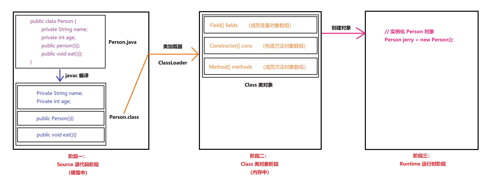

# 反射和注解

# 一、反射

> 反射：框架设计的灵魂！
>
> 对于 Java 而言：框架 = 设计模式 + 反射 + (注解)
>
> > 注意：对于基本的框架使用是不需要懂反射的，但是对于深入理解框架或设计框架则必须懂反射。

反射：将类的各个组成部分封装为其它对象，这就是反射机制。

> Java 反射机制是在程序运行状态中，可以构造任意一个类的对象，可以得到任意一个对象所属的类的信息，可以调用任意一个类的成员变量和方法，可以获取任意一个对象的属性和方法。反射机制的优点是可以实现动态创建对象和编译（即：动态编译）。

## 1.1 Java代码在计算机中经历的三个阶段



`.java` 源代码首先通过 javac 编译为 `.class` 字节码文件，此时该字节码文件是存在于硬盘中的，无法提供类的实例化操作，需要通过类加载器将字节码文件里的内容加载为 Class 类对象，此时该类对象中把原先代码中的成员变量、构造方法、成员方法都封装为了对应的对象数组（之所以是对象是因为后续需要独立操作，之所以是数组是因为也许不止一个），最后我们在运行中实例化对象便会调用 Class 类对象中相应的对象的方法。

> 反射的原理其实就可以理解为阶段二，所以学习反射关键就在于掌握这个 Class 类。

## 1.2 获取Class对象的三个方式

1. `Class.forName("全类名")`：将字节码文件加载进内存，返回 Class 类对象（对应第一阶段情况）
   - 多用于配置文件，将全类名定义在配置文件中。读取配置文件，加载类
2. `类名.class`：通过类名的属性 class 来获取，返回 Class 类对象（对应第二阶段情况）
   - 多用于参数传递
3. `对象.getClass()`：通过对象的 getClass() 方法（在 Object 中定义）来获取，返回 Class 类对象（对应第三阶段情况）
   - 多用于对象的获取字节码的方式

- `cn/itcast/domain/Person.java`

```java
package cn.itcast.domain;

public class Person {
    private String name;

    private int age;

    public String getName() {
        return name;
    }

    public void setName(String name) {
        this.name = name;
    }

    public int getAge() {
        return age;
    }

    public void setAge(int age) {
        this.age = age;
    }

    // 打印对象时会默认调用对象的 toString 方法将其转换为字符串再打印
    // 对象的 toString 方法默认是输出对象的地址
    // 我们重写 toString 方法，让其输出对象的成员变量列表
    @Override
    public String toString() {
        return "Person{" +
                "name='" + name + '\'' +
                ", age=" + age +
                '}';
    }
}
```

- `cn/itcast/reflect/ReflectDemo1.java`

```java
package cn.itcast.reflect;

import cn.itcast.domain.Person;

public class ReflectDemo1 {
    public static void main(String[] args) throws Exception {
        // 1、Class.forName("全类名")
        Class cls1 = Class.forName("cn.itcast.domain.Person");
        System.out.println(cls1);

        // 2、类名.class
        Class cls2 = Person.class;
        System.out.println(cls2);

        // 3、对象.getClass()
        Person person = new Person();
        Class cls3 = person.getClass();
        System.out.println(cls3);

        // 验证是否为同一对象
        System.out.println(cls1 == cls2);   // true
        System.out.println(cls1 == cls3);   // true
        // 结论：同一个字节码文件，在一次程序的运行过程中只会被加载一次，
        // 无论通过哪一种方式获取的同一个类的 Class 类对象都是同一个！
    }
}

/*
运行结果：
class cn.itcast.domain.Person
class cn.itcast.domain.Person
class cn.itcast.domain.Person
true
true
*/
```


## 1.3 使用Class对象

### 1.3.1 Class对象的常见功能：

1. 获取成员变量们：

   - `Field[] getFields()`：获取所有的 public 修饰的成员变量，包括从父类继承来的 public 成员变量
   - `Field getField(String name)`：获取指定名称的 public 修饰的成员变量，包括从父类继承来的 public 成员变量
   - `Field[] getDeclaredFields()`：获取本类所有的成员变量，但是不能获取继承来的成员变量
   - `Field getDeclaredField(String name)`：获取本类指定名称的成员变量，但是不能获取继承来的成员变量

   > 操作：
   >
   > - 设置值：`void set(Object obj, Object value)`
   > - 获取值：`Object get(Object obj)`
   > - 忽略访问权限修饰符的安全检查：`setAccessible(true)`
   >
   > 注意：`getDeclaredFields()`、`getDeclaredField(String name)`方法可以获取到本类所有的成员变量（不能获取继承来的成员变量），但是并不能访问（设置、获取）非 public 类型的成员变量的值！！！，如果要访问非 public 类型的成员变量的值的话，需要忽略访问权限修饰符的安全检查（“暴力反射”）：`obj.setAccessible(true);`，注意：后续的 Declared 遇到非 public 都需要“暴力反射”！

2. 获取构造方法们：

   - `Constructor<?>[] getConstructors()`
   - `Constructor<T> getConstructor(类<?>... parameterTypes)`
   - `Constructor<?>[] getDeclaredConstructors()`
   - `Constructor<T> getDeclaredConstructor(类<?>... parameterTypes)`

   > 操作：
   >
   > - 创建对象：`T newInstance(Object... initargs)`
   >   - 如果使用空参数构造方法创建对象，操作可以简化：Class 对象的 `newInstance` 方法

3. 获取成员方法们：

   - `Method[] getMethods()`
   - `Method getMethod(String name, 类<?>... parameterTypes)`
   - `Method[] getDeclaredMethods()`
   - `Method getDeclaredMethod(String name, 类<?>... parameterTypes)`

   > 操作：
   >
   > - 执行方法：`Object invoke(Object obj, Object... args)`
   > - 获取方法名称：`String getName()`

4. 获取类名：
   - `String getName()`

### 1.3.2 获取Field

```java
package cn.itcast.reflect;

import cn.itcast.domain.Person;

import java.lang.reflect.Field;

public class ReflectDemo {
    public static void main(String[] args) throws Exception {
        Class personClass = Person.class;

        Field[] fields = personClass.getDeclaredFields();

        for (Field field : fields) {
            System.out.println(field);
        }

        // 注意：name 是 public 的，默认是 null
        Field field = personClass.getDeclaredField("name");

        System.out.println(field);

        // 获取成员变量 name 的值
        Person p = new Person();
        Object name = field.get(p);
        System.out.println(name);

        // 设置成员变量 name 的值
        field.set(p, "张三");
        System.out.println(p);
    }
}

/*
public java.lang.String cn.itcast.domain.Person.name
private int cn.itcast.domain.Person.age
public java.lang.String cn.itcast.domain.Person.name
null
Person{name='张三', age=0}
*/
```

```java
package cn.itcast.reflect;

import cn.itcast.domain.Person;

import java.lang.reflect.Field;

public class ReflectDemo {
    public static void main(String[] args) throws Exception {
        Class personClass = Person.class;

        // age 是 private 的，默认是 0
        Field field = personClass.getDeclaredField("age");

        System.out.println(field);

        // 获取非 public 的成员变量需要 “暴力反射”
        field.setAccessible(true);

        // 获取成员变量 age 的值
        Person p = new Person();
        Object name = field.get(p);
        System.out.println(name);

        // 设置成员变量 age 的值
        field.set(p, 18);
        System.out.println(p);
    }
}

/*
private int cn.itcast.domain.Person.age
0
Person{name='null', age=18}
*/
```

### 1.3.3 获取Constructor

```java
package cn.itcast.reflect;

import cn.itcast.domain.Person;

import java.lang.reflect.Constructor;

public class ReflectDemo {
    public static void main(String[] args) throws Exception {
        Class personClass = Person.class;

        Constructor constructor = personClass.getConstructor(String.class, int.class);
        System.out.println(constructor);

        // 创建对象
        Object person = constructor.newInstance("张三", 24);
        System.out.println(person);

        System.out.println("-----------");

        Constructor constructor1 = personClass.getConstructor();
        System.out.println(constructor1);

        // 创建对象
        Object person1 = constructor1.newInstance();
        System.out.println(person1);

        Object o = personClass.newInstance();
        System.out.println(o);
    }
}

/*
public cn.itcast.domain.Person(java.lang.String,int)
Person{name='张三', age=24}
-----------
public cn.itcast.domain.Person()
Person{name='null', age=0}
Person{name='null', age=0}
*/
```

### 1.3.4 获取Method

```java
package cn.itcast.reflect;

import cn.itcast.domain.Person;

import java.lang.reflect.Method;

public class ReflectDemo {
    public static void main(String[] args) throws Exception {
        Class personClass = Person.class;

        // 获取指定名称的方法
        // eat()，不带参函数
        Method eat_method = personClass.getMethod("eat");
        Person p = new Person();
        // 执行方法
        eat_method.invoke(p);

        // 获取指定名称的方法
        // eat(String food)，带参函数
        Method eat_method2 = personClass.getMethod("eat", String.class);
        // 执行方法
        eat_method2.invoke(p, "饭");

        System.out.println("----------------------");

        // 获取所有 public 修饰的方法
        // 由于 Person 类直接继承了 Object 类，所以这里还会包含 Object 类的 Public 方法
        Method[] methods = personClass.getMethods();
        for (Method method : methods) {
            System.out.println(method);
            // 获取方法名称
            String name_method = method.getName();
            System.out.println(name_method);
        }
    }
}

/*
eat...
eat...饭
----------------------
public java.lang.String cn.itcast.domain.Person.toString()
toString
public void cn.itcast.domain.Person.setName(java.lang.String)
setName
public void cn.itcast.domain.Person.eat(java.lang.String)
eat
public void cn.itcast.domain.Person.eat()
eat
public int cn.itcast.domain.Person.getAge()
getAge
public void cn.itcast.domain.Person.setAge(int)
setAge
public final void java.lang.Object.wait() throws java.lang.InterruptedException
wait
public final void java.lang.Object.wait(long,int) throws java.lang.InterruptedException
wait
public final native void java.lang.Object.wait(long) throws java.lang.InterruptedException
wait
public boolean java.lang.Object.equals(java.lang.Object)
equals
public native int java.lang.Object.hashCode()
hashCode
public final native java.lang.Class java.lang.Object.getClass()
getClass
public final native void java.lang.Object.notify()
notify
public final native void java.lang.Object.notifyAll()
notifyAll
*/
```

### 1.3.5 获取类名

```java
package cn.itcast.reflect;

import cn.itcast.domain.Person;

public class ReflectDemo1 {
    public static void main(String[] args) throws Exception {
        Class personClass = Person.class;

        // 获取类名
        String className = personClass.getName();
        System.out.println(className);  // cn.itcast.domain.Person
    }
}
```

# 二、注解

