# 【面向对象】

> 原创内容，转载请注明出处！

# 一、认识对象

对象（object）是 “键值对” 的集合，表示属性和值的映射关系。

```javascript
var xiaoming = {
    name: '小明',
    age: 12,
    sex: '男',
    hobbies: ['足球', '编程']
};
```

- 属性名（键名，key）: 属性值（value）
- JS 中，大括号表示对象
- 最后的属性后面不加逗号
- {} 后加上分号

## 1.1 对象的语法

k 和 v 之间用冒号分隔，每组 `k:v` 之间用逗号分隔，最后一个 `k:v` 对后可以不书写逗号。

```javascript
var obj = {
    k: v,
    K: v,
    K: v,
    K: v
};
```

## 1.2 属性是否加引号

如果对象的属性键名不符合 JS 标识符命名规范，则这个键名必须用引号包裹。

```javascript
var xiaoming = {
    name: '小明',
    age: 12,
    sex: '男',
    hobbys: ['足球', '游泳', '编程'],
    'favorite-book': '舒克和贝塔'
    // 属性名中有短横，不符合JS标识符命名规范，属性名必须用引号包裹。
};
```

## 1.3 属性的访问

可以用“点语法”访问对象中指定键的值。

```javascript
xiaoming.name;		// '小明'
xiaoming.age;		// 12
xiaoming.hobbys;	// ['足球', '游泳', '编程'] 
```

如果属性名不符合 JS 标识符命名规范，则必须用方括号的写法来访问。

> 方括号 `[]` 中只能是字符串类型！
>
> 任何对象的属性名都可以通过 `[]` 来访问，只要把属性名写为字符串的形式。

```javascript
xiaoming['favorite-book'];	// '舒克和贝塔'
```

如果属性名以变量形式存储，则必须使用方括号形式。

```javascript
var obj = {
    a: 1,
    b: 2,
    c: 3
};

var key = 'b';
console.log(obj.key);	// undefined
console.log(obj[key]);	// 2
```

## 1.4 属性的更改

直接使用赋值运算符重新对某属性赋值即可更改属性。

```javascript
var obj = {
    a: 10
};
obj.a = 30;
obj.a++;
```

## 1.5 属性的创建

如果对象本身没有某个属性值，则用点语法赋值时，这个属性会被创建出来。

```javascript
var obj = {
    a: 10
};
obj.b = 40;
```

```javascript
var obj = {
    a: 10
};
obj['zjr-b'] = 40;
```

## 1.6 属性的删除

如果要删除某个对象的属性，需要使用 delete 操作符。

```javascript
var obj = {
    a: 1,
    'zjr-b': 2
};
delete obj.a;
delete obj['zjr-b'];
```

# 二、对象的方法

## 2.1 认识方法

如果某个属性值是函数，则它也被称为对象的 “方法”。

```javascript
var xiaoming = {
    name: '小明',
    age: 12,
    sex: '男',
    hobbys: ['足球', '游泳', '编程'],
    'favorite-book': '舒克和贝塔',
    // sayHello方法
    sayHello: function () {
		console.log('你好我是小明，今年12岁，我是个男生');
	}
};
```

## 2.2 方法的调用

使用 “点语法” 可以调用对象的方法。

```javascript
xiaoming.sayHello();
```

## 2.3 方法和函数

方法也是函数，只不过方法是对象的 “函数属性”，它需要用对象打点调用。

在正式学习了什么是 “方法” 之后，就能深入理解之前我们学习的一些函数的书写形式了，比如：

```javascript
console.log();
Math.ceil();
```

## 2.4 对象的遍历

和遍历数组类似，对象也可以被遍历，遍历对象需要使用 for...in... 循环。

使用 for...in... 循环可以遍历对象的每个键。

在后续的 ES6 相关课程中，还会学习新的对象遍历的方式。

【for...in...循环】

```javascript
// k: 循环变量，它会依次成为对象的每一个键
// obj: 要遍历的对象
for (var k in obj) {
    console.log('属性' + k + '的值是' + obj[k]);
}
```

【案例】

```javascript
var obj = {
    a: 11,
    b: 22,
    c: 88
};
for (var k in obj) {
    console.log('对象obj的属性' + k + '的值是' + obj[k]);
}

/*
对象obj的属性a的值是11
对象obj的属性b的值是22
对象obj的属性c的值是88
*/
```

```javascript
var zjr = {
    name: 'jerry',
    love: [180, 18, 1800000],
    home: {
        mm: 'glp',
        bb: 'zyj'
    }
};

for (var i in zjr) {
    console.log(i);
    console.log(typeof i);
}

/*
name
string
love
string
home
string
*/
```

> for...in.. 循环中，每一个迭代值是对应值的字符串形式。

# 三、对象的深浅克隆

## 3.1 复习基本类型值和引用类型值

还记得我们之前学习过的基本类型值和引用类型值吗？

|            | 举例                                | 当 var a = b 变量传值时                          | 当用 == 比较时                             | 当用 === 比较时                            |
| ---------- | ----------------------------------- | ------------------------------------------------ | ------------------------------------------ | ------------------------------------------ |
| 基本类型值 | 数字、字符串、布尔、undefined、null | 内存中产生新的副本                               | 比较值是否相等                             | 类型相等的前提下，比较值相等               |
| 引用类型值 | 对象、数组等                        | 内存中不产生新的副本，而是让新变量指向同一个对象 | 比较内存地址是否相同，即比较是否为同一对象 | 比较内存地址是否相同，即比较是否为同一对象 |

```javascript
var a = {};
var b = {};
var c = a;

console.log(a == b);	// false
console.log(a === b);	// false
console.log(a == c);	// true
console.log(a === c);	// true
```

## 3.2 对象是引用类型值

对象是引用类型值，这意味着：

不能用 `var obj2 = obj1` 这样的语法克隆一个对象。

使用 == 或者 === 进行对象的比较时，比较的是它们是否为内存中的同一个对象，而不是比较值是否相同。

【案例】

```javascript
// 例子1
var obj1 = {
    a: 1,
    b: 2,
    c: 3
};
var obj2 = {
    a: 1,
    b: 2,
    c: 3
};
console.log(obj1 == obj2);      // false
console.log(obj1 === obj2);     // false

console.log({} == {});          // false
console.log({} === {});         // false

// 例子2
var obj3 = {
    a: 10
};
var obj4 = obj3;
obj3.a++;
console.log(obj4);              // {a: 11}
console.log(obj3 == obj4);      // true
console.log(obj3 === obj4);		// true
```

## 3.3 对象的浅克隆

复习什么是浅克隆：只克隆对象的 “表层”，如果对象的某些属性值又是引用类型值，则不进一步克隆它们，只是传递它们的引用。

使用 for...in... 循环即可实现对象的浅克隆。

【案例】

```javascript
var obj1 = {
    a: 1,
    b: 2,
    c: [44, 55, 66]
};

// var obj2 = obj1;  这不是克隆，千万不能这样！！！！

// 实现浅克隆
var obj2 = {};
for (var k in obj1) {
    // 每遍历一个 k 属性，就给 obj2 也添加一个同名的 k 属性
    // 值和 obj1 的 k 属性值相同
    obj2[k] = obj1[k];
}

// 为什么叫浅克隆呢？比如 c 属性的值是引用类型值，那么本质上 obj1 和 obj2 的 c 属性是内存中的同一个数组，并没有被克隆分开。
obj1.c.push(77);
console.log(obj2);                  // obj2 的 c 属性这个数组也会被增加 77 数组
console.log(obj1.c == obj2.c);      // true，true 就证明了数组是同一个对象
```

## 3.4 对象的深克隆

复习什么是深克隆：克隆对象的全貌，不论对象的属性值是否又是引用类型值，都能将它们实现克隆。

和数组的深克隆类似，对象的深克隆需要使用递归。

面试时经常会考察深克隆算法，必须掌握。

【案例】

```javascript
var obj1 = {
    a: 1,
    b: 2,
    c: [33, 44, {
        m: 55,
        n: 66,
        p: [77, 88]
    }]
};

// 深克隆
function deepClone(o) {
    // 要判断 o 是对象还是数组
    if (Array.isArray(o)) {
        // 数组
        var result = [];
        for (var i = 0; i < o.length; i++) {
            result.push(deepClone(o[i]));
        }
    } else if (typeof o == 'object') {
        // 对象
        var result = {};
        for (var k in o) {
            result[k] = deepClone(o[k]);
        }
    } else {
        // 基本类型值
        var result = o;
    }
    return result;
}

var obj2 = deepClone(obj1);
console.log(obj2);

console.log(obj1.c == obj2.c);      // false

obj1.c.push(99);
console.log(obj2);                  // obj2 不变的，因为没有“藕断丝连”的现象

obj1.c[2].p.push(999);
console.log(obj2);                  // obj2 不变的，因为没有“藕断丝连”的现象
```

# 四、认识上下文

## 4.1 什么是上下文

垃圾分类，`这` 是非常好的习惯，值得表扬。

随手关灯，`这` 是非常好的习惯，值得表扬。

课后复习，`这` 是非常好的习惯，值得表扬。

早睡早起，`这` 是非常好的习惯，值得表扬。

## 4.2 函数的上下文

函数中可以使用 this 关键字，它表示函数的上下文。

与中文中 “这” 类似，函数中的 this 具体指代什么必须通过调用函数时的 “前言后语” 来判断。

## 4.3 函数中的 this

```javascript
var xiaoming = {
    nickname: '小明',
    age: 12,
    sayHello: function () {
        console.log('我是' + this.nickname + '，我' + this.age + '岁了');
    }
};
xiaoming.sayHello();

// 我是小明，我12岁了
```

```javascript
var xiaoming = {
    nickname: '小明',
    age: 12,
    sayHello: function () {
        console.log('我是' + this.nickname + '，我' + this.age + '岁了');
    }
};
var sayHello = xiaoming.sayHello;	// 将函数“提”出来，单独存为变量
sayHello();		// 直接圆括号调用这个函数，而不是对象打点调用了

// 我是undefined，我undefined岁了
```

## 4.4 函数的上下文由调用方式决定

同一个函数，用不同的形式调用它，则函数的上下文不同。

- 情形1：对象打点调用函数，函数中的 this 指代这个打点的对象

```javascript
xiaoming.sayHello();
```

- 情形2：圆括号直接调用函数，函数中的 this 指代 window 对象

```javascript
var sayHello = xiaoming.sayHello;
sayHello();
```

【案例】

```javascript
var obj = {
    a: 1,
    b: 2,
    fn: function() {
        console.log(this.a + this.b);
        /*
        请问，这里的两个 this 指代什么？
        正确答案：不知道！
        原因：函数只有被调用时，它的上下文才能被确定。
    }
};

obj.fn();	// 3

var fn = obj.fn;	// 提炼的是函数本身，而不是函数执行结果，所以不能加()
fn();		// NaN
```

# 五、上下文规则

## 5.1 函数的上下文由调用函数的方式决定

函数的上下文（this 关键字）由调用函数的方式决定，function 是 “运行时上下文” 策略。

函数如果不调用，则不能确定函数的上下文。

## 5.2 规则1

**规则1：对象打点调用它的方法函数，则函数的上下文是这个打点的对象。**

```javascript
对象.方法()
```

【规则1题目举例 - 第1小题】 

```javascript
function fn() {
    console.log(this.a + this.b);
}

var obj = {
    a: 66,
    b: 33,
    fn: fn
};

obj.fn();	// 99	
// 构成 对象.方法() 的形式，适用规则1
```

【规则1题目举例 - 第2小题】

```javascript
var obj1 = {
    a: 1,
    b: 2,
    fn: function() {
        console.log(this.a + this.b);
    }
};

var obj2 = {
    a: 3,
    b: 4,
    fn: obj1.fn		// obj2中的fn方法指向了obj1中的fn方法，即：fn方法在内存中只有一份但是被两次指向
};

obj2.fn();	// 7
// 构成 对象.方法() 的形式，使用规则1
```

【规则1题目举例 - 第3小题】

```javascript
function outer() {
    var a = 11;
    var b = 22;
    // 返回一个对象
    return {
        a: 33,
        b: 44,
        fn: funtion() {
        	console.log(this.a + this.b);
    	}
    };
}

outer().fn();	// 77
// 构成 对象.方法() 的形式，适用规则1
```

【规则1题目举例 - 第4小题】

```javascript
funtion fun() {
    console.log(this.a + this.b);
}
var obj = {
    a: 1,
    b: 2,
    c: [{
        a: 3,
        b: 4,
        c: fun
    }]
};
var a = 5;
obj.c[0].c();	// 7	
// 构成 对象.方法()的形式，适用规则1
```

## 5.3 规则2

**规则2：圆括号直接调用函数，则函数的上下文是 window 对象。**

```javascript
函数()
```

【规则2题目举例 - 第1小题】

```javascript
var obj1 = {
    a: 1,
    b: 2,
    fn: function() {
        console.log(this.a + this.b);
    }
};

var a = 3;
var b = 4;

var fn = obj1.fn;	// 将函数的引用交给变量存储
fn();	// 7
// 构成函数()的形式，适用规则2
```

【规则2题目举例 - 第2小题】

```javascript
function fun() {
    return this.a + this.b;
}
var a = 1;
var b = 2;
var obj = {
    a: 3,
    b: fun(),	// fun函数的执行结果赋给b，适用规则2，b = 3
    fun: fun	// fun函数的引用
};
var resulr = obj.fun();		// 适用规则1
console.log(result);	// 6
```

## 5.4 规则3

**规则3：数组（类数组对象）枚举出函数进行调用，上下文是这个数组（类数组对象）。**

```javascript
数组[下标]()
```

【规则3题目举例 - 第1小题】

```javascript
var arr = ['A', 'B', 'C', function() {
    console.log(this[0]);
}];
arr[3]();	// A
// 适用规则3
```

【类数组对象】

什么是类数组对象：所有键名为自然数序列（从0开始），且有 length 属性的对象。

arguments 对象是最常见的类数组对象，它是函数的实参列表。

【规则3题目举例 - 第2小题】

```javascript
function fun() {
    arguments[3]();	// 适用规则3
}
fun('A', 'B', 'C', function() {
    console.log(this[1]);
});
// B
```

## 5.5 规则4

**规则4：IIFE 中的函数，上下文是 window 对象。**

```javascript
(function() {
 })();
```

【规则4题目 - 举例】

```javascript
var a = 1;
var obj = {
    a: 2,
    fun: (funciton() {
          var a = this.a;
          return function() {
    	  	  console.log(a + this.a);	// 1 + 2
		  }
     })()	// 适用规则4
};
obj.fun();	// 适用规则1
// 3
```

## 5.6 规则5

**规则5：定时器、延时器调用函数，上下文是 window 对象。**

```javascript
setInterval(函数, 时间);
setTimeout(函数, 时间);
```

【规则5题目举例 - 第1小题】

```javascript
var obj = {
    a: 1,
    b: 2,
    fun: funciton() {
    	console.log(this.a + this.b);
	}
}
var a = 3;
var b = 4;

setTimeout(obj.fun, 2000);	// 7
// 适用规则5
```

【规则5题目举例 - 第2小题】

```javascript
var obj = {
    a: 1,
    b: 2,
    fun: function() {
        console.log(this.a + this.b);
    }
}
var a = 3;
var b = 4;
setTimeout(funciton() {
		obj.fun(); // 适用规则1，原因：此时setTimeout没有直接调用obj.fun()，而是直接调用了匿名函数
}, 2000);
```

## 5.7 规则6

**规则6：事件处理函数的上下文是绑定事件的 DOM 元素。**

```javascript
DOM元素.onclick = function() {
};
```

【规则6 - 小案例1】

请实现效果：点击哪个盒子，哪个盒子就变红，要求使用同一个事件处理函数实现。

```html
<!DOCTYPE html>
<html lang="en">
<head>
    <meta charset="UTF-8">
    <meta name="viewport" content="width=device-width, initial-scale=1.0">
    <title>Document</title>
    <style>
        div {
            width: 200px;
            height: 200px;
            float: left;
            border: 1px solid #000;
            margin-right: 10px;
        }
    </style>
</head>
<body>
<div id="box1"></div>
<div id="box2"></div>
<div id="box3"></div>

<script>
    function setColorToRed() {
        this.style.backgroundColor = 'red';
    }

    var box1 = document.getElementById('box1');
    var box2 = document.getElementById('box2');
    var box3 = document.getElementById('box3');

    box1.onclick = setColorToRed;
    box2.onclick = setColorToRed;
    box3.onclick = setColorToRed;
</script>
</body>
</html>
```

【规则6 - 小案例2】

请实现效果：点击哪个盒子，哪个盒子在 2000 毫秒后就变红，要求使用同一个事件处理函数实现。

```html
<!DOCTYPE html>
<html lang="en">
<head>
    <meta charset="UTF-8">
    <meta name="viewport" content="width=device-width, initial-scale=1.0">
    <title>Document</title>
    <style>
        div {
            width: 200px;
            height: 200px;
            float: left;
            border: 1px solid #000;
            margin-right: 10px;
        }
    </style>
</head>
<body>
<div id="box1"></div>
<div id="box2"></div>
<div id="box3"></div>

<script>
    function setColorToRed() {
        // 备份上下文（因为：定时器、延时器调用函数，上下文是 window 对象，所以要先备份上下文，用self或that或_this）
        var self = this;
        setTimeout(function () {
            self.style.backgroundColor = 'red';
        }, 2000);
    }

    var box1 = document.getElementById('box1');
    var box2 = document.getElementById('box2');
    var box3 = document.getElementById('box3');

    box1.onclick = setColorToRed;
    box2.onclick = setColorToRed;
    box3.onclick = setColorToRed;
</script>
</body>
</html>
```

# 六、call和apply

## 6.1 call和apply能指定函数的上下文

```javascript
function sum() {
    alert(this.chinese + this.math + this.english);
}

var xiaoming = {
    chinese: 80,
    math: 95,
    english: 93
};
```

将 xiaoming 变为 sum() 的上下文就可以了。

`sum.call(xiaoming);` 或 `sum.apply(xiaoming);`

- `函数.call(上下文);`
- `函数.apply(上下文);`

```javascript
function sum() {
    console.log(this.chinese + this.math + this.english);
}

var xiaoming = {
    chinese: 80,
    math: 95,
    english: 93
};

sum.call(xiaoming);		// 268
sum.apply(xiaoming);	// 268
```

> 当然直接利用规则1方法也行：
>
> ```javascript
> function sum() {
>    	alert(this.chinese + this.math + this.english);
> }
> 
> var xiaoming = {
>    	chinese: 80,
>    	math: 95,
>    	english: 93,
>    	sum: sum
> };
> 
> xiaoming.sum();
> ```

## 6.2 call和apply的区别（参数形式不同）

```javascript
function sum(b1, b2) {
    alert(this.c + this.m + this.e + b1 + b2);
}

var xiaoming = {
    c: 80,
    m: 95,
    e: 93
};

sum.call(xiaoming, 5, 3);		// 276 call 必须要用逗号罗列参数
sum.apply(xiaoming, [5, 3]);	// 276 apply 必须要把参数写到数组中
```

## 6.3 到底使用call还是apply？

```javascript
function fun1() {
    fun2.apply(this, arguments);	// arguments 是数组，只能用 apply
	// this 是 fun1 的上下文，而因为 fun1 是用 () 直接调用的，所以上下文为 window 对象
}

function fun2(a, b) {
    alert(a + b);
}

fun1(33, 44);	// 77
```

## 6.4 上下文规则总结

| 规则               | 上下文          |
| ------------------ | --------------- |
| `对象.函数()`      | 对象            |
| `函数()`           | window          |
| `数组[下标]()`     | 数组            |
| `IIFE`             | window          |
| `定时器`           | window          |
| `DOM 事件处理函数` | 绑定 DOM 的元素 |
| `call 和 apply`    | 任意指定        |

# 七、用new操作符调用函数

现在，我们学习一种新的函数调用方式：`new 函数()`

你可能知道 new 操作符和 “面向对象” 息息相关，但是现在我们先不探讨它的 “面向对象” 意义，而是先把用 new 调用函数的执行步骤和它上下文弄清楚。

## 7.1 用new调用函数的四步走

JS 规定，使用 new 操作符调用函数会进行 “四步走”：

1. 函数体内会自动创建出一个空白对象
2. 函数的上下文（this）会指向这个对象
3. 函数体内的语句会执行
4. 函数会自动返回上下文对象，即使函数没有 return 语句

## 7.2 四步走详解

```javascript
function fun() {
    this.a = 3;
    this.b = 5;
}

var obj = new fun();
console.log(obj);
```

**【第一步：函数体内会自动创建出一个空白对象】**

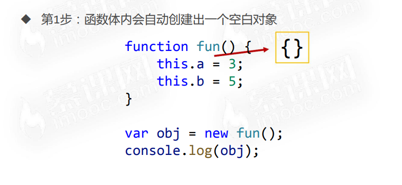

**【第二步：函数的上下文（this）会指向这个对象】**

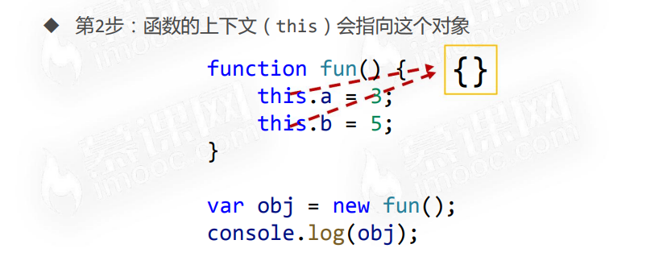

**【第三步：执行函数体中的语句】**

> 之后这个对象就不再是空对象了。

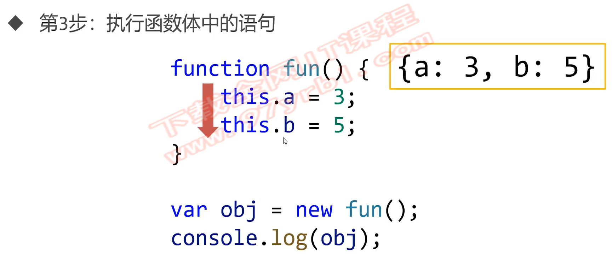

**【第四步：函数会自动返回上下文对象，即使函数没有 return 语句】**

> 执行结果为：{a: 3, b: 5}

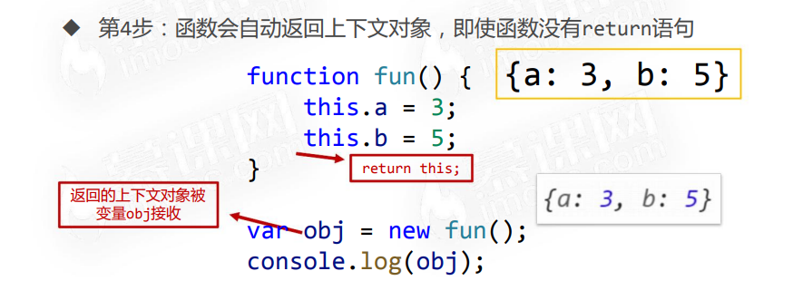

【案例】

```javascript
function fun() {
    this.a = 3;
    this.b = 6;
    var m = 34;
    if (this.a > this.b) {
        this.c = m;
    } else {
        this.c = m + 2;
    }
}

var obj = new fun();
console.log(obj);

// fun { a: 3, b: 6, c: 36 }
```

## 7.3 上下文规则总结

| 规则              | 上下文           |
| ----------------- | ---------------- |
| `对象.函数()`     | 对象             |
| `函数()`          | window           |
| `数组[下标]()`    | 数组             |
| `IIFE`            | window           |
| `定时器`          | window           |
| `DOM事件处理函数` | 绑定 DOM 的元素  |
| `call和apply`     | 任意指定         |
| `用new调用函数`   | 秘密创建出的对象 |

# 八、构造函数

## 8.1 什么是构造函数

我们将之前书写的函数进行一下小改进：

```javascript
// 书写规范：构造函数首字母大写
// 接收三个参数
function People(name, age, sex) {
    // this上绑定三个参数的同名属性
    this.name = name;
    this.age = age;
    this.sex = sex;
}

// 传入三个参数
var xiaoming = new People('小明', 12, '男');
var xiaohong = new People('小红', 10, '女');
var xiaogang = new People('小刚', 13, '男');

console.log(xiaoming);	// People { name: '小明', age: 12, sex: '男' }
console.log(xiaohong);	// People { name: '小红', age: 10, sex: '女' }
console.log(xiaogang);	// People { name: '小刚', age: 13, sex: '男' }
```

- 用 new 调用一个函数，这个函数就被称为 “构造函数”，任何函数都可以是构造函数，只需要用 new 调用它
- 顾名思义，构造函数用来 “构造新对象”，它内部的语句将为新对象添加若干属性和方法，完成对象的初始化
- 构造函数必须用 new 关键字调用，否则不能正常工作，正因如此，开发者约定构造函数命名时首字母要大写

> 注意：一个函数是不是构造函数，要看它是否用 new 调用，而至于名称首字母大写，完全是开发者的习惯约定。

## 8.2 如果不用new调用构造函数

```javascript
function People(name, age, sex) {
    this.name = name;
    this.age = age;
    this.sex = sex;
}

People('小明', 12, '男');
People('小红', 10, '女');
People('小刚', 13, '男');

/* 此时的 this 为 windown 对象，所以下面三条语句会依次给 windown 的三个属性（全局变量）赋值又相互覆盖 */
```

## 8.3 构造函数中的this不是函数本身

> 构造函数中的 this 不是这个函数本身，而是在这个函数中新创建的空白对象。
>
> 四步走原理！！！

## 8.4 为对象添加方法 

```javascript
function People(name, age, sex) {
    this.name = name;
    this.age = age;
    this.sex = sex;
    // 添加方法
    this.sayHello = function() {
        console.log('我是' + this.name + '，我' + this.age + '岁了');
    };
}

var xiaoming = new People('小明', 12, '男');
var xiaohong = new People('小红', 10, '女');
var xiaogang = new People('小刚', 13, '男');
xiaoming.sayHello();
xiaohong.sayHello();
xiaogang.sayHello();

var say = xiaoming.sayHello;
say();

/*
我是小明，我12岁了
我是小红，我10岁了
我是小刚，我13岁了
我是undefined，我undefined岁了
*/
```

> 注意：直接将方法写在构造函数中的方式是不妥的，后面会讲解原因。

# 九、类与实例

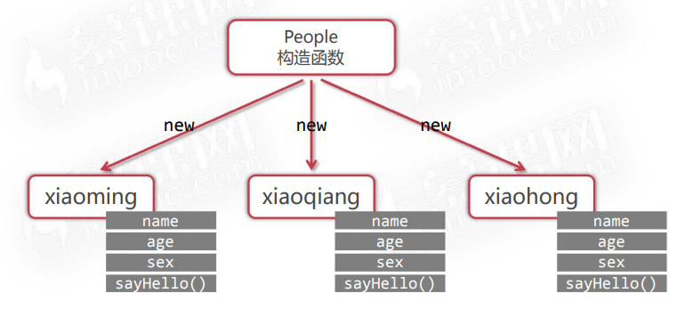

【类好比是 “蓝图”】

如同 “蓝图” 一样，类只描述对象会拥有哪些属性和方法，但是并不具体指明属性的值。

【实例是具体的对象】


【构造函数和 “类”】

- Java、C++ 等是 **“面向对象”** 语言
- JavaScript 是 **“基于对象”** 语言
- JavaScript 中的构造函数可以类比于 OO 语言中的 “类”，写法的确类似，但和真正 OO语言 还是有本质不同，在后续课程还将看见 JS 和其他 OO 语言完全不同的、特有的原型特性。

> JS 构造函数 ≈ OO 语言“类”
>
> JS 构造函数可以看做是面向对象语言中的“类”

# 十、prototype和原型链查找

## 10.1 什么是prototype

任何函数都有 prototype 属性，prototype 是英语 “原型” 的意思。

prototype 属性值是个对象，同时该对象默认拥有 constructor 属性并指回函数，constructor 属性是一个函数。


```javascript
function sum(a, b) {
    return a + b;
}
console.log(sum.prototype);
console.log(typeof sum.prototype);
console.log(sum.prototype.constructor);
console.log(typeof sum.prototype.constructor);
console.log(sum.prototype.constructor === sum);
/*
{}
object
[Function: sum]
function
true
*/
```

对于普通函数来说的 prototype 属性没有任何用处，而**构造函数的 prototype 属性非常有用**。

**构造函数的 prototype 属性是它的实例的原型**。

## 10.2 构造函数的prototype是实例的原型

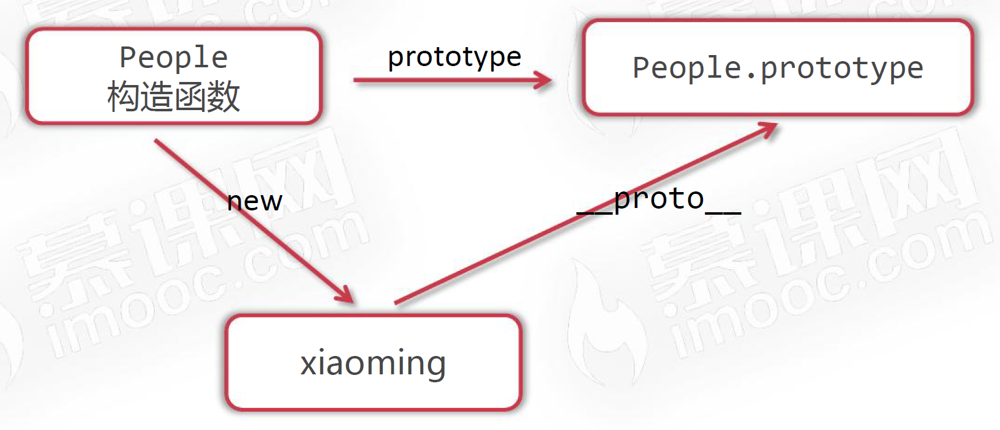

`People.prototype` 是 `xiaoming` 的原型。

`__proto__` 属性：Chrome 提出的一个属性（W3C 中没有）。

```javascript
function People(name, age, sex) {
    this.name = name;
    this.age = age;
    this.sex =sex;
}

// 实例化
var xiaoming = new People('小明', 12, '男');
// 测试三角关系是否存在
console.log(xiaoming.__proto__ === People.prototype);	// true
```

## 10.3 原型链查找

JavaScript 规定：实例可以 “打点” 访问**它的原型的属性和方法**，这被称为 “原型链查找”。

```javascript
function People(name, age, sex) {
    this.name = name;
    this.age = age;
    this.sex = sex;
}
// 在构造函数的 prototype 上添加 nationality 属性
People.prototype.nationality = '中国';

var xiaoming = new People('小明', 12, '男');
// 实例可以 “打点” 访问原型的属性和方法
console.log(xiaoming.nationality);	// 中国
```

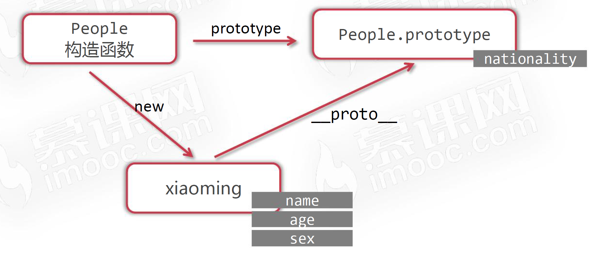

【遮蔽效应】

```javascript
function People(name, age, sex) {
    this.name = name;
    this.age = age;
    this.sex =sex;
}
People.prototype.nationality = '中国';

var xiaoming = new People('小明', 12, '男');
console.log(xiaoming.nationality);	// 中国

var tom = new People('汤姆', 10, '男');
tom.nationality = '美国';

// 被遮蔽
console.log(tom.nationality); // 美国
```

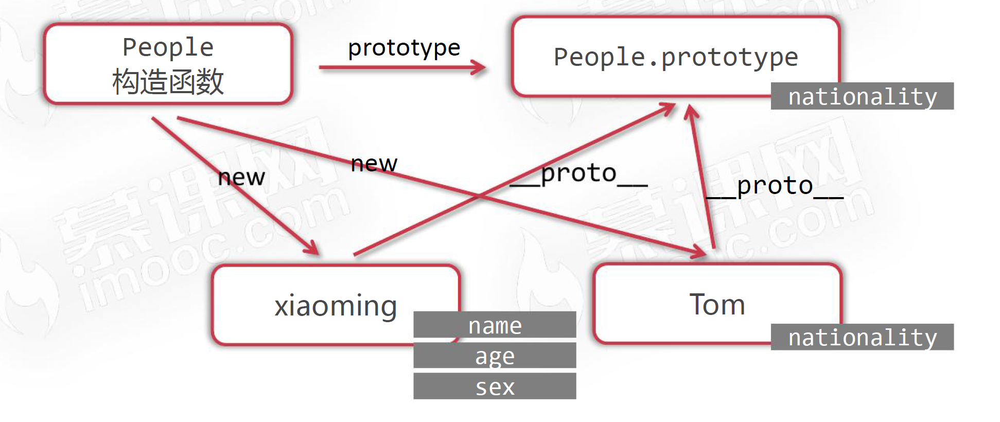

## 10.4 hasOwnProperty

hasOwnProperty 方法可以检查对象是否真正 “自己拥有” 某属性或者方法。

```javascript
xiaoming.hasOwnProperty('name');		// true
xiaoming.hasOwnProperty('age');			// true
xiaoming.hasOwnProperty('sex');			// true
xiaoming.hasOwnProperty('nationality');	// false
```

## 10.5 in

in 运算符只能检查某个属性或方法是否可以被对象访问，不能检查是否是自己的属性或方法。

```javascript
'name' in xiaoming			// true
'age' in xiaoming			// true
'sex' in xiaoming			// true
'nationality' in xiaoming	// true
```

# 十一、在prototype上添加方法

## 11.1 之前，我们将方法写到了对象身上

在之前的课程中，我们把方法都是直接添加到实例身上：

```javascript
function People(name, age, sex) {
    this.name = name;
    this.age = age;
    this.sex = sex;
    this.sayHello = function() {	// 方法直接添加到实例身上
        console.log('我是' + this.name);
    }
}
```

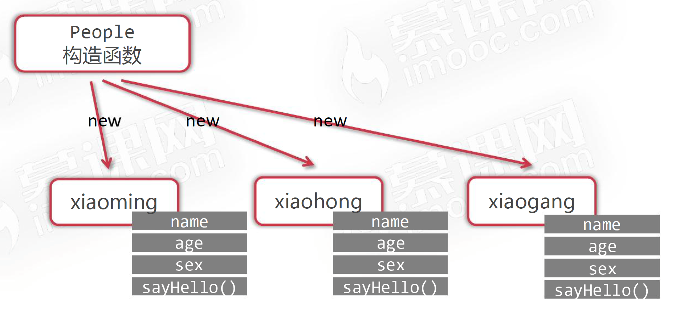

把方法直接添加到实例身上的缺点：每个实例和每个实例的方法函数都是内存中不同的函数，造成了内存的浪费。

解决办法：将方法写到 prototype 上。

## 11.2 方法要写到 prototype 上


```javascript
function People(name, age, sex) {
    this.name = name;
    this.age = age;
    this.sex =sex;
}
// 方法要写到 prototype 上
People.prototype.sayHello = function() {
    console.log('我是' + this.name);
}

People.prototype.sleep = function() {
    console.log(this.name + '开始睡觉.zzzz');
}

var xiaoming = new People('小明', 12, '男');
xiaoming.sayHello();	// 我是小明
xiaoming.sleep();		// 小明开始睡觉.zzzz

var tom = new People('汤姆', 10, '男');

// 同一份方法
console.log(xiaoming.sayHello === tom.sayHello);	// true
```

# 十二、原型链的终点

【原型链的终点】

Object 可以看做是所有对象的构造函数。

所以，People.prototype 这个对象可以看做是 Object new 出来的。

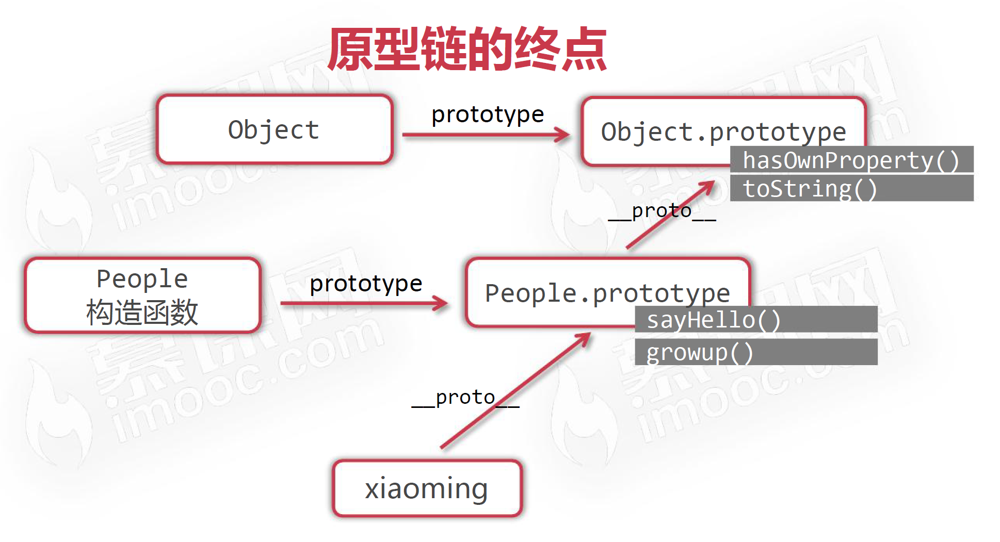

```javascript
function People() {
}
var xiaoming = new People();

console.log(xiaoming.__proto__.__proto__ === Object.prototype);		// true

// Object 是原型链的终点
console.log(Object.prototype.__proto__);	// null
```

【关于数组的原型链】

任何数组实际上都是可以看做是 Array 这个构造函数 new 出来的。

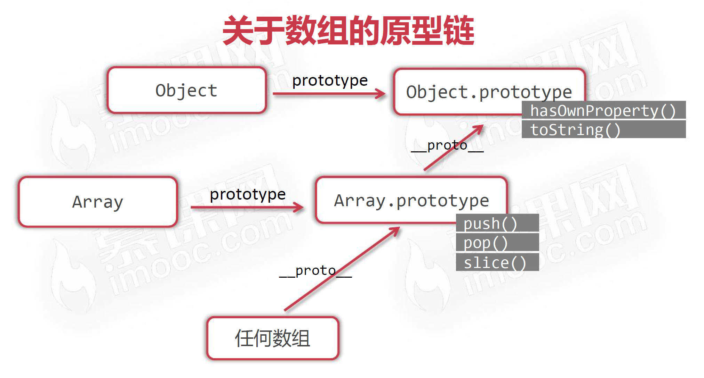

# 十三、继承

## 13.1 两个无关类


## 13.2 两个有关类


## 13.3 People类和Student类的关系

- People 类拥有的属性和方法 Student 类都有，Student 类还扩展了一些属性和方法。

- Student “是一种” People，两类之间是 "is a kind of" 关系。

- 这就是继承关系：Student 类继承自 Pelple 类。

## 13.4 继承

- 继承描述了两个类之间的 "is a kind of" 关系
- People 是 “父类”（或 “超类”、“基类”），Student 是 “子类”（或 “派生类”）
- 子类丰富了父类，让类描述得更加具体化、更细化


## 13.5 JavaScript中如何实现继承

- 实现继承的关键在于：子类必须拥有父类的全部属性和方法，同时子类还应该能够定义自己特有的属性和方法
- 使用 JavaScript 特有的原型链特性来实现继承，是普遍的做法
- 在今后学习 ES6 时，将介绍新的实现继承的方法

## 13.6 通过原型链实现继承

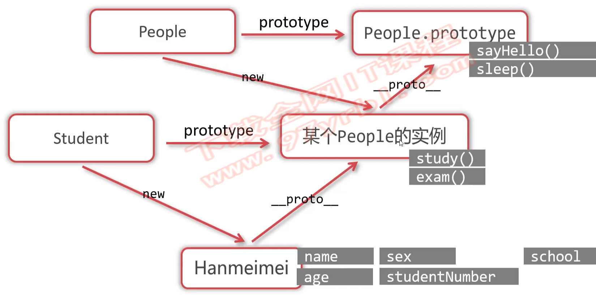

```javascript
// 父类，人类
function People(name, age, sex) {
    this.name = name;
    this.age = age;
    this.sex = sex;
}

People.prototype.sayHello = function () {
    console.log('你好，我是' + this.name + '我今年' + this.age + '岁了');
};
People.prototype.sleep = function () {
    console.log(this.name + '开始睡觉，zzzzz');
};

// 子类，学生类
function Student(name, age, sex ,school, studentNumber) {
    this.name = name;
    this.age = age;
    this.sex = sex;
    this.school = school;
    this.studentNumber = studentNumber;
}

// 关键语句，实现继承
Student.prototype = new People();

Student.prototype.study = function () {
    console.log(this.name + '正在学习');
}
Student.prototype.exam = function () {
    console.log(this.name + '正在考试，加油！');
}

// 重写、复写（override）父类的 sayHello
Student.prototype.sayHello = function () {
    console.log('敬礼！我是' + this.name + '我今年' + this.age + '岁了');
}

// 实例化
var jerry = new Student('周吉瑞', 21, '清华大学', 2019245424);
jerry.study();
jerry.sayHello();
jerry.sleep();
```

# 十四、面向对象案例

- 面向对象的本质：定义不同的类，让类的实例工作
- 面向对象的优点：程序编写更清晰、代码结构更严密、使代码更健壮更利于维护
- 面向对象经常用到的场合：需要封装和复用性的场合（组件思维）

## 14.1 小案例：红绿灯

页面上做一个红绿灯，点击红灯就变黄，点击黄灯就变绿，点击绿灯就变回红灯。

> 思路：设置一个变量，这个变量可以指示当前是什么灯，然后给红绿灯图片添加点击事件，当被点击时让变量依次从红变黄再从黄变绿，同时修改图片的 src 属性。

如果页面上有 100 个这样的红绿灯呢？

> 思路：利用面向对象解决。
>
> - 使用面向对象编程，就能以 “组件化” 的思维解决大量红绿灯相互冲突的问题
> - 面向对象编程，最重要的就是编写类

【TrafficLight 类】

- 属性：自己的当前颜色 `color`、自己的 DOM 元素 `dom`

- 方法：初始化 `init()`、切换颜色 `changeColor()`、绑定事件 `bindEvent()`

```html
<!DOCTYPE html>
<html lang="en">
<head>
    <meta charset="UTF-8">
    <meta content="width=device-width, initial-scale=1.0" name="viewport">
    <title>Document</title>
    <style>
        #box img {
            width: 80px;
        }
    </style>
</head>
<body>
<div id="box"></div>

<script>
    // 定义红绿灯类（构造函数）
    function TrafficLight() {
        // 颜色属性，一开始都是红色
        // 红色1、黄色2、绿色3
        this.color = 1;
        // 调用自己的初始化方法
        this.init();
        // 绑定监听
        this.bindEvent();
    }

    // 初始化方法
    TrafficLight.prototype.init = function () {
        // 创建自己的DOM
        this.dom = document.createElement('img');
        // 设置src属性
        this.dom.src = 'images/' + this.color + '.jpg';
        box.appendChild(this.dom);
    }

    // 绑定监听
    TrafficLight.prototype.bindEvent = function () {
        // 备份上下文，这里的this指的是JS的实例
        var self = this;
        // 当自己的dom被点击的时候
        this.dom.onclick = function () {
            // 当被点击的时候，调用自己的changeColor方法
            self.changeColor();
            // 如果在这里直接写this，那么this指向的是dom元素本身（事件处理函数的上下文是绑定事件的 DOM 元素）
        };
    }

    // 改变颜色
    TrafficLight.prototype.changeColor = function () {
        // 改变自己的color属性，从而有一种“自治”的感觉，自己管理自己，不干扰别的红绿灯
        this.color++;
        if (this.color === 4) {
            this.color = 1;
        }
        // 光color属性变化没有用，还要更改自己的dom的src属性
        this.dom.src = 'images/' + this.color + '.jpg';
    }

    // 得到盒子
    var box = document.getElementById('box');

    // 实例化100个
    var count = 100;

    while (count--) {
        new TrafficLight();
    }

</script>

</body>
</html>
```

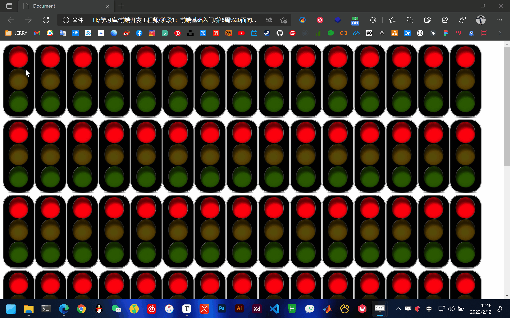

## 14.2 小案例：炫彩小球

【Ball 类】

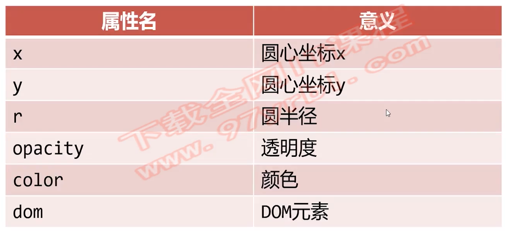

**如何实现多个小球动画？**

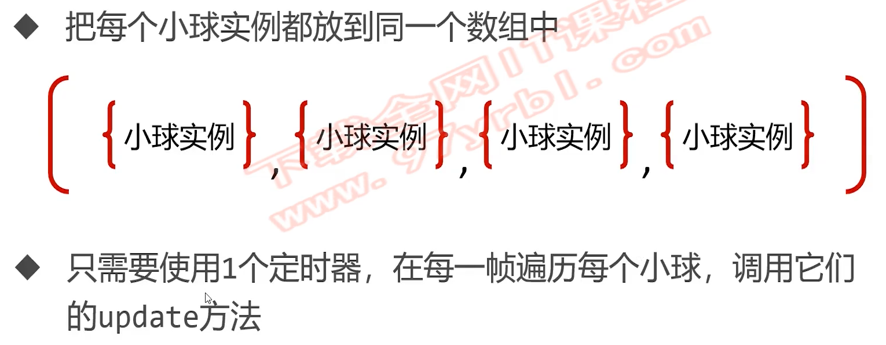

```html
<!DOCTYPE html>
<html lang="en">

<head>
    <meta charset="UTF-8">
    <meta content="width=device-width, initial-scale=1.0" name="viewport">
    <title>Document</title>
    <style>
        body {
            background-color: black;
        }

        .ball {
            position: absolute;
            border-radius: 50%;
        }
    </style>
</head>

<body>
<script>
    // 小球类
    function Ball(x, y) {
        // 属性x、y表示的是圆心的坐标
        this.x = x;
        this.y = y;
        // 半径属性
        this.r = 20;
        // 透明度
        this.opacity = 1;
        // 小球背景颜色，从颜色数组中随机选择一个颜色
        this.color = colorArr[parseInt(Math.random() * colorArr.length)];
        // 这个小球的x增量和y的增量，使用do while语句，可以防止dX和dY都是零
        do {
            this.dX = parseInt(Math.random() * 20) - 10;
            this.dY = parseInt(Math.random() * 20) - 10;
        } while (this.dX === 0 && this.dY === 0)

        // 初始化
        this.init();
        // 把自己推入数组，注意，这里的this不是类本身，而是实例
        ballArr.push(this);
    }

    // 初始化方法
    Ball.prototype.init = function () {
        // 创建自己的dom
        this.dom = document.createElement('div');
        this.dom.className = 'ball';
        this.dom.style.width = this.r * 2 + 'px';
        this.dom.style.height = this.r * 2 + 'px';
        this.dom.style.left = this.x - this.r + 'px';
        this.dom.style.top = this.y - this.r + 'px';
        this.dom.style.backgroundColor = this.color;
        // 上树
        document.body.appendChild(this.dom);
    };
    // 更新
    Ball.prototype.update = function () {
        // 位置改变
        this.x += this.dX;
        this.y -= this.dY;
        // 半径改变
        this.r += 0.2;
        // 透明度改变
        this.opacity -= 0.01;
        this.dom.style.width = this.r * 2 + 'px';
        this.dom.style.height = this.r * 2 + 'px';
        this.dom.style.left = this.x - this.r + 'px';
        this.dom.style.top = this.y - this.r + 'px';
        this.dom.style.opacity = this.opacity;

        // 当透明度小于0的时候，就需要从数组中删除自己，DOM元素也要删掉自己
        if (this.opacity < 0) {
            // 从数组中删除自己
            for (var i = 0; i < ballArr.length; i++) {
                if (ballArr[i] === this) {
                    ballArr.splice(i, 1);
                }
            }
            // 还要删除自己的dom
            document.body.removeChild(this.dom);
        }
    };


    // 把所有的小球实例都放到一个数组中
    var ballArr = [];

    // 初始颜色数组
    var colorArr = ['#66CCCC', '#CCFF66', '#FF99CC', '#FF6666',
        '#CC3399', '#FF6600'];

    // 定时器，负责更新所有的小球实例
    setInterval(function () {
        // 遍历数组，调用调用的update方法
        for (var i = 0; i < ballArr.length; i++) {
            ballArr[i].update();
        }
    }, 20);

    // 鼠标指针的监听
    document.onmousemove = function (e) {
        // 得到鼠标指针的位置
        var x = e.clientX;
        var y = e.clientY;

        new Ball(x, y);
    };
</script>
</body>

</html>
```

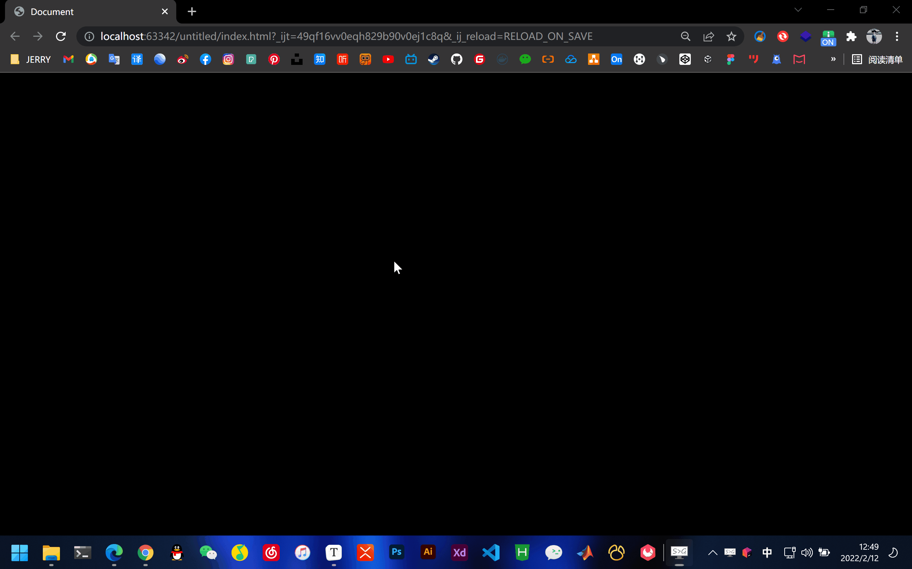

# 十五、包装类

- Number()、String()、Boolean() 分别是数字、字符串、布尔值的 “包装类”
- 很多编程语言都有 “包装类” 的设计，包装类的目的就是为了让基本类型值可以从它们的构造函数的 prototype 上获得方法

## 15.1 举例

请看下面的程序：

```javascript
var a = new Number(123);
var b = new String('慕课网');
var c = new Boolean(true);

console.log(a);					// [Number: 123]
console.log(typeof a);			// object
console.log(b);					// [String: '慕课网']
console.log(typeof b);			// object
console.log(c);					// [Boolean: true]
console.log(typeof c);			// object

console.log(5 + a);				// 128
console.log(b.slice(0, 2));		// 慕课
console.log(c && true);			// true

var d = 123;
console.log(d.__proto__ == Number.prototype);	// true

var e = '慕课网';
console.log(e.__proto__ == String.prototype);	// true
```

a、b、c 是基本类型值吗？它们和普通的数字、字符串、布尔值有什么区别？


## 15.2 总结

- Number()、String() 和 Boolean() 的实例都是 object 类型，它们的 PrimitiveValue 属性存储它们的本身值
- new 出来的基本类型值可以正常参与运算
- 包装类的目的就是为了让基本类型值可以从它们的构造函数的 prototype 上获得方法（打点调用）

> ```javascript
> var d = 123;
> console.log(d.__proto__ == Number.prototype);	// true
> 
> var e = '慕课网';
> console.log(e.__proto__ == String.prototype);	// true
> ```
>
> 从以上代码可以看出，直接定义的基本变量本质也是 new 出来的，所以才可以直接打点调用相关方法。

> 注意：只有 Number()、String()、Boolean() 才是包装类， 而 Array() 不是数组的包装类，因为数组不是基本类型谈不上 “包装类” 这一说法的。

# 十六、Math（数学）对象

## 16.1 已经学习过的Math对象方法

- 幂和开发：Math.pow()、Math.sqrt()
- 向上取整和向下取整：Math.ceil()、Math.floor()

## 16.2 四舍五入Math.round()

`Math.round()` 可以将一个数字四舍五入为整数。

```javascript
console.log(Math.round(3.4));	// 3
console.log(Math.round(3.5));	// 4
console.log(Math.round(3.98));	// 4
console.log(Math.round(3.49));	// 3
```


```javascript
var a = 3.7554;
console.log(Math.round(a * 100) / 100);	 // 3.65
```

## 16.3 Math.max()和Math.min()

- `Math.max()` 可以得到参数列表的最大值
- `Math.min()` 可以得到参数列表的最小值

```javascript
console.log(Math.max(6, 2, 9, 4));	// 9
console.log(Math.min(6, 2, 9, 4));	// 2
```

【利用 Math.max() 求数组最大值】

- Math.max() 要求参数必须是 “罗列出来”，而不能是数组
- 还记得 apply 方法么？它可以指定函数的上下文，并且以数组的形式传入 “零散值” 当做函数的参数

```javascript
var arr = [3, 6, 9, 2];
var max = Math.max.apply(null, arr);
console.log(max);	// 9

// 在今后学习 ES6 之后，求数组最值还可以
console.log(Math.max(...arr));	// 9
```

## 16.4 随机数Math.random()

- `Math.random()` 可以得到 0~1 之间的小数
- `[a, b]` 区间内的整数，可以使用这个公式：`parseInt(Math.random() * (b - a + 1)) + a`

# 十七、Date（）日期对象

- 使用 new Date() 即可得到当前时间的日期对象，它是 object 类型值
- 使用 new Date(2020, 11, 1) 即可得到指定日期的日期对象，注意第二个参数表示月份，从 0 开始算，11 表示 12 月（2020-12-1）

- 也可以是 new Date('2020-12-01') 这样的写法

```javascript
// 什么参数都不加，自动得到今天此时此刻的日期对象
var d1 = new Date();
console.log(d1);			// Sat Feb 12 2022 17:59:12 GMT+0800 (中国标准时间)
console.log(typeof d1);		// object

var d2 = new Date(2020, 5, 1);		// 不算时区
var d3 = new Date('2020-06-01');	// 算时区，中国为东八区

console.log(d2);	// Mon Jun 01 2020 00:00:00 GMT+0800 (中国标准时间)
console.log(d3);	// Mon Jun 01 2020 08:00:00 GMT+0800 (中国标准时间)
```

## 17.1 日期对象的常见的方法

| 方法            | 功能            |
| --------------- | --------------- |
| `getDate()`     | 得到日期 1~31   |
| `getDay()`      | 得到星期 0~6    |
| `getMonth()`    | 得到月份 0~11   |
| `getFullYear()` | 得到年份        |
| `getHours()`    | 得到小时数 0~23 |
| `getMinutes()`  | 得到分钟数 0~59 |
| `getSeconds()`  | 得到秒数 0~59   |

> 返回 Number 类型。

## 17.2 时间戳

- 时间戳表示 1970 年 1 月 1 日 零点整距离某时刻的毫秒数
- 通过 getTime() 方法或者 Date.parse() 函数可以将日期对象变为时间戳
- 通过 new Date(时间戳) 的写法，可以将时间戳变为日期对象

```javascript
// 日期对象
var d = new Date();

// 显示时间戳的两种方式
var timestamp1 = d.getTime();       // 精确到毫秒
var timestamp2 = Date.parse(d);     // 精确到秒，也是毫秒数，只不过最后三位一定是 000

console.log(timestamp1);	// 1644661417729
console.log(timestamp2);	// 1644661417000

// 将时间戳变为日期对象
var dd = new Date(1644661417000);
console.log(dd);	// 2022-02-12T10:23:37.000Z
```

> 时间戳的优点：方便存储、方便运算。

## 17.3 小案例：倒计时小程序

```html
<!DOCTYPE html>
<html lang="en">

<head>
    <meta charset="UTF-8">
    <meta content="width=device-width, initial-scale=1.0" name="viewport">
    <title>Document</title>
</head>

<body>
<h1>2021年高考倒计时</h1>
<h2 id="info"></h2>
<script>
    var info = document.getElementById('info');

    // 定时器
    setInterval(function () {
        // 现在的日期
        var nd = new Date();
        // 目标的日期，5表示六月
        var td = new Date(2021, 5, 7);

        // 毫秒差
        var diff = td - nd;

        // 任务很简单，就是把diff换算为天、小时、分钟、秒
        // 换算为多少天，除以一天的总毫秒数，不就是换算为多少天么
        var day = parseInt(diff / (1000 * 60 * 60 * 24));
        // 零多少小时呢？
        var hours = parseInt(diff % (1000 * 60 * 60 * 24) / (1000 * 60 * 60));
        // 零多少分钟呢？
        var minutes = parseInt(diff % (1000 * 60 * 60) / (1000 * 60));
        // 零多少秒呢？
        var seconds = parseInt(diff % (1000 * 60 * 60) % (1000 * 60) / 1000);

        info.innerText = day + '天' + hours + '时' + minutes + '分' + seconds + '秒';
    }, 1000);

</script>
</body>

</html>
```

