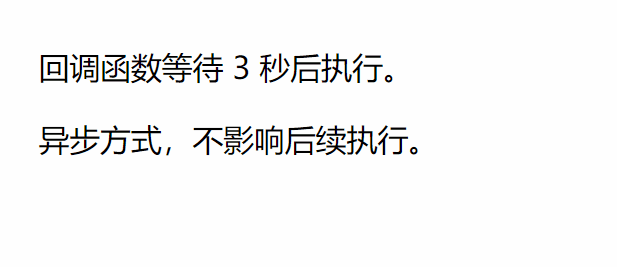
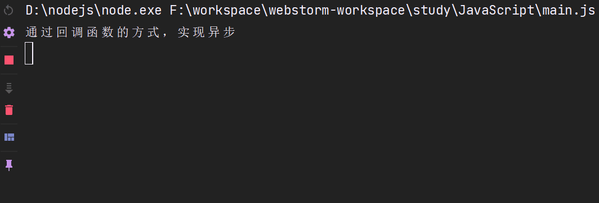
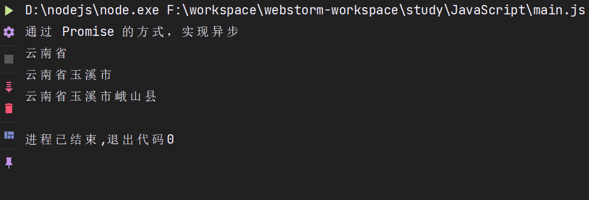

# 【ES6之Promise与Class类】

> 原创内容，转载请注明出处！

# 一、Promise

## 1.1 Promise 是什么？

Promise 是异步操作的一种解决方案。

> ### 异步的概念
>
> 异步（Asynchronous, async）是与同步（Synchronous, sync）相对的概念。
>
> 在我们学习的传统单线程编程中，程序的运行是同步的（同步不意味着所有步骤同时运行，而是指步骤在一个控制流序列中按顺序执行）。而异步的概念则是不保证同步的概念，也就是说，一个异步过程的执行将不再与原有的序列有顺序关系。
>
> 简单来理解就是：同步按你的代码顺序执行，异步不按照代码顺序执行，异步的执行效率更高。
>
> 以上是关于异步的概念的解释，接下来我们通俗地解释一下异步：异步就是从主线程发射一个子线程来完成任务。
>
> 
>
> ### 什么时候用异步编程
>
> 在前端编程中（甚至后端有时也是这样），我们在处理一些简短、快速的操作时，例如计算 1 + 1 的结果，往往在主线程中就可以完成。主线程作为一个线程，不能够同时接受多方面的请求。所以，当一个事件没有结束时，界面将无法处理其他请求。
>
> 现在有一个按钮，如果我们设置它的 onclick 事件为一个死循环，那么当这个按钮按下，整个网页将失去响应。
>
> 为了避免这种情况的发生，我们常常用子线程来完成一些可能消耗时间足够长以至于被用户察觉的事情，比如读取一个大文件或者发出一个网络请求。因为子线程独立于主线程，所以即使出现阻塞也不会影响主线程的运行。但是子线程有一个局限：一旦发射了以后就会与主线程失去同步，我们无法确定它的结束，如果结束之后需要处理一些事情，比如处理来自服务器的信息，我们是无法将它合并到主线程中去的。
>
> JavaScript 是单线程语言，为了解决多线程问题，JavaScript 中的异步操作函数往往通过回调函数来实现异步任务的结果处理。
>
> ### 回调函数
>
> 回调函数就是一个函数（作为函数参数的函数），它是在我们启动一个异步任务的时候就告诉它：等你完成了这个任务之后要干什么。这样一来主线程几乎不用关心异步任务的状态了，他自己会善始善终。
>
> ## 实例
>
> `setInterval()` 和 `setTimeout()` 是两个异步语句。
>
> 异步（asynchronous）：不会阻塞 CPU 继续执行其他语句，当异步完成时（包含回调函数的主函数的正常语句完成时），会执行 “回调函数”（callback）。
>
> ```html
> <!DOCTYPE html>
> <html>
> 
> <head>
>  <meta charset="utf-8">
>  <title>菜鸟教程(runoob.com)</title>
> </head>
> 
> <body>
> 
>  <p>回调函数等待 3 秒后执行。</p>
>  <p id="demo"></p>
>  <p>异步方式，不影响后续执行。</p>
>  <script>
>      function print() {
>          document.getElementById("demo").innerHTML = "RUNOOB!";
>      }
>      setTimeout(print, 3000);
>  </script>
> 
> </body>
> 
> </html>
> ```
>
> 
>
> 这段程序中的 setTimeout 就是一个消耗时间较长（3 秒）的过程，它的第一个参数是个回调函数，第二个参数是毫秒数，这个函数执行之后会产生一个子线程，子线程会等待 3 秒，然后执行回调函数 "print"，在命令行输出 "RUNOOB!"。
>
> 当然，JavaScript 语法十分友好，我们不必单独定义一个函数 print ，我们常常将上面的程序写成：
>
> ## 实例
>
> ```html
> <!DOCTYPE html>
> <html>
> 
> <head>
>  <meta charset="utf-8">
>  <title>菜鸟教程(runoob.com)</title>
> </head>
> 
> <body>
> 
>  <p>回调函数等待 3 秒后执行。</p>
>  <p id="demo"></p>
>  <p>异步方式，不影响后续执行。</p>
>  <script>
>      setTimeout(function () {
>          document.getElementById("demo").innerHTML = "RUNOOB!";
>      }, 3000);
>      /* ES6 箭头函数写法
>      setTimeout(() => {
>          document.getElementById("demo").innerHTML = "RUNOOB!";
>      }, 3000);
>      */
>  </script>
> 
> </body>
> 
> </html>
> ```
>
> **注意：**既然 setTimeout 会在子线程中等待 3 秒，在 setTimeout 函数执行之后主线程并没有停止，所以：
>
> ## 实例
>
> ```html
> <!DOCTYPE html>
> <html>
> 
> <head>
>  <meta charset="utf-8">
>  <title>菜鸟教程(runoob.com)</title>
> </head>
> 
> <body>
> 
>  <p>回调函数等待 3 秒后执行。</p>
>  <p id="demo1"></p>
>  <p id="demo2"></p>
>  <script>
>      setTimeout(function () {
>          document.getElementById("demo1").innerHTML = "RUNOOB-1!";
>      }, 3000);
>      document.getElementById("demo2").innerHTML = "RUNOOB-2!";
>  </script>
> 
> </body>
> 
> </html>
> ```
>
> 这段程序的执行结果是：
>
> 

（之前常用的异步操作解决方案是：回调函数）

```javascript
document.addEventListener(
    'click',
    () => {
        console.log('这里是异步的');
    },
    false
);
console.log('这里是同步的');
```

什么时候使用 Promise 呢？

Promise 一般用来解决层层嵌套的回调函数（回调地狱 callback hell）的问题。

例如下面展示两个回调地狱的例子：

例子1：分别间隔一秒打印省市县

```html
<!DOCTYPE html>
<html lang="zh">

<head>
    <meta charset="UTF-8">
    <meta http-equiv="X-UA-Compatible" content="IE=edge">
    <meta name="viewport" content="width=device-width, initial-scale=1.0">
    <title>回调举例</title>
</head>

<body>
<script>
    /*
    // 此种方式，省市县都会在一秒后同时打印，没有实现要求
    setTimeout(() => {
        console.log("云南省");
    }, 1000);
    setTimeout(() => {
        console.log("玉溪市");
    }, 1000);
    setTimeout(() => {
        console.log("峨山县");
    }, 1000);
    */

    // 通过回调函数的方式，实现异步
    setTimeout(() => {
        console.log("云南省");
        let str01 = "云南省";
        setTimeout(() => {
            console.log(str01 + "玉溪市");
            let str02 = "云南省玉溪市";
            setTimeout(() => {
                console.log(str02 + "峨山县");
            }, 1000, str02);
        }, 1000, str01);
    }, 1000);
    console.log("通过回调函数的方式，实现异步");
</script>
</body>

</html>
```



例子2：当我们点击窗口后，盒子依次 “右——>下——>左” 移动

```html
<!DOCTYPE html>
<html lang="en">
<head>
    <meta charset="UTF-8"/>
    <title>Promise</title>
    <style>
        * {
            padding: 0;
            margin: 0;
        }

        #box {
            width: 300px;
            height: 300px;
            background-color: red;
            transition: all 0.5s;
        }
    </style>
</head>
<body>
<div id="box"></div>
<script>    
    // 运动函数
    const move = (el, {x = 0, y = 0} = {}, end = () => {}) => {
        el.style.transform = `translate3d(${x}px, ${y}px, 0)`;
        el.addEventListener(
            // transitionend 事件在 CSS 完成过渡后触发。
            'transitionend',
            () => {
                end();
            },
            false
        );
    };

    const boxEl = document.getElementById('box');

    // 形成回调地狱
    document.addEventListener(
        'click',
        () => {
            move(boxEl, {x: 150}, () => {
                move(boxEl, {x: 150, y: 150}, () => {
                    move(boxEl, {y: 150}, () => {
                        move(boxEl, {x: 0, y: 0});
                    });
                });
            });
        },
        false
    );
</script>
</body>
</html>
```


## 1.2 Promise 的基本用法

### 1.2.1 实例化构造函数生成实例对象

Promise 实质上是一个构造函数，所以我们一般通过实例化的方式来使用它。

### 1.2.2 Promise 的状态

Promise 有三个状态：pending（等待）、fulfilled 或 resolved（成功）、rejected（失败）。

并且 Promise 必须接收一个回调函数，这个回调函数有两个参数，这两个参数也是两个函数，`(resolve, reject) => {}`。

- 实例化 Promise 后，默认是等待状态。

- 当执行 `resolve()` 函数时，Promise 从等待状态——>成功状态。

- 当执行 `reject()` 函数时，Promise 从等待状态——>失败状态。

注意：当 Promise 的状态一但从等待转变为某一个状态后，后续的转变就自动忽略了，比如：先调用 resolve() 再调用 reject()，那么 Promise 的最终结果是成功状态。

### 1.2.3 then 方法

当我们实例化 Promise 后得到的 Promise 对象便具有一个 `then` 方法。

then 方法具有两个回调函数作为参数，`() => {}, () => {}`。

- 当 Promise 对象为成功状态时就默认自动执行 then 方法的第一个回调函数
- 当 Promise 对象为失败状态时就默认自动执行 then 方法的第二个回调函数

### 1.2.4 resolve 和 reject 函数的参数

`resolve()` 和 `reject()` 函数是可以接收参数的。

- `resolve()` 接收的参数会传递给 then 方法的第一个回调函数
- `reject()` 接收的参数会传递给 then 方法的第二个回调函数

注意：通常我们不仅仅会传递一个基本数据类型的值，我们还常常传递对象，比如再 reject 中传递一个错误对象：

`reject(new Error("出错了！"));`

## 1.3 then()

1. then 方法的两个回调函数什么时候执行

   - pending——>fulfilled 时，执行 then 的第一个回调函数
   - pending——>rejected 时，执行 then 的第二个回调函数

2. then 方法执行后的返回值

   - then 方法执行后默认自动返回一个新的 Promise 对象

3. then 方法返回的 Promise 对象的状态改变

   - then 方法其实默认返回的是 undefined，即：`return undefined`，但是 ES6 的机制规定：当 then 返回 undefined 时，那么会将这个 undefined 包装成一个 Promise，并且这个 Promise 默认调用了 `resilve()` 方法（成功态），并且把 undefined 作为了 resilve() 的参数，相当于：

     ```javascript
     const p = new Promise((resolve, reject) => {
         resolve();
     });
     p.then(() => {
         // 默认会执行这一条
         // return undefined;
     }, () => {
     });
     
     // 实际上，return 会包装为一个 Promise 对象，同时默认执行 resolve()，并把 return 的值作为 resolve() 的参数
     /*
     return new Promise(resolve => {
         resolve(undefined);
     });
     */
     
     // -----------------------------
     // 如果我们在这个返回的 Promise 上继续调用 then 方法，并接收参数的话，可以发现 then 中成功接收到了被 Promise 包装后的参数
     const p2 = new Promise((resolve, reject) => {
         resolve();
     });
     p2.then(() => {
         // 默认会执行这一条
         // return undefined;
     }).then(data => {
         console.log(data);  // 打印 undefined
         // 手动 return 一个值
         return 24;
         // 相当于：return new Promise(resolve => {resolve(24);});
     }).then((data) => {
         console.log(data);	// 打印 undefined
     });
     ```

   - 如果我们要让 then 返回一个失败状态的 Promise，那么我们可以手动 return 一个 Promise 并执行 reject() 方法。

     ```javascript
     const p3 = new Promise((resolve, reject) => {
         resolve();
     });
     p3.then(() => {
         // 手动返回一个调用了 reject 的 Promise
         return new Promise((resolve, reject) => {
             reject("失败");
         })
     }).then(() => {}, errData => {
         console.log(errData);	// 失败
     });
     ```

学习了以上知识，现在我们来用 Promise 改造之前的两个回调地狱案例。

案例一：分别间隔一秒打印省市县。

```javascript
<!DOCTYPE html>
<html lang="zh">

<head>
    <meta charset="UTF-8">
    <meta http-equiv="X-UA-Compatible" content="IE=edge">
    <meta name="viewport" content="width=device-width, initial-scale=1.0">
    <title>Promise</title>
</head>

<body>
<script>
    // 通过 Promise 的方式，解决回调地狱
    new Promise((resolve) => {
        setTimeout(() => {
            console.log("云南省");
            resolve("云南省");
        }, 1000);
    }).then(res => {
        return new Promise((resolve) => {
            setTimeout(() => {
                console.log(res + "玉溪市");
                resolve(res + "玉溪市");
            }, 1000);
        });
    }).then(res => {
        setTimeout(() => {
            console.log(res + "峨山县");
        }, 1000);
    });

    console.log("通过 Promise 的方式，实现异步");
</script>
</body>

</html>
```



例子2：当我们点击窗口后，盒子依次 “右——>下——>左” 移动。

```html
// 利用 Promise 解决回调地狱问题
// 例子2：当我们点击窗口后，盒子依次 “右——>下——>左” 移动
<!DOCTYPE html>
<html lang="en">
<head>
    <meta charset="UTF-8"/>
    <title>Promise</title>
    <style>
        * {
            padding: 0;
            margin: 0;
        }

        #box {
            width: 300px;
            height: 300px;
            background-color: red;
            transition: all 0.5s;
        }
    </style>
</head>
<body>
<div id="box"></div>
<script>
    // 运动函数
    const move = (el, {x = 0, y = 0} = {}, end = () => {}) => {
        el.style.transform = `translate3d(${x}px, ${y}px, 0)`;
        el.addEventListener(
            // transitionend 事件在 CSS 完成过渡后触发。
            'transitionend',
            () => {
                end();
            },
            false
        );
    };

    const boxEl = document.getElementById('box');

    const movePromise = (el, point) => {
        return new Promise(resolve => {
            move(el, point, () => {
                resolve();
            });
        });
    };

    document.addEventListener(
        'click', () => {
            movePromise(boxEl, {x: 150}).then(() => {
                return movePromise(boxEl, {x: 150, y: 150});
            }).then(() => {
                return movePromise(boxEl, {y: 150});
            }).then(() => {
                movePromise(boxEl, {x: 0, y: 0});
            })
        }, false);
</script>
</body>
</html>
```

## 1.4 catch()

由之前的例子可以看出，我们在使用 Promise 的时候，大部分情况下，我们只用 resolve() 方法（成功态），所以在 Promise 回调函数中我们常常省略 reject 函数参数，在 then 中我们常常省略第二个回调函数。

但是我们还是需要处理异步中的异常，所以 ES6 中提供了我们一个 `catch()` 方法专门用来处理 Promise 的异常部分（失败态）。

- catch 专门用来处理 rejected 状态

- catch 本质上是 then 的特例

```javascript
new Promise((resolve, reject) => {
    reject("失败");
}).then(res => {
    console.log(res);
}).catch(err => {
    console.log(err);   // 失败
});

// -------------------------------------
// 上面的代码本质上等同于
new Promise((resolve, reject) => {
    reject("失败");
}).then(res => {
    console.log(res);
}).then(null, err => {
    console.log(err);	// 失败
});
```

> 在 Promise 中，一但出现了错误状态，那么这个错误是不会消失的，会一直向下传递，直到遇到可以处理错误的函数。

由于 catch 是 then 的特例，所以 catch 依旧返回的是一个 Promise 对象，我们可以在 catch 后继续调用 then。

```javascript
new Promise((resolve, reject) => {
    reject("失败");
}).then(res => {
    console.log(res);
}).catch(err => {
    console.log(err);   // 失败
    return "测试";
}).then(res => {
   console.log(res);	// 测试 
});
```

> 一般总是建议，Promise 对象后面要跟一个或多个 catch 方法，这样可以处理 Promise 内部发生的错误！

## 1.5 finally()

 当 Promise 状态发生变化时，不论如何变化都会执行，不变化不执行。

- finally() 不能接收参数。

- finally 也是 then 的特例。

```javascript
new Promise(resolve => {
    resolve("测试01");
}).finally(data => {
    console.log(data + " finally01");
    return new Promise((resolve, reject) => {
        reject("测试02");
    })
}).finally(data => {
    console.log(data + " finally02")
}).catch(err => {
    console.log("catch: " + err);
});

/*
undefined finally01
undefined finally02
catch: 测试02
*/

// 从以上示例可以看出：finally 可以接收正确状态或错误状态，但是不能接收参数。

// -------------------------------------
// finally 也是 then 的特例
// finally 等同于：
new Promise((resolve, reject) => {
    ...
}).then(res => {
    return res;
}, err => {
    return new Promise((resolve, reject) => {
        reject(err);
    })
})
```

`finally`：主要是用来处理一些必做操作，比如在操作数据库之后（无论成功与否）都要关闭数据库连接。

## 1.6 Promise.resolve()和Promise.reject()


## 1.7 Promise.all()


## 1.8 Promise.race()和Promise.allSettled()


## 1.9 Promise的注意事项


## 1.10 Promise的应用
