# MySQL精简笔记

> 学习目标：
>
> * 完成 MySQL 的安装及登陆基本操作
> * 能通过 SQL 对数据库进行 CRUD
> * 能通过 SQL 对表进行 CRUD
> * 能通过 SQL 对数据进行 CRUD
> * 事务、索引、权限……

# 一、数据库相关概念

以前我们做系统，数据持久化的存储采用的是文件存储。

存储到文件中可以达到系统关闭数据不会丢失的效果，但是文件存储也有它的弊端。

假设在文件中存储以下的数据：

```
姓名	年龄	性别	住址
张三	23	 男	  北京西三旗
李四	24	 女	  北京西二旗
王五	25	 男	  西安软件新城
```

假设现要修改李四为男性，我们现学习的 IO 技术可以通过将所有的数据读取到内存中，然后进行修改再存到该文件中。通过这种方式操作存在很大问题，现在只有三条数据，如果文件中存储1T的数据，那么就会发现内存根本就存储不了。就算内存足够存储，数据的操作与管理也极不方便。

现需要既能持久化存储数据，也要能避免上述问题的技术使用在我们的系统中。数据库就是这样的一门技术。

## 2.1 数据库

* 存储和管理数据的仓库，数据是有组织的进行存储

* 英文：DataBase，简称 DB

数据库就是将数据存储在硬盘上，可以达到持久化存储的效果。

## 2.2 数据库管理系统

* 管理数据库的大型软件
* 英文：DataBase Management System，简称 DBMS

在电脑上安装了数据库管理系统后，就可以通过数据库管理系统创建数据库来存储数据，也可以通过该系统对数据库中的数据进行数据的增删改查相关的操作。我们平时说的 MySQL 数据库其实是 MySQL 数据库管理系统。


通过上面的描述，大家应该已经知道了`数据库管理系统`和`数据库`的关系。那么有有哪些常见的数据库管理系统呢？

## 2.3 常见的数据库管理系统


接下来对上面列举的数据库管理系统进行简单的介绍：

* Oracle：收费的大型数据库，Oracle 公司的产品（政企公共部门、金融银行等行业常使用）
* MySQL：开源免费的中小型数据库（Sun 公司收购了 MySQL，而 Sun 公司后又被 Oracle 收购）
* SQL Server：MicroSoft 公司收费的中型数据库（C#、.net 等语言常使用）
* PostgreSQL：开源免费中小型的数据库
* DB2：IBM 公司的大型收费数据库产品
* SQLite：嵌入式的轻型数据库（如：作为 Android 内置数据库）

我们学习的是 MySQL 数据库管理系统，Oracle 在一些公司也有使用，此时大家肯定会想以后在公司中如果使用我们没有学习过的Oracle 数据库管理系统怎么办？这点大家大可不必担心，如下图所示：


我们可以通过数据库管理系统操作数据库，对数据库中的数据进行增删改查操作，而怎么样让用户跟数据库管理系统打交道呢？通过一门数据库语言（SQL）来实现。并且 SQL 是关系型数据库的通用语言，所以学会 SQL 那么无论遇到哪种关系型数据库都问题不大。

## 2.4 SQL

* 英文：Structured Query Language，简称 SQL（结构化查询语言）
* 操作关系型数据库的编程语言
* 定义操作所有关系型数据库的统一标准，可以使用 SQL 操作所有的关系型数据库管理系统，以后工作中如果使用到了其他的关系型数据库管理系统，也同样的使用SQL来操作

> 非关系型数据库（NoSql）
>
> - MongoDB：基于分布式文件存储的数据库。由C++语言编写，旨在为 Web 应用提供可扩展的高性能数据存储解决方案
> - Redis（Remote Dictionary Server )，即远程字典服务：是一个开源的使用 ANSI-C 语言编写、支持网络、可基于内存亦可持久化的日志型、Key-Value 数据库，并提供多种语言的 API（常用于缓存数据库）

# 二、MySQL基础

## 2.1 MySQL安装

> 安装环境：Windows11 64位
> 软件版本：MySQL 5.7.24 解压版（绿色安装版）

### 2.1.1  下载

https://downloads.mysql.com/archives/community/

点开上面的链接就能看到如下界面：


选择和自己系统位数相对应的版本点击右边的`Download`即可下载。


### 2.1.2  安装

下载完成后我们得到的是一个压缩包，将其解压，我们就可以得到 MySQL 5.7.24 的软件本体了（就是一个文件夹），我们可以把它放在你想安装的位置。


## 2.2 MySQL配置

### 2.2.1 添加环境变量

> 环境变量里面有很多选项，这里我们只用到`Path`这个参数。为什么在初始化的开始要添加环境变量呢？
> 在终端中输入一个可执行程序的名字，Windows会先在环境变量中的`Path`所指示的路径中寻找一遍，如果找到了就直接执行，没找到就在当前工作目录中继续寻找，如果还没找到，就报错。我们添加环境变量的目的就是能够在任意路径下的终端中直接调用 MySQL 中的相关程序而不用总是切换工作目录，大大方便了操作。

右键`开始菜单`→`设置`→`系统`→`系统信息`，点击`高级系统设置`点击`环境变量`


在`系统变量`中新建`MYSQL_HOME`，之后点击确定


在`系统变量`中找到并编辑`Path`点击`新建`，输入`%MYSQL_HOME%\bin`，最后点击确定。


**如何验证是否添加成功？**

右键开始菜单，选择`Windeos终端(管理员)`，打开终端，敲入`mysql`，回车。
如果提示`Can't connect to MySQL server on 'localhost'`则证明添加成功。
如果提示`mysql : 无法将“mysql”项识别为 cmdlet、函数、脚本文件或可运行程序的名称。请检查名称的拼写，如果包
括路径，请确保路径正确，然后再试一次。`则表示添加失败，请重新检查步骤并重试。

### 2.2.2 新建配置文件

新建一个文本文件，写入以下内容：

```ini
[mysql]
default-character-set=utf8

[mysqld]
character-set-server=utf8
default-storage-engine=INNODB
sql_mode=STRICT_TRANS_TABLES,NO_ZERO_IN_DATE,NO_ZERO_DATE,ERROR_FOR_DIVISION_BY_ZERO,NO_AUTO_CREATE_USER,NO_ENGINE_SUBSTITUTION
```

把上面的文本文件另存为，在保存类型里选`所有文件 (*.*)`，文件名为`my.ini`，存放的路径为MySQL的`根目录`（例如我的是`D:\mysql-5.7.24-winx64`根据自己的 MySQL 目录位置修改）。


上面配置文本的意思是，配置数据库的默认编码集为`utf-8`和默认存储引擎为`INNODB`。

### 2.2.3  初始化MySQL

在刚才的终端中敲入`mysqld --initialize-insecure`回车，稍微等待一会，如果没有出现报错信息则证明`data`目录初始化没有问题，此时再查看MySQL目录下已经有`data`目录生成。

```
mysqld --initialize-insecure
```


### 2.2.4  注册MySQL服务

在终端里敲入`mysqld -install`，回车。

```
mysqld -install
```

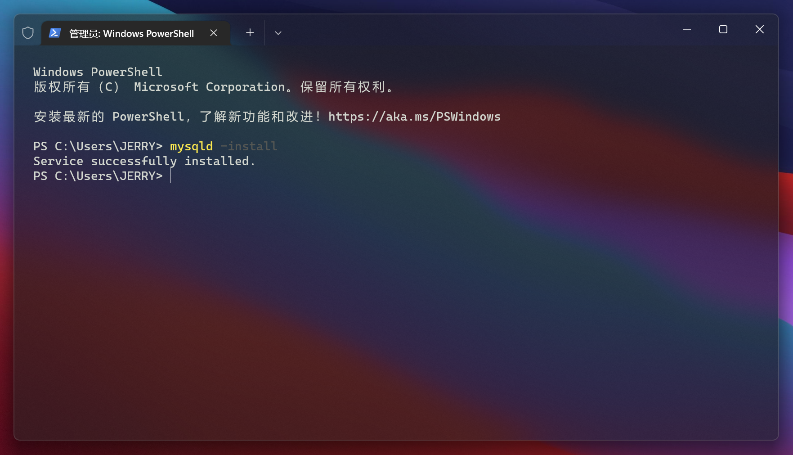

现在你的计算机上已经安装好了 MySQL 服务了。

> 安装了 MySQL 服务的计算机便可以叫做：MySQL 服务器

> 假设出现`Install/Remove of the Service Denied!`提示，请切换管理员权限终端再试

### 2.2.5  启动MySQL服务

在终端里敲入`net start mysql`，回车。

```java
net start mysql	// 启动 mysql 服务
net stop mysql	// 停止 mysql 服务
```


### 2.2.6  修改默认账户密码

在终端里敲入`mysqladmin -u root password 123456`，这里的`123456`就是指默认管理员（即 root 账户）的密码，可以自行修改成你所需的。

```
mysqladmin -u root password 123456
```


**至此，MySQL 5.7.24 解压版安装完毕！**

## 2.3  MySQL卸载

如果你想卸载 MySQL，也很简单。

右键开始菜单，选择`Windeos终端(管理员)`，打开终端。

1. 敲入`net stop mysql`，回车。

```
net stop mysql
```

2. 再敲入`mysqld -remove mysql`，回车。

```
mysqld -remove mysql
```


3. 最后删除 MySQL 目录及相关的环境变量。

**至此，MySQL 5.7.24 解压版卸载完成！**

## 2.4  MySQL登陆和退出

### 2.4.1  登陆

右键开始菜单，选择`Windeos终端(管理员)`，打开终端。
在终端中输入，`mysql -uroot -p123456`，回车，出现下图且左下角为`mysql>`，则登录成功。

```
mysql -uroot -p123456

登录参数：
mysql -u用户名 -p密码 -h要连接的mysql服务器的ip地址(默认127.0.0.1) -P端口号(默认3306)
```

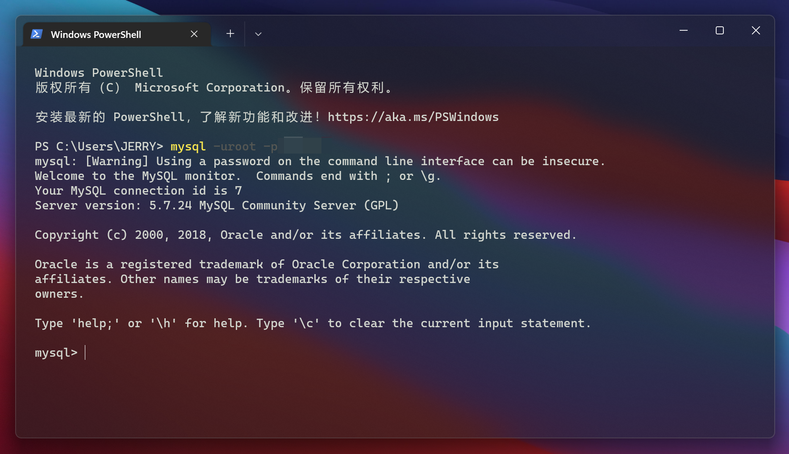

**到这里你就可以开始你的 MySQL 之旅了！**

### 2.4.2  退出

退出 MySQL：

```
exit 或 quit
```

## 2.5  MySQL数据模型

**关系型数据库：**

> 关系型数据库是建立在关系模型基础上的数据库，简单说，关系型数据库是由多张能互相连接的`二维表`组成的数据库

如下图，`订单信息表` 和 `客户信息表` 都是有行有列二维表我们将这样的称为关系型数据库。


接下来看关系型数据库的优点：

* 都是使用表结构，格式一致，易于维护
* 使用通用的 SQL 语言操作，使用方便，支持复杂查询
* 数据持久化存储在磁盘中，安全稳定

**数据模型：**


如上图，我们通过客户端利用数据库管理系统创建数据库，在数据库中创建表，在表中添加数据。创建的每一个数据库对应到磁盘上都是一个文件夹。比如可以通过 SQL 语句创建一个数据库（数据库名称为`db01`），语句如下。该语句咱们后面会学习。

```sql
CREATE DATABASE db01;
```

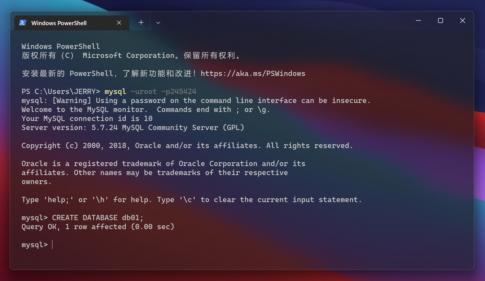

我们可以在数据库安装目录下的`data`目录下看到多了一个`db01`的文件夹。所以，**在 MySQL 中一个数据库对应到磁盘上的一个文件夹。**


而一个数据库下可以创建多张表，我们到 MySQL 中自带的 mysql 数据库的文件夹目录下：


而上图中右边的 `db.frm` 是表文件，`db.MYD` 是数据文件，通过这两个文件就可以构建数据二维表。

> 此处只是使用`db.frm`与`db.MYD`举例，其他数据库中的任意一张表也是同理

**小结：**

* MySQL 中可以创建多个数据库，每个数据库对应到磁盘上的一个文件夹
* 在每个数据库中可以创建多个表，每张都对应到磁盘上一个 frm 文件
* 每张表可以存储多条数据，数据会被存储到磁盘中 MYD 文件中

## 2.6 MySQL文件结构


- bin：用于放置一些可执行文件，如 mysql.exe、mysqld.exe、mysqlshow.exe 等
- data：用于放置一些日志文件以及数据库，我们创建和保存的数据都存在这个目录里
- docs：用于存放一些文档
- include：由于 MySQL 是用 C 语言写的，这里放置一些头文件，如：mysql.h、mysql_ername.h 等
- lib：用于放置一系列库文件
- share：用于存放字符集、语言等信息
- my.ini：默认使用的配置文件，一般情况下，只要修改该配置文件中的内容就可以对 MySQL 进行配置
- COPYING：许可声明
- README：自述文件

# 三、SQL基础

了解了数据模型后，接下来我们就学习 SQL 语句，通过 SQL 语句对数据库、表、数据进行增删改查操作。 

## 3.1 SQL简介

* 英文：Structured Query Language，简称 SQL（结构化查询语言）
* 一门操作关系型数据库的编程语言
* 定义操作所有关系型数据库的统一标准
* 对于同一个需求，每一种数据库操作的方式可能会存在一些不一样的地方，我们称为“方言”，不过只要我们掌握了 SQL 那么切换不同的关系型数据库的成本也是非常低的，即：学好“普通话”那么学“方言”也会非常快

## 3.2 通用语法

* SQL 语句可以单行或多行书写，以分号结尾

   

  如上，以分号结尾才是一个完整的 SQL 语句

* MySQL 数据库的 SQL 语句不区分大小写，关键字建议使用大写

  （同样的一条 SQL 语句写成下图的样子，一样可以运行处结果）

   

* 注释

  * 单行注释：`-- 注释`或`# 注释`（MySQL 特有） 

   

    > 注意：使用`--`添加单行注释时，`--`后面一定要加空格，而`#`没有要求，但推荐注释符号后都留一个空格

  * 多行注释: `/* 注释 */`

  ```sql
  -- 单行注释
  #单行注释
  # 推荐留一个空格
  /*
  多行
  注释
  */
  ```


## 3.3 SQL分类

* DDL（Data Definition Language）数据定义语言，用来定义数据库对象：数据库、表、列等

  DDL 简单理解就是用来操作数据库和表的

  

* DML（Data Manipulation Language）数据操作语言，用来对数据库中表的数据进行增删改

  DML 简单理解就对表中数据进行增删改

  

* DQL（Data Query Language）数据查询语言，用来查询数据库中表的记录（数据）

  DQL 简单理解就是对数据进行查询操作，从数据库表中查询到我们想要的数据

* DCL（Data Control Language）数据控制语言，用来定义数据库的访问权限和安全级别及创建用户

  DML 简单理解就是对数据库进行权限控制，比如我让某一个数据库表只能让某一个用户进行操作等。

> 注意： 以后我们最常操作的是 `DML` 和 `DQL`  ，因为我们开发中最常操作的就是数据

# 四、DDL数据库定义语言

我们先来学习 DDL 来操作数据库，而操作数据库主要就是对数据库的增删查操作。

## 4.1  查询

查询所有的数据库

```sql
SHOW DATABASES;
```

运行上面语句效果如下：

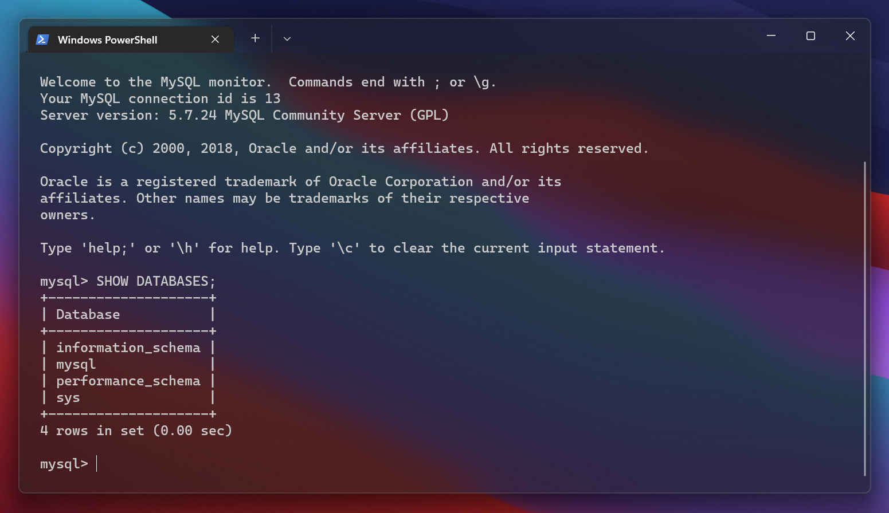

上述查询到的是的这些数据库是 mysql 安装好自带的数据库，是数据库的核心，请不要操作这些数据库。

- `information_schema`是信息数据库，其中保存着关于 MySQL 服务器所维护的所有其他数据库的信息
- `performance_schema`可以理解为MySQLServer数据库性能监控，记录着内存、CPU 和网络磁盘 IO 情况
- `mysql`主要存储用户信息和权限，还有日志、时区信息、内存信息之类
- `sys`提供了一些代替直接访问 performance_schema 的视图，目标是把 performance_schema 的把复杂度降低，让 DBA 能更好的阅读这个库里的内容，让 DBA 更快的了解 DB 的运行情况

## 4.2  创建数据库

* **创建数据库**：

```sql
CREATE DATABASE 数据库名称;
```

而在创建数据库的时候，我并不知道 db01 数据库有没有创建，直接再次创建名为 db01 的数据库就会出现错误。

（Can't create database 'db01'; database exists）

为了避免上面的错误，在创建数据库的时候先做判断，如果不存在再创建。

* **创建数据库（判断，如果不存在则创建）**

```sql
CREATE DATABASE IF NOT EXISTS 数据库名称;
```

运行语句效果如下：

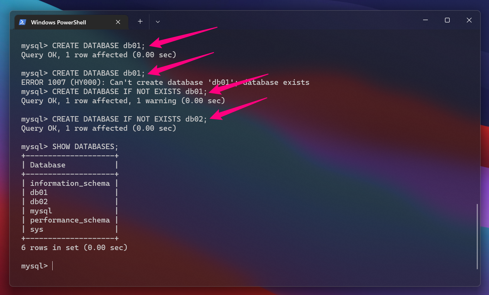

从上面的效果可以看到虽然 db01 数据库已经存在，再创建 db01 也没有报错，而创建 db02 数据库则创建成功。

## 4.3  删除数据库

* **删除数据库**

```sql
DROP DATABASE 数据库名称;
```

* **删除数据库(判断，如果存在则删除)**

```sql
DROP DATABASE IF EXISTS 数据库名称;
```

运行语句效果如下：

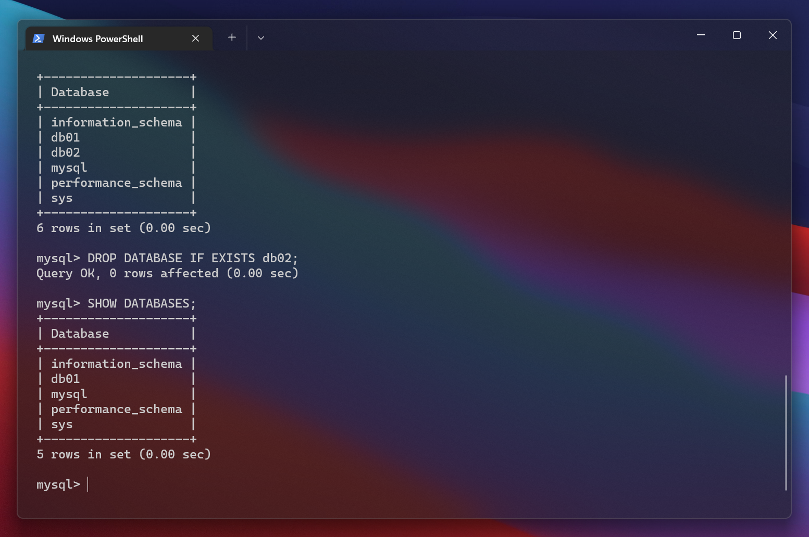

## 4.4  使用数据库

数据库创建好了，要在数据库中创建表，得先明确在哪个数据库中操作，此时就需要使用数据库。

* **使用数据库**

```sql
USE 数据库名称;
```

* **查看当前使用的数据库**

```sql
SELECT DATABASE();
```

运行语句效果如下：


## 4.5 操作表

操作表也就是对表进行增（Create）删（Retrieve）改（Update）查（Delete）。

### 4.5.1 查询表

* **查询当前数据库下所有表名称**

```sql
SHOW TABLES;
```

我们创建的数据库中没有任何表，因此我们进入 MySQL 自带的 mysql 数据库，执行上述语句查看。


* **查询表结构**

```sql
DESC 表名称;
```

查看 mysql 数据库中 func 表的结构，运行语句如下：


### 4.5.2 创建表

* **创建表**

```sql
CREATE TABLE 表名 (
	字段名1  数据类型1,
	字段名2  数据类型2,
	…
	字段名n  数据类型n
);
```

> 注意：最后一行末尾，不能加逗号

知道了创建表的语句，那么我们创建创建如下结构的表


```sql
CREATE TABLE tb_user (
	id int,
    username varchar(20),
    password varchar(32)
);
```

运行语句如下：

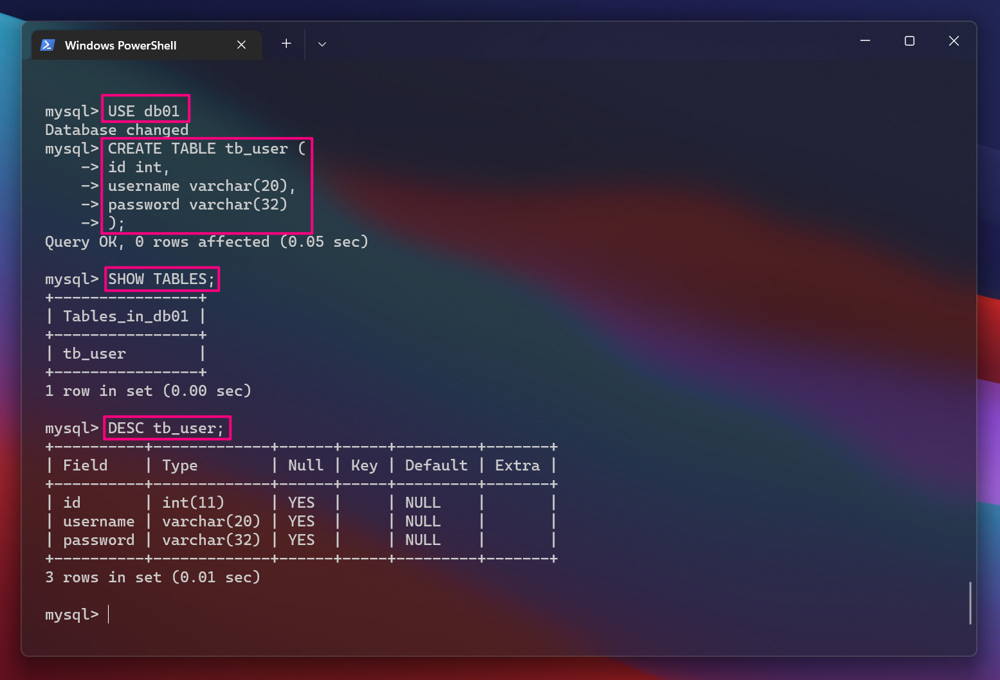

### 4.5.3 数据类型

MySQL 支持多种类型，可以分为三类：

* 数值

  ```sql
  tinyint：小整数型，占一个字节
  int：大整数类型，占四个字节，使用格式：字段名 int;
  double：浮点类型，使用格式：字段名 double(总长度, 小数点后保留的位数);
  ```
  
* 日期

  ```sql
  date：日期值，只包含年月日，eg：birthday date;
  datetime：混合日期和时间值，包含年月日时分秒
  ```
  
* 字符串

  ```sql
  char：定长字符串。
  	优点：存储性能高
  	缺点：浪费空间
  	eg：name char(10) 如果存储的数据字符个数不足10个，也会占10个的空间
  varchar：变长字符串。
  	优点：节约空间
  	缺点：存储性能底
  	eg：name varchar(10) 如果存储的数据字符个数不足10个，那就数据字符个数是几就占几个的空间	
  ```

> 注意：其他类型参考资料中的《MySQL数据类型.xlsx》

**案例：**

> 需求：设计一张学生表，请注重数据类型、长度的合理性
> 1. 编号
> 2. 姓名，姓名最长不超过10个汉字
> 3. 性别，因为取值只有两种可能，因此最多一个汉字（一个汉字占两个字符，但是这里用0表示女，1表示男）
> 4. 生日，取值为年月日
> 5. 入学成绩，小数点后保留两位
> 6. 邮件地址，最大长度不超过 64
> 7. 家庭联系电话，不一定是手机号码，可能会出现 - 等字符
> 8. 学生状态（用数字表示，正常、休学、毕业...）

语句设计如下：

```sql
create table student (
	id int,
    name varchar(10),
    gender char(1),
    birthday date,
    score double(5,2),
    email varchar(15),
    tel varchar(15),
    status tinyint
);
```

### 4.5.4 删除表

* **删除表**

```sql
DROP TABLE 表名;
```

* **删除表时判断表是否存在**

```sql
DROP TABLE IF EXISTS 表名;
```

运行语句效果如下：


### 4.5.5 修改表

* **修改表名**

```sql
ALTER TABLE 表名 RENAME TO 新的表名;

-- 将表名 student 修改为 stu
ALTER TABLE student RENAME TO stu;
```

* **添加一列**

```sql
ALTER TABLE 表名 ADD 列名 数据类型;

-- 给 stu 表添加一列 address，该字段类型是 varchar(50)
ALTER TABLE stu ADD address varchar(50);
```

* **修改数据类型**

```sql
ALTER TABLE 表名 MODIFY 列名 新数据类型;

-- 将 stu 表中的 address 字段的类型改为 char(50)
ALTER TABLE stu MODIFY address char(50);
```

* **修改列名和数据类型**

```sql
ALTER TABLE 表名 CHANGE 列名 新列名 新数据类型;

-- 将 stu 表中的 address 字段名改为 addr，类型改为 varchar(50)
ALTER TABLE stu CHANGE address addr varchar(50);
```

* **删除列**

```sql
ALTER TABLE 表名 DROP 列名;

-- 将 stu 表中的 addr 字段 删除
ALTER TABLE stu DROP addr;
```

## 4.6 Navicat使用

通过上面的学习，我们发现在命令行中写 SQL 语句特别不方便，尤其是编写创建表的语句，我们只能在记事本上写好后直接复制到命令行进行执行。那么有没有更好的工具提供给我们进行使用呢？ 当然有！

### 4.6.1  Navicat概述

* Navicat for MySQL 是管理和开发 MySQL 的理想解决方案
* 这套全面的工具为数据库管理、开发和维护提供了一款直观而强大的图形界面。
* Navicat几乎支持市面上所有主流的数据库
* 官网： [http://www.navicat.com.cn](http://www.navicat.com.cn/) 

### 4.6.3  Navicat使用

**建立和 MySQL 服务的连接**

第一步： 点击连接，选择 MySQL


第二步：填写连接数据库必要的信息


以上操作没有问题就会提示“连接成功”。

连接成功后就能看到如下图界面：


* **创建表**

通过下图操作创建表：

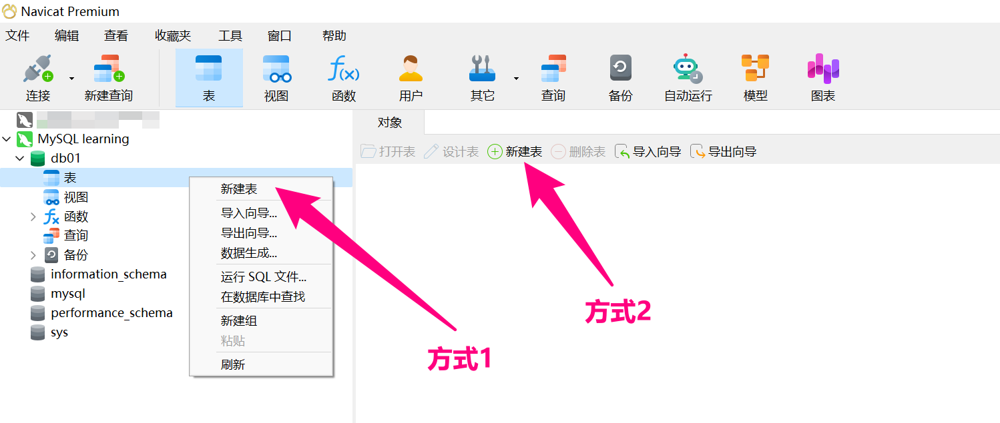


* **修改表结构**

通过下图操作修改表结构：

设计表完成后，可以点击设计表，对表进行再修改。

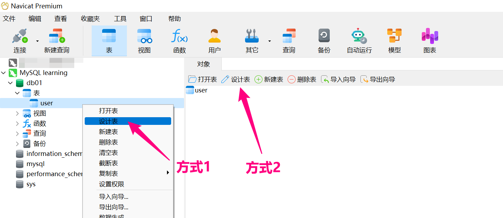


* **编写SQL语句并执行**

按照如下图所示进行操作即可书写 SQL 语句并执行 SQL 语句。

首先，在某个数据库下新建查询：

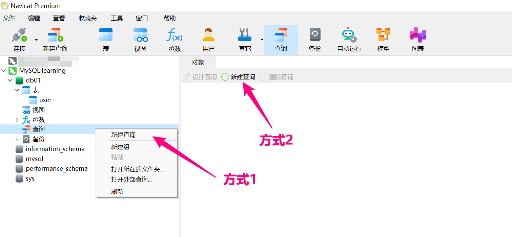

在编辑窗口中输入 SQL 代码，点击运行并在结果窗口中查看执行结果。


> 注意：运行 SQL 语句有两种方式：1、运行全部 SQL 语句；2、运行选中的 SQL 语句

- **将表构建为模型或图表**


- **导入导出数据**

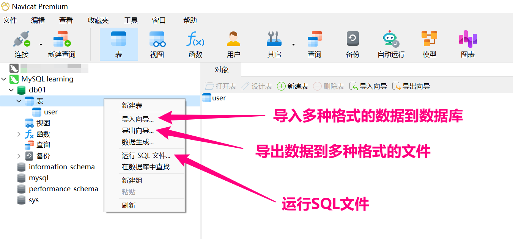

将数据库导出为 SQL 文件或执行 SQL 文件：

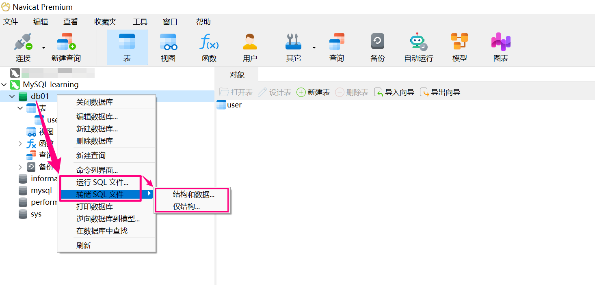

# 五、DML

DML 主要是对数据进行增（insert）删（delete）改（update）操作。

### 5.1  添加数据

* **给指定列添加数据**

```sql
INSERT INTO 表名(列名1,列名2,…) VALUES(值1,值2,…);
```

* **给全部列添加数据**

```sql
INSERT INTO 表名 VALUES(值1,值2,…);
```

* **批量添加数据**

```sql
INSERT INTO 表名(列名1,列名2,…) VALUES(值1,值2,…),(值1,值2,…),(值1,值2,…)…;
INSERT INTO 表名 VALUES(值1,值2,…),(值1,值2,…),(值1,值2,…)…;
```

* **练习**

为了演示以下的增删改操作是否操作成功，故先将查询所有数据的语句介绍给大家：

```sql
select * from stu;
```

```sql
-- 给指定列添加数据
INSERT INTO stu (id, NAME) VALUES (1, '张三');
-- 给所有列添加数据，列名的列表可以省略的
INSERT INTO stu (id,NAME,sex,birthday,score,email,tel,STATUS) VALUES (2,'李四','男','1999-11-11',88.88,'lisi@itcast.cn','13888888888',1);

INSERT INTO stu VALUES (2,'李四','男','1999-11-11',88.88,'lisi@itcast.cn','13888888888',1);

-- 批量添加数据
INSERT INTO stu VALUES 
	(2,'李四','男','1999-11-11',88.88,'lisi@itcast.cn','13888888888',1),
	(2,'李四','男','1999-11-11',88.88,'lisi@itcast.cn','13888888888',1),
	(2,'李四','男','1999-11-11',88.88,'lisi@itcast.cn','13888888888',1);
```

### 5.2  修改数据

* **修改表数据**

```sql
UPDATE 表名 SET 列名1=值1,列名2=值2,… [WHERE 条件] ;
```

> 注意：
>
> 1. 修改语句中如果不加条件，则将所有数据都修改！
> 2. 像上面的语句中的中括号，表示在写sql语句中可以省略这部分

* **练习**

  * 将张三的性别改为女

    ```sql
    update stu set sex = '女' where name = '张三';
    ```

  * 将张三的生日改为 1999-12-12 分数改为99.99

    ```sql
    update stu set birthday = '1999-12-12', score = 99.99 where name = '张三';
    ```

  * 注意：如果update语句没有加where条件，则会将表中所有数据全部修改！

    ```sql
    update stu set sex = '女';
    ```

    上面语句的执行完后查询到的结果是：

    

### 5.3  删除数据

* **删除数据**

```sql
DELETE FROM 表名 [WHERE 条件] ;
```

* **练习**

```sql
-- 删除张三记录
delete from stu where name = '张三';

-- 删除stu表中所有的数据
delete from stu;
```

# 六、DQL

下面是黑马程序员展示试题库数据的页面


页面上展示的数据肯定是在数据库中的试题库表中进行存储，而我们需要将数据库中的数据查询出来并展示在页面给用户看。上图中的是最基本的查询效果，那么数据库其实是很多的，不可能在将所有的数据在一页进行全部展示，而页面上会有分页展示的效果，如下：


当然上图中的难度字段当我们点击也可以实现排序查询操作。从这个例子我们就可以看出，对于数据库的查询时灵活多变的，需要根据具体的需求来实现，而数据库查询操作也是最重要的操作，所以此部分需要大家重点掌握。

接下来我们先介绍查询的完整语法：

```sql
SELECT 
    字段列表
FROM 
    表名列表 
WHERE 
    条件列表
GROUP BY
    分组字段
HAVING
    分组后条件
ORDER BY
    排序字段
LIMIT
    分页限定
```

为了给大家演示查询的语句，我们需要先准备表及一些数据：

```sql
-- 删除stu表
drop table if exists stu;


-- 创建stu表
CREATE TABLE stu (
 id int, -- 编号
 name varchar(20), -- 姓名
 age int, -- 年龄
 sex varchar(5), -- 性别
 address varchar(100), -- 地址
 math double(5,2), -- 数学成绩
 english double(5,2), -- 英语成绩
 hire_date date -- 入学时间
);

-- 添加数据
INSERT INTO stu(id,NAME,age,sex,address,math,english,hire_date) 
VALUES 
(1,'马运',55,'男','杭州',66,78,'1995-09-01'),
(2,'马花疼',45,'女','深圳',98,87,'1998-09-01'),
(3,'马斯克',55,'男','香港',56,77,'1999-09-02'),
(4,'柳白',20,'女','湖南',76,65,'1997-09-05'),
(5,'柳青',20,'男','湖南',86,NULL,'1998-09-01'),
(6,'刘德花',57,'男','香港',99,99,'1998-09-01'),
(7,'张学右',22,'女','香港',99,99,'1998-09-01'),
(8,'德玛西亚',18,'男','南京',56,65,'1994-09-02');
```

接下来咱们从最基本的查询语句开始学起。

### 6.1  基础查询

#### 6.1.1  语法

* **查询多个字段**

```sql
SELECT 字段列表 FROM 表名;
SELECT * FROM 表名; -- 查询所有数据
```

* **去除重复记录**

```sql
SELECT DISTINCT 字段列表 FROM 表名;
```

* **起别名**

```sql
AS: AS 也可以省略
```

#### 6.1.2  练习

* 查询name、age两列

  ```sql
  select name,age from stu;
  ```

* 查询所有列的数据，列名的列表可以使用*替代

  ```sql
  select * from stu;
  ```

  上面语句中的\*不建议大家使用，因为在这写\*不方便我们阅读sql语句。我们写字段列表的话，可以添加注释对每一个字段进行说明

  

  而在上课期间为了简约课程的时间，老师很多地方都会写*。

* 查询地址信息

  ```sql
  select address from stu;
  ```

  执行上面语句结果如下：

  

  从上面的结果我们可以看到有重复的数据，我们也可以使用 `distinct` 关键字去重重复数据。

* 去除重复记录

  ```sql
  select distinct address from stu;
  ```

* 查询姓名、数学成绩、英语成绩。并通过as给math和english起别名（as关键字可以省略）

  ```sql
  select name,math as 数学成绩,english as 英文成绩 from stu;
  select name,math 数学成绩,english 英文成绩 from stu;
  ```

  

### 6.2  条件查询

#### 6.2.1  语法

```sql
SELECT 字段列表 FROM 表名 WHERE 条件列表;
```

* **条件**

条件列表可以使用以下运算符


#### 6.2.2  条件查询练习

* 查询年龄大于20岁的学员信息

  ```sql
  select * from stu where age > 20;
  ```

* 查询年龄大于等于20岁的学员信息

  ```sql
  select * from stu where age >= 20;
  ```

* 查询年龄大于等于20岁 并且 年龄 小于等于 30岁 的学员信息

  ```sql
  select * from stu where age >= 20 &&  age <= 30;
  select * from stu where age >= 20 and  age <= 30;
  ```

  > 上面语句中 &&  和  and  都表示并且的意思。建议使用 and 。
  >
  > 也可以使用  between ... and 来实现上面需求

  ```sql
  select * from stu where age BETWEEN 20 and 30;
  ```

* 查询入学日期在'1998-09-01' 到 '1999-09-01'  之间的学员信息

  ```sql
  select * from stu where hire_date BETWEEN '1998-09-01' and '1999-09-01';
  ```

* 查询年龄等于18岁的学员信息

  ```sql
  select * from stu where age = 18;
  ```

* 查询年龄不等于18岁的学员信息

  ```sql
  select * from stu where age != 18;
  select * from stu where age <> 18;
  ```

* 查询年龄等于18岁 或者 年龄等于20岁 或者 年龄等于22岁的学员信息

  ```sql
  select * from stu where age = 18 or age = 20 or age = 22;
  select * from stu where age in (18,20 ,22);
  ```

* 查询英语成绩为 null的学员信息

  null值的比较不能使用 =  或者 != 。需要使用 is  或者 is not

  ```sql
  select * from stu where english = null; -- 这个语句是不行的
  select * from stu where english is null;
  select * from stu where english is not null;
  ```

#### 6.2.3  模糊查询练习

> 模糊查询使用like关键字，可以使用通配符进行占位:
>
> （1）_ : 代表单个任意字符
>
> （2）% : 代表任意个数字符

* 查询姓'马'的学员信息

  ```sql
  select * from stu where name like '马%';
  ```

* 查询第二个字是'花'的学员信息  

  ```sql
  select * from stu where name like '_花%';
  ```

* 查询名字中包含 '德' 的学员信息

  ```sql
  select * from stu where name like '%德%';
  ```

  

### 6.3  排序查询

#### 6.3.1  语法

```sql
SELECT 字段列表 FROM 表名 ORDER BY 排序字段名1 [排序方式1],排序字段名2 [排序方式2] …;
```

上述语句中的排序方式有两种，分别是：

* ASC ： 升序排列 **（默认值）**
* DESC ： 降序排列

> 注意：如果有多个排序条件，当前边的条件值一样时，才会根据第二条件进行排序


#### 6.3.2  练习

* 查询学生信息，按照年龄升序排列 

  ```sql
  select * from stu order by age ;
  ```

* 查询学生信息，按照数学成绩降序排列

  ```sql
  select * from stu order by math desc ;
  ```

* 查询学生信息，按照数学成绩降序排列，如果数学成绩一样，再按照英语成绩升序排列

  ```sql
  select * from stu order by math desc , english asc ;
  ```

  

### 6.4  聚合函数

#### 6.4.1  概念

 ==将一列数据作为一个整体，进行纵向计算。==

如何理解呢？假设有如下表


现有一需求让我们求表中所有数据的数学成绩的总和。这就是对math字段进行纵向求和。

#### 6.4.2  聚合函数分类

| 函数名      | 功能                             |
| ----------- | -------------------------------- |
| count(列名) | 统计数量（一般选用不为null的列） |
| max(列名)   | 最大值                           |
| min(列名)   | 最小值                           |
| sum(列名)   | 求和                             |
| avg(列名)   | 平均值                           |

#### 6.4.3  聚合函数语法

```sql
SELECT 聚合函数名(列名) FROM 表;
```

> 注意：null 值不参与所有聚合函数运算


#### 6.4.4  练习

* 统计班级一共有多少个学生

  ```sql
  select count(id) from stu;
  select count(english) from stu;
  ```

  上面语句根据某个字段进行统计，如果该字段某一行的值为null的话，将不会被统计。所以可以在count(*) 来实现。\* 表示所有字段数据，一行中也不可能所有的数据都为null，所以建议使用 count(\*)

  ```sql
  select count(*) from stu;
  ```

* 查询数学成绩的最高分

  ```sql
  select max(math) from stu;
  ```

* 查询数学成绩的最低分

  ```sql
  select min(math) from stu;
  ```

* 查询数学成绩的总分

  ```sql
  select sum(math) from stu;
  ```

* 查询数学成绩的平均分

  ```sql
  select avg(math) from stu;
  ```

* 查询英语成绩的最低分

  ```sql
  select min(english) from stu;
  ```

  

### 6.5  分组查询

#### 6.5.1  语法

```sql
SELECT 字段列表 FROM 表名 [WHERE 分组前条件限定] GROUP BY 分组字段名 [HAVING 分组后条件过滤];
```

> 注意：分组之后，查询的字段为聚合函数和分组字段，查询其他字段无任何意义


#### 6.5.2  练习

* 查询男同学和女同学各自的数学平均分

  ```sql
  select sex, avg(math) from stu group by sex;
  ```

  > 注意：分组之后，查询的字段为聚合函数和分组字段，查询其他字段无任何意义

  ```sql
  select name, sex, avg(math) from stu group by sex;  -- 这里查询name字段就没有任何意义
  ```

* 查询男同学和女同学各自的数学平均分，以及各自人数

  ```sql
  select sex, avg(math),count(*) from stu group by sex;
  ```

* 查询男同学和女同学各自的数学平均分，以及各自人数，要求：分数低于70分的不参与分组

  ```sql
  select sex, avg(math),count(*) from stu where math > 70 group by sex;
  ```

* 查询男同学和女同学各自的数学平均分，以及各自人数，要求：分数低于70分的不参与分组，分组之后人数大于2个的

  ```sql
  select sex, avg(math),count(*) from stu where math > 70 group by sex having count(*)  > 2
  ```


**where 和 having 区别：**

* 执行时机不一样：where 是分组之前进行限定，不满足where条件，则不参与分组，而having是分组之后对结果进行过滤。

* 可判断的条件不一样：where 不能对聚合函数进行判断，having 可以。

### 6.6  分页查询

如下图所示，大家在很多网站都见过类似的效果，如京东、百度、淘宝等。分页查询是将数据一页一页的展示给用户看，用户也可以通过点击查看下一页的数据。


接下来我们先说分页查询的语法。

#### 6.6.1  语法

```sql
SELECT 字段列表 FROM 表名 LIMIT  起始索引 , 查询条目数;
```

> 注意： 上述语句中的起始索引是从0开始

#### 6.6.2  练习

* 从0开始查询，查询3条数据

  ```sql
  select * from stu limit 0 , 3;
  ```

* 每页显示3条数据，查询第1页数据

  ```sql
  select * from stu limit 0 , 3;
  ```

* 每页显示3条数据，查询第2页数据

  ```sql
  select * from stu limit 3 , 3;
  ```

* 每页显示3条数据，查询第3页数据

  ```sql
  select * from stu limit 6 , 3;
  ```

从上面的练习推导出起始索引计算公式：

```sql
起始索引 = (当前页码 - 1) * 每页显示的条数
```

