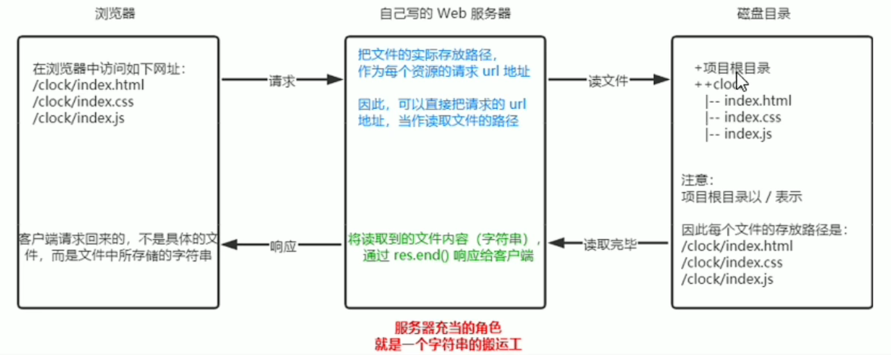
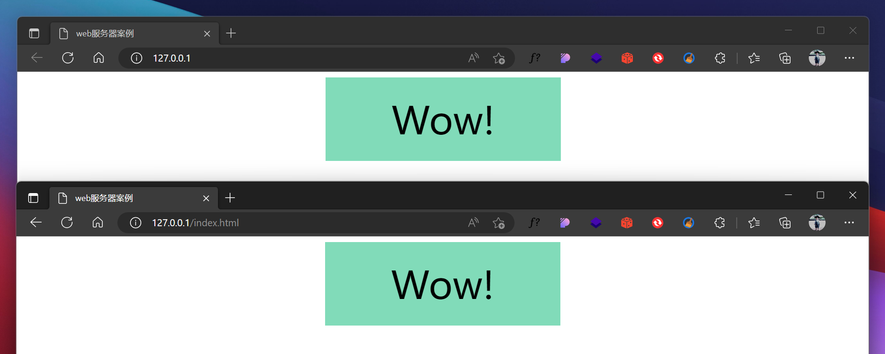

# http模块

> 原创内容，转载请注明出处！

# 一、什么是http模块

在网络节点中，负责消费资源的电脑，叫作“客服端”，负责对外提供网络资源的电脑，叫作“服务器”。

http 模块是 Node.js 官方提供的，用来创建 Web 服务器的模块。通过 http 模块提供的`http.createServer()`方法，就能方便的把一台普通的电脑，变成一台 Web 服务器，从而对外提供 Web 资源服务。

如果要希望使用 http 模块创建 Web 服务器，则需要先导入它：

```javascript
const http = require('http');
```

# 二、进一步了解http模块的作用

服务器和普通电脑的区别在于，服务器上安装了 web 服务器软件，例如：IIS、Apache、Nginx 等。通过安装这些服务器软件，就能把一台普通的电脑变成一台 web 服务器。

在 Node.js 中，我们不需要使用 IIS、Apache、Nginx 等这些第三方 web 服务器软件。因为我们可以基于 Node.js 提供的 http 模块，通过几行简单的代码，就能轻松的手写一个服务器软件，从而对外提供 web 服务。

# 三、服务器相关的概念

## 3.1 IP地址

IP 地址就是互联网上每台计算机的唯一地址，因此 IP 地址具有唯一性，只有在知道对方的 IP 地址的前提下，才能与对应的电脑之间进行数据通信。

IP 地址的格式：通常使用“点分十进制”表示成（a.b.c.d）的形式，其中，a,b,c,d 都是 0~255 之间的十进制整数。例如：用点分十进制表示的 IP 地址（192.168.1.1）

> 在开发期间，自己的电脑既是一台服务器，也是一个客服端，为了方便测试，默认规定 127.0.0.1 这个 IP 地址为本机地址，也就是本机作为服务器时的地址。

 ## 3.2 域名和域名服务器

尽管 IP 地址能够唯一标记网络上的计算机，但 IP 地址是一长串数字，不直观，而且不便于记忆，于是人们又发明了另外一套字符型的地址方案，即所谓的域名（Domain Name）地址。

IP 地址和域名是一一对应的关系，这份对应关系存在一种叫作“域名服务器”（DNS，Domain name server）的电脑中，使用者只需通过好记的域名访问对应的服务器即可，对应的转换工作由域名服务器实现。因此，域名服务器就是提供 IP 地址和域名之间的转换服务的服务器。

> `127.0.0.1`对应的域名是`localhost`，它们都代表：本机。

## 3.3 端口号

如果把计算机比喻成一栋大楼，那么计算机中的端口号就好像是每户的门牌号一样。

同样的道理，在一台电脑中，可以运行成白上千个 web 服务，每个 web 服务都对应一个唯一的端口号。客户端发送过来的网络请求，通过端口号，可以被准确地交给对应的 web 服务进行处理。

注意：

- 每个端口号不能同时被多个 web 服务占用
- 在实际应用中，URL 中的 80 端口可以被省略

# 四、创建最基本的web服务器

## 4.1 创建web服务器的基本步骤

1. 导入 http 模块
2. 创建 web 服务器实例
3. 为服务器实例绑定 request 实际，监听客户端的请求
4. 启动服务器

 步骤1 - 导入 http 模块

```javascript
const http = require('http');
```

步骤2 - 创建 web 服务器实例

```javascript
// 调用 http.createServer() 方法，即可快速创建一个 web 服务器实例
const server = http.createServer();
```

步骤3 - 为服务器实例绑定 request 事件

```javascript
// 为服务器实例绑定 request 事件，即可监听客户端发送过来的网络请求：
// 使用服务器实例的 .on() 方法绑定事件，为服务器绑定一个 request 事件
server.on('request', (req, res) => {
    // 只要客户端来请求服务器，就会触发 request 事件，从而调用这个事件处理回调函数
    console.log('Someone visit our web server.')
})
```

步骤4 - 启动服务器

```javascript
// 调用服务器实例的 .listen() 方法，即可启动当前的 web 服务器实例：
// 调用 server.listen(端口号, 回调函数) 方法，即可启动 web 服务器
server.listen(80, () => {
    console.log('http server running at http://127.0.0.1');
})
```

## 4.2 创建web服务器案例

```javascript
const http = require('http');

const server = http.createServer();

server.on('request', (req, res) => {
    console.log('Someone visit our web server.')
})

server.listen(8080, () => {
    console.log('http server running at http://127.0.0.1:8080');
})
```

运行结果：


可见，一个最基本的 web 服务器就成功运行了！我们点击这个 URL 用浏览器（客服端）进行访问：


web 服务器成功接收到了客服端（浏览器）的请求，并在控制台打印 Someone visit our web server. ，而浏览器窗口之所以一直处于加载中，那时因为目前 web 服务器并没有响应任何数据给客服端（浏览器）。

 ## 4.3 req请求对象

req（request【请求】）

只要服务器接收到了客户端的请求，就会调用通过`server.on()`为服务器绑定的`request`事件处理函数。

如果想要在事件处理函数中，访问与客户端相关的数据或属性，可以使用如下方式：

```javascript
server.on('request', (req) => {
    // req 是请求对象，它包含了与客户端相关的数据和属性，例如：
    // req.url 是客户端请求的 URL 地址
    // req.method 是客户端的 method 请求类型
    const str = `Your request url is ${req.url}, and request method is ${req.method}`;
    console.log(str);
})
```

现在来看实际演示：

```javascript
const http = require('http');

const server = http.createServer();

server.on('request', (req) => {
    // req 是请求对象，它包含了与客户端相关的数据和属性，例如：
    // req.url 是客户端请求的 URL 地址
    // req.method 是客户端的 method 请求类型
    const str = `Your request url is ${req.url}, and request method is ${req.method}`;
    console.log(str);
})

server.listen(80, () => {
    console.log('http server running at http://127.0.0.1');
})
```

运行代码，我们在浏览器地址栏中输入 127.0.0.1：


可见，此时客户端请求的 URL 是根路径（/），请求方式是 GET（浏览器地址栏都是 GET 方式）。

我们在浏览器地址栏中输入 127.0.0.1/index.html：


可见，此时客户端请求的 URL 是（/index.html），请求方式是 GET。

下面，我们利用 Apifox、Postman 等这些 API 请求工具来测试 POST 请求方式：

> Apifox、Postman 这些都是目前最火热的 API 请求工具，其中 Postman 是全世界最出名的 API 请求工具，Apifox 是近几年国产的一款功能丰富的 API 请求工具，这里推荐直接使用 Apifox，因为支持中文，功能丰富和强大，界面友好，且免费！


可见，此时客户端请求的 URL 是（/about.html），请求方式是 POST。

## 4.4 res响应对象

在服务器的 request 事件处理函数中，如果想响应与服务器相关的数据或属性，可以使用如下的方式：

```javascript
server.on('request', (req, res) => {
    // res 是响应对象，它包含了与服务器相关的数据和属性，例如：
    // 要发送（响应）到客服端的字符串
    const str = `Your request url is ${req.url}, and request method is ${req.method}`;
    // res.end() 方法的作用：
    // 向客户端发送指定的内容，并结束这次请求的处理过程
    res.end(str);
})
```

现在来看实际演示：

```javascript
const http = require('http');

const server = http.createServer();

server.on('request', (req, res) => {
    const str = `Your request url is ${req.url}, and request method is ${req.method}`;
    res.end(str);
})

server.listen(80, () => {
    console.log('http server running at http://127.0.0.1');
})
```

运行代码，我们在浏览器地址栏中输入 127.0.0.1：


利用 Apifox 进行 POST 测试：


## 4.5 解决中文乱码问题

当调用 res.end() 方法，向客户端发送中文内容的时候，会出现乱码问题，此时，需要手动设置内容的编码格式：

乱码情况：

```javascript
server.on('request', (req, res) => {
    // 发送（响应）包含中文的内容
    const str = `您请求的 url 地址是 ${req.url}, 请求的 method 类型是 ${req.method}`;
    res.end(str);
})
```


解决方案：

```javascript
server.on('request', (req, res) => {
    // 发送（响应）包含中文的内容
    const str = `您请求的 url 地址是 ${req.url}, 请求的 method 类型是 ${req.method}`;
    // 为了防止中文显示乱码的问题，需要利用 .setHeader() 方法设置响应头 Content-Type 的值为 text/html; charset=utf-8
    res.setHeader('Content-Type', 'text/html; charset=utf-8');
    res.end(str);
})
```


## 4.6 根据不同的url响应不同的内容

核心实现步骤：

1. 获取请求的 url 地址
2. 设置默认的响应内容为 404 Not found
3. 判读用户请求的是否为 / 或 /index.html 首页
4. 判断用户请求的是否为 /about.html 关于页面
5. 设置 Content-Type 响应头，防止中文乱码
6. 使用 res.end() 把内容响应给客户端

实现代码：

```javascript
const http = require('http');

const server = http.createServer();

server.on('request', (req, res) => {
    // 获取请求的 url 地址
    const url = req.url;
    // 设置默认的内容为 404 Not found
    let content = '<h1>404 Not found!</h1>';
    if (url === '/' || url === '/index.html') {
        // 客户端请求的是首页
        content = '<h1>首页</h1>';
    } else if (url === '/about.html') {
        // 客户端请求的是关于页面
        content = '<h1>关于页面</h1>';
    }
    // 设置 Content-Type 响应头，防止中文乱码
    res.setHeader('Content-Type', 'text/html; charset=utf-8');
    // 使用 res.end() 把内容响应给客户端
    res.end(content);
})

server.listen(80, () => {
    console.log('http server running at http://127.0.0.1');
})
```

测试：


# 五、web服务器案例


在 node/web 路径下有三个网页文件，我们的目标就是实现一个 Node.js 服务器来运行这个网页。

**核心思路**

把文件的实际存放路径，作为每个资源的请求 url 地址。

下图展示了这种思路的一个基本原理及流程。



**实现代码**

```javascript
// 导入 http 模块
const http = require('http');
// 导入 fs 模块
const fs = require('fs');
// 导入 path 模块
const path = require('path');

// 创建 web 服务器
const server = http.createServer()

// 监听 web 服务器的 request 事件
server.on('request', (req, res) => {
    // 获取到客户端请求的 url 地址
    const url = req.url;
    // 把请求的 url 地址映射为具体的文件存放路径
    const fpath = path.join(__dirname, url);

    // 根据映射过来的文件路径读取文件的内容
    fs.readFile(fpath, 'utf8', (err, dataStr) => {
        // 读取失败，向客户端响应固定的错误信息
        if (err) {
            return res.end('404 Not Found.');
        }
        // 读取成功，将读取到的内容响应给客服端
        res.end(dataStr);
    })
})

// 启动服务器
server.listen(80, () => {
    console.log('server running at http://127.0.0.1');
})
```

测试：


**思考：**我们刚才只处理了对 html 文件的访问，没有处理对 css 及 js 文件的访问，那 css 及 js 是如何响应过去的呢？

为了弄清楚这个问题，我们修改一下代码，打印一些信息：

```javascript
// 获取到客户端请求的 url 地址
const url = req.url;
// 把请求的 url 地址映射为具体的文件存放路径
console.log('--------------------------------------------');
console.log(url);
const fpath = path.join(__dirname, url);
console.log(fpath);
```

再次运行，访问 127.0.0.1/web/index.html，查看控制台：


```html
<!DOCTYPE html>
<html lang="en">
<head>
    <meta charset="UTF-8">
    <meta http-equiv="X-UA-Compatible" content="IE=edge">
    <meta name="viewport" content="width=device-width, initial-scale=1.0">
    <title>web服务器案例</title>
    <link rel="stylesheet" href="./index.css">
</head>
<body>
    <div class="wow" id="wow">Wow!</div>
    <script src="./index.js"></script>
</body>
</html>
```

解释：当访问 http://127.0.0.1/web/index.html 时，浏览器收到了服务器的响应，获得了 index.html 页面，浏览器在解析 index.html 页面时发现了该页面需要另外的 "./index.css" 以及 "./index.js"，所以浏览器会继续请求服务器来获取 css 及 js 文件，而请求的路径则是在原有路径 http://127.0.0.1/web 的基础上加上 "./index.css" 以及 "./index.js"，所以最终浏览器就以 http://127.0.0.1/web/index.css 及 http://127.0.0.1/web/index.js 的形式又请求了两次服务器（还有一次是请求浏览器窗口图标，暂时不用管）。

---

通常，考虑到用户访问的方便性以及系统安全性，我们以 127.0.0.1 及 127.0.0.1/index.html 代替 127.0.0.1/web/index.html，所以我们对代码进行资源请求路径的优化：

```javascript
// 导入 http 模块
const http = require('http');
// 导入 fs 模块
const fs = require('fs');
// 导入 path 模块
const path = require('path');

// 创建 web 服务器
const server = http.createServer()

// 监听 web 服务器的 request 事件
server.on('request', (req, res) => {
    // 获取到客户端请求的 url 地址
    const url = req.url;
    // 把请求的 url 地址映射为具体的文件存放路径
    // 优化资源的请求路径
    let fpath = '';
    if (url === '/') {
        fpath = path.join(__dirname, './web/index.html');
    } else {
        fpath = path.join(__dirname, '/web', url);
    }

    // 根据映射过来的文件路径读取文件的内容
    fs.readFile(fpath, 'utf8', (err, dataStr) => {
        // 读取失败，向客户端响应固定的错误信息
        if (err) {
            return res.end('404 Not Found.');
        }
        // 读取成功，将读取到的内容响应给客服端
        res.end(dataStr);
    })
})

// 启动服务器
server.listen(80, () => {
    console.log('server running at http://127.0.0.1');
})
```



