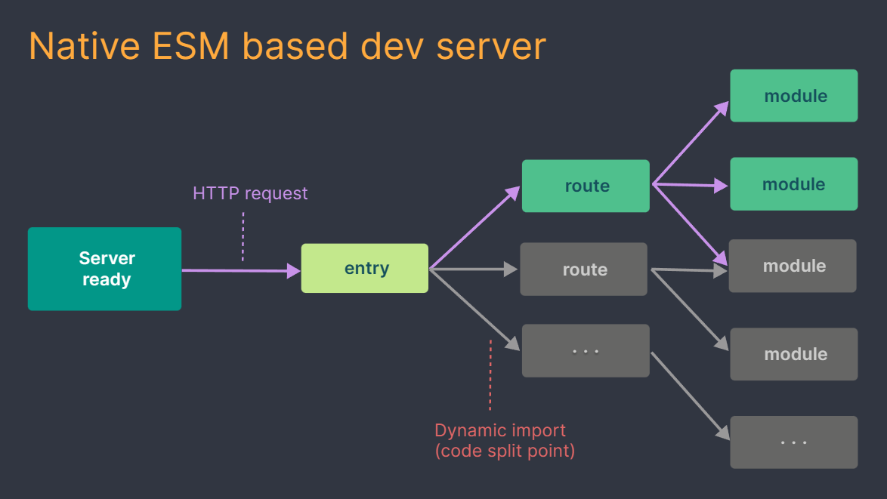
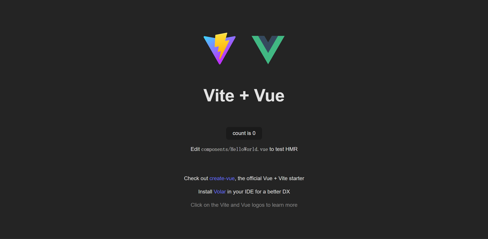
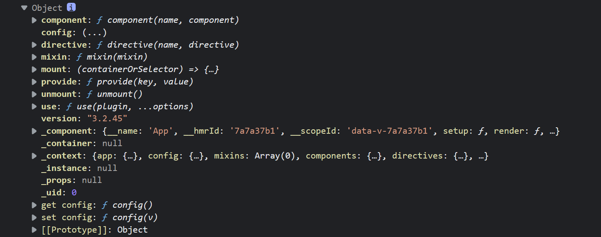
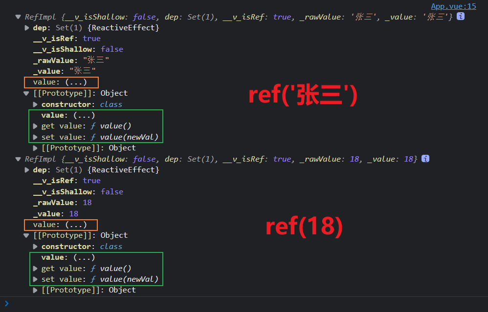

# Vue3 快速上手


> Vue3 改变较大，详细内容请一定结合[官网文档](https://cn.vuejs.org/)进行学习！

# 一、Vue3 简介

- 2020 年 9 月 18 日，Vue.js 发布 3.0 版本，代号：One Piece（海贼王）
- 耗时 2 年多、2600+ Commits、30+ RFCs、600+  pull requests、99 位贡献者
- GitHub 上的 tags 地址：https://github.com/vuejs/vue-next/releases/tag/v3.0.0
- 官网文档：[Vue.js - 渐进式 JavaScript 框架 | Vue.js (vuejs.org)](https://cn.vuejs.org/)

# 二、Vue3 带来了什么

【性能的提升】

- 打包大小减少 41%

- 初次渲染快 55%，更新渲染快 133%

- 内存减少 54%

  ......

【源码的升级】

- 使用 Proxy 代替 defineProperty 实现响应式

- 重写虚拟 DOM 的实现和 Tree-Shaking

  ......

【拥抱 TypeScript】

- Vue3 可以更好的支持 TypeScript

【新的特性】

- Composition API（组合式 API）

  - setup 配置

  - ref 与 reactive

  - watch 与 watchEffect

  - provide 与 inject

  - ......

- 新的内置组件

  - Fragment 

  - Teleport

  - Suspense

- 其他改变

  - 新的生命周期钩子

  - data 选项应始终被声明为一个函数
  - 移除 filter 过滤器

  - 移除 keyCode 支持作为 v-on 的修饰符

  - ......

# 三、创建 Vue3 工程

## 3.1 使用 Vue CLI 创建

官方文档：[创建一个项目 | Vue CLI (vuejs.org)](https://cli.vuejs.org/zh/guide/creating-a-project.html)

> 目前 Vue CLI 只处于维护阶段，Vue3 官方推荐使用 Vite！

```bash
# 查看 @vue/cli 版本，确保 @vue/cli 版本在 4.5.0 以上
vue --version
# 安装或者升级你的 @vue/cli
npm install -g @vue/cli
# 创建
vue create <project-name>
# 启动
cd <project-name>
npm run serve
```

## 3.2 使用 Vite 创建

【背景】

> 在浏览器支持 ES 模块之前，JavaScript 并没有提供原生机制让开发者以模块化的方式进行开发。 这也正是我们对 “打包” 这个概念熟悉的原因：使用工具抓取、处理并将我们的源码模块串联成可以在浏览器中运行的文件。
>
> 时过境迁，我们见证了诸如 [webpack](https://webpack.js.org/)、[Rollup](https://rollupjs.org/) 和 [Parcel](https://parceljs.org/) 等工具的变迁，它们极大地改善了前端开发者的开发体验。
>
> 然而，当我们开始构建越来越大型的应用时，需要处理的 JavaScript 代码量也呈指数级增长。 包含数千个模块的大型项目相当普遍。 基于 JavaScript 开发的工具就会开始遇到性能瓶颈：通常需要很长时间（甚至是几分钟！ ）才能启动开发服务器，即使使用了模块热替换（HMR），文件修改后的效果也需要几秒钟才能在浏览器中反映出来。 如此循环往复，迟钝的反馈会极大地影响开发者的开发效率和幸福感。
>
> 随着前端生态的发展，大量的浏览器开始原生支持 ES 模块，且越来越多 JavaScript 工具使用编译型语言编写，而 Vite 就是希望利用这些新成果来解决之前打包的问题。

官方文档：[快速上手 | Vue.js (vuejs.org)](https://cn.vuejs.org/guide/quick-start.html#creating-a-vue-application)

Vite官网：[Vite | 下一代的前端工具链 (vitejs.dev)](https://cn.vitejs.dev/)

- 什么是 Vite？—— 新一代前端构建工具。
- 优势如下：
  - 开发环境中，无需打包操作，可快速的冷启动
  - 轻量快速的热重载（HMR）
  - 真正的按需编译，不再等待整个应用编译完成
- 传统构建 与 Vite 构建对比图

传统打包方式：把所有文件都编译打包完，服务器才进入就绪状态……

Vite 打包方式：服务器直接进入就绪状态，请求哪部分页面就处理哪部分页面……

|  |  |
| ------------------------------------------------------------ | ------------------------------------------------------------ |

> 需要注意一下 Vite 的生产环境下打包是通过 Rollup 来完成的！
>
> > Rollup 是 JavaScript 的模块 bundler（打包器）
>
> 也就是说 Vite 提供的是开发环境中的编译，打包工作是依靠的 Rollup！

> 一些来自官网的说明：
>
> Vite 使用 [esbuild](https://esbuild.github.io/) [预构建依赖](https://cn.vitejs.dev/guide/dep-pre-bundling.html)。 esbuild 使用 Go 编写，并且比以 JavaScript 编写的打包器预构建依赖快 10-100 倍。
>
> Vite 以 [原生 ESM](https://developer.mozilla.org/en-US/docs/Web/JavaScript/Guide/Modules) 方式提供源码。 这实际上是让浏览器接管了打包程序的部分工作：Vite 只需要在浏览器请求源码时进行转换并按需提供源码。 根据情景动态导入代码，即只在当前屏幕上实际使用时才会被处理。
>
> 为什么生产环境仍需打包？
>
> 尽管原生 ESM 现在得到了广泛支持，但由于嵌套导入会导致额外的网络往返，在生产环境中发布未打包的 ESM 仍然效率低下（即使使用 HTTP/2）。 为了在生产环境中获得最佳的加载性能，最好还是将代码进行 tree-shaking、懒加载和 chunk 分割（以获得更好的缓存）。
>
> 要确保开发服务器和生产环境构建之间的最优输出和行为一致并不容易。 所以 Vite 附带了一套 [构建优化](https://cn.vitejs.dev/guide/features.html#build-optimizations) 的 [构建命令](https://cn.vitejs.dev/guide/build.html)，开箱即用。
>
> 为何不用 ESBuild 打包？
>
> 虽然 快得惊人，并且已经是一个在构建库方面比较出色的工具，但一些针对构建 *应用* 的重要功能仍然还在持续开发中 —— 特别是代码分割和 CSS 处理方面。 就目前来说，Rollup 在应用打包方面更加成熟和灵活。 尽管如此，当未来这些功能稳定后，我们也不排除使用 作为生产构建器的可能。
>
> > 特别强调：Vite 是建立在原生支持 ES 模块的浏览器上的，这也是 Vite 为什么能快的核心原因！所以对于兼容性要求比较高的项目来说，暂时还是建议用 Vue CLI，虽然 Vite 也提供了针对 ES5 浏览器的兼容性配置方法。不过话说回来，Vite 不出意外应该是不远未来的趋势！

```shell
# 安装并执行 create-vue，它是 Vue 官方的项目脚手架工具
npm init vue@latest

# 项目初始化配置
Need to install the following packages:
  create-vue@3.5.0
Ok to proceed? (y) y

Vue.js - The Progressive JavaScript Framework

√ Project name: ... <project-name>
√ Add TypeScript? ... No / Yes
√ Add JSX Support? ... No / Yes
√ Add Vue Router for Single Page Application development? ... No / Yes
√ Add Pinia for state management? ... No / Yes
√ Add Vitest for Unit Testing? ... No / Yes
√ Add an End-to-End Testing Solution? » No
√ Add ESLint for code quality? ... No / Yes

Scaffolding project in F:\Vue\Vue3\<project-name>...

Done. Now run:

  cd <project-name>
  npm install
  npm run dev
  
# 进入项目
cd <project-name>

# 安装依赖
npm install

# 运行（开发环境）
npm run dev

# 打包
npm run build

# 直接在本地测试打包好的应用（为 dist 文件夹启动一个静态 Web 服务器）
npm run preview
```

> 项目初始化配置说明：
>
> - 项目名称：`<project-name>`（项目名称）
>
> - 添加 TypeScript？（Vue3 对 TS 支持非常好！以后建议利用 TS 开发）
>
> - 添加 JSX 支持？（JSX 是 JavaScript 的一种语法扩展）
>
> - 为单页应用程序开发添加 Vue Router？（单页应用必选）
>
> - 添加 Pinia 进行状态管理？（Pinia 是 Vue 官方出品的类似与 Vuex 的新一代状态管理工具）
>
> - 添加 Vitest 进行单元测试？（由 Vite 提供支持的极速单元测试框架）
>
> - 添加端到端测试解决方案？
>
> - 添加 ESLint 以提高代码质量？（未来开发实际项目，推荐用 ESLint 约束代码质量）

`npm run dev`：

  VITE v4.0.4  ready in 607 ms

  ➜  Local:   http://localhost:5173/
  ➜  Network: use --host to expose
  ➜  press h to show help


也可以通过这种方式创建：

- `npm create vite@latest <project-name> -- --template vue`（JS 版本）
- `npm create vite@latest <project-name> -- --template vue-ts`（TS 版本）



Vite 基本项目结构：

- `node_modules`：项目依赖包目录
- `public`：项目公用文件
  - `favicon.ico`：网站标签栏小图标
- `src`：源文件目录
  - `assets`：静态文件目录（图标、图片、视频……）
  - `components`：自定义组件目录
  - `App.vue`：项目的根组件
  - `main.js`：项目入口文件
- `.gitignore`：Git 管理配置文件（设置那些目录或文件不管理）
- `index.html`：项目的默认首页（Vue 的组件需要挂载到这个文件上）
- `package-lock.json`：项目包的锁定文件（用于防止包版本不一样导致的错误）
- `package.json`：项目配置文件（项目名称、版本、命令、包管理……）
- `vite.config.js`：Vite 配置文件

> 注意：以上结构是最基础的 Vite + Vue3 项目结构，如果创建项目时我们选择了其他配置项，那么项目结构还会有其他文件，比如：我们选择了 TypeScript，那么项目根目录会出现 `tsconfig.json`  等文件，如果我们选择了 Vue Router，那么 src 目录下还会有 `router` 及 `views` 文件夹，如果我们选择了 ESLint，那么项目根目录会出现 `.eslintrc.cjs` 文件……

【Vite + Vue3 对 TypeScript、CSS、JSON、Sass、Less 的支持】

- TypeScript

在 `<script>` 标签中加入 `lang=ts` 就可以了……

```vue
<script lang="ts">
// ...
</script>
```

- CSS 直接引入

在 `.vue` 及 `.js` `.ts` 文件中，可以直接使用 `import` 进行引入 CSS 文件……

```js
import './assets/main.css'
```

> 其中，在 App.vue 及 main.js 中引入的 CSS 将会全局生效！

- JSON 直接引入

在 `.vue` 及 `.js` `.ts` 文件中，还支持 JSON 文件的引入，方法和引入 CSS 一样……

```js
import users from './assets/users.json'
```

- Sass、Less

Vite 推荐原生 CSS（因为 Vite 就是建立在现代浏览器上），不过也内置支持了 Sass、Less（不需要安装插件，只需要有预处理器依赖），安装了预处理器依赖后直接在 `<style>` 标签中加入 `lang=""` 即可……

安装预处理器：`npm i sass -D`、`npm i less -D`

```vue
<style lang="scss">
</style>
----------------------------
<style lang="less">
</style>
```

## 3.3 Vue3 结构变化

main.js 文件：

```js
// 引入的不再是 Vue 构造函数了，而是一个名为 createApp 的工厂函数
import { createApp } from 'vue';
import App from './App.vue';
import router from './router';

// 支持引入 CSS 文件（此处全局生效）
import './assets/main.css';

// 创建应用实例对象（类似 Vue2 中的 vm，但比 vm 更“轻”）
// “轻”：更少、更精简、更合理、更高效的属性和方法（见图）
const app = createApp(App);

app.use(router);

// 挂载到 index.html 中的 #app 上
app.mount('#app');
// 对应的还有一个 unmount 卸载方法
```



App.vue 文件：

```vue
<!-- Vue3 中，官方推荐将 script 放在 .vue 文件最上方，因为 js/ts 是操作频率最高的部分，且 结构 与 样式 在一块更合理 -->
<script setup>
<!-- <script setup> 是 Vue3 组合式 API 写法中 setup 函数的语法糖（帮助开发者省略 return 步骤）-->
<!-- 截止至 2021-07-16 ，<script setup> 方案已在 Vue3.2.0-beta.1 版本中脱离实验状态，正式进入 Vue3 的队伍，在新的版本中已经可以作为一个官方标准的开发方案使用（但初期仍需注意与开源社区的项目兼容性问题，特别是 UI 框架）-->
import { RouterLink, RouterView } from 'vue-router';
import HelloWorld from './components/HelloWorld.vue';
</script>

<!-- Vue3 中，template 内不再需要一个根标签包裹 -->
<template>
    <header>
        

        <div class="wrapper">
            <HelloWorld msg="You did it!" />

            <nav>
                <RouterLink to="/">Home</RouterLink>
                <RouterLink to="/about">About</RouterLink>
            </nav>
        </div>
    </header>

    <RouterView />
</template>

<style scoped>
/* ... */
</style>
```

# 四、常用 Composition API

官方说明：[组合式 API 常见问答 | Vue.js (vuejs.org)](https://cn.vuejs.org/guide/extras/composition-api-faq.html)

官网文档：[Vue.js - 渐进式 JavaScript 框架 | Vue.js (vuejs.org)](https://cn.vuejs.org/)

## 4.1 拉开序幕的 setup

1. 理解：Vue3 中一个新的配置项，值为一个函数。
2. setup 是所有 <strong style="color:#DD5145">Composition API（组合API）</strong><i style="color:gray;font-weight:bold">“ 表演的舞台 ”</i>。
4. 组件中所用到的：数据、方法、计算属性、监视属性、生命周期钩子等，均要配置在 setup 中！
5. setup 函数的两种返回值：
   1. 若返回一个对象，则对象中的属性、方法在模板中均可以直接使用（重点关注！）
   2. 若返回一个渲染函数：则可以自定义渲染内容（了解即可）
6. 注意点：
   1. 尽量不要与 Vue2 配置混用
      - Vue2 配置（data、methos、computed...）中 <strong style="color:#DD5145">可以访问到</strong> setup 中的属性、方法！
      - 但在 setup 中 <strong style="color:#DD5145">不能访问到</strong> Vue2 配置（data、methos、computed...）
      - 如果有重名的属性和方法，setup 优先！
   
      - 实际上 Vue2 之前的写法在 Vue3 中称为：**选项式 API**，而 setup 函数的写法在 Vue3 中称为：**组合式 API**，目前 Vue3 两种写法都支持！但请不要混用两种写法！并且，选项式 API 其实是组合式 API 的封装，选项式 API 对于初学者比较友好，但是组合式 API 更加自由，也需要你对 Vue 的响应式系统有更深的理解才能高效使用。相应的，它的灵活性也使得组织和重用逻辑的模式变得更加强大。官网推荐在低复杂度的场景中可以用选项式 API（例如渐进增强的应用场景），当你打算用 Vue 构建完整的单页应用，推荐采用组合式 API + 单文件组件。
   2. setup 不能是一个 async 函数，因为返回值将不再是普通 return 的对象, 而是 Promise，模板看不到 return 对象中的属性！（后期也可以返回一个 Promise 实例，但需要 Suspense 和异步组件的配合）

```vue
<!-- App.vue -->
<script>
export default {
    name: 'App',
    setup() {
        // 数据
        let name = '张三';
        let age = 18;

        // 方法
        function sayHello() {
            alert(`我叫 ${name}，我 ${age} 岁了……`);
        }

        // 返回对象（对象里的内容可以在模板中直接使用）
        return {
            name,
            age,
            sayHello
        };

        // 返回渲染函数（了解即可）
        // 前提：import {h} from 'vue'
        // 渲染内容会替换模板中的全部内容
        // return h('h1', '尚硅谷');
    }
};
</script>

<template>
    <h1>个人信息</h1>
    <h2>姓名：{{ name }}</h2>
    <h2>年龄：{{ age }}</h2>
    <button @click="sayHello">说话</button>
</template>

<style scoped></style>
```

##  4.2 ref 函数

- 作用：定义一个响应式的数据
- 语法：```const ref对象 = ref(源值)``` 
  - 创建一个包含响应式数据的 <strong style="color:#DD5145">ref 对象（RefImpl 对象【Reflmpl：reference 引用 + implement 实现】，即：引用实现对象，我们通常简称 ref 对象）</strong>
  - JS 中操作数据： ```ref对象.value```
  - 模板中读取数据：不需要 `.value`，直接：```<div>{{xxx}}</div>```
- 备注：
  - 接收的数据可以是：基本类型、也可以是对象类型。
  - 基本类型的数据：响应式依然是靠 `Object.defineProperty()` 的 `get` 与 `set` 来实现。
  - 对象类型的数据（包括数组）：内部属性（元素）的响应式<i style="color:gray;font-weight:bold">“ 求助 ”</i> 了 Vue3 中的一个新函数 `reactive` 来实现。
  - 对象类型的数据（包括数组）在操作其内部属性（元素）时不用加 `.value`。

**setup 中普通的数据和函数的修改只会在内存中完成，不会带有响应式！**

```vue
<!-- App.vue -->
<script>
export default {
    name: 'App',
    setup() {
        // 数据
        let name = '张三';
        let age = 18;

        // 方法
        function changeInfo() {
            name = '李四';
            age = 81;
            console.log(`${name}：${age}`);
        }

        // 返回对象（对象里的内容可以在模板中直接使用）
        return {
            name,
            age,
            changeInfo
        };
    }
};
</script>

<template>
    <h1>个人信息</h1>
    <h2>姓名：{{ name }}</h2>
    <h2>年龄：{{ age }}</h2>
    <button @click="changeInfo">修改信息</button>
</template>

<style scoped></style>
```


我们需要借助 `ref` 函数定义响应式数据（也包含对象和数组），利用 `.value` 在 JS 中操作数据，其中对象和数组的内部属性和元素不需要使用 `.value`！模板中可以直接使用数据不需要 `.value`！

```vue
<!-- App.vue -->
<script>
import { ref } from 'vue';
export default {
    name: 'App',
    setup() {
        // 数据
        let name = ref('张三');
        let age = ref(18);

        // 方法
        function changeInfo() {
            name.value = '李四';
            age.value = 81;
        }

        // 返回对象（对象里的内容可以在模板中直接使用）
        return {
            name,
            age,
            changeInfo
        };
    }
};
</script>

<template>
    <h1>个人信息</h1>
	<!-- 模板中不需要 .value，Vue3 会帮我们自动检测并加工 -->
    <h2>姓名：{{ name }}</h2>
    <h2>年龄：{{ age }}</h2>
    <button @click="changeInfo">修改信息</button>
</template>

<style scoped></style>
```

注意：`ref()` 返回的是一个 RefImpl 的实例对象！

橙色框的 value 就类似 Vue2 中 vm 上的数据，绿色框的 value 就类似与 Vue2 中 _data 上的数据，而且这里巧妙的把绿色框的 value 放在了原型对象上，这样橙色框的 value 找不到就会自动去找绿色款（原型对象）上的 value，所以橙色框的 value 不需要有 get set（从这个角度就可以看出 Vue3 的先进之处）！



## 4.3 reactive 函数

- 作用：定义一个 <strong style="color:#DD5145">对象类型</strong>（包括数组）的响应式数据（基本类型不要用它，要用 `ref` 函数）
- 语法：`const 代理对象 = reactive(源对象)` 接收一个对象（或数组），返回一个 <strong style="color:#DD5145">代理对象（Proxy 的实例对象，简称 proxy 对象）</strong>
- reactive 定义的响应式数据是 “深层次的”！
- 内部基于 ES6 的 Proxy 实现，通过代理对象操作源对象内部数据。

## 4.4 Vue3 中的响应式原理

### Vue2 的响应式

- 实现原理：
  - 对象类型：通过 `Object.defineProperty()` 对属性的读取、修改进行拦截（数据劫持）。
  
  - 数组类型：通过重写更新数组的一系列方法来实现拦截。（对数组的变更方法进行了包裹）。
  
    ```js
    Object.defineProperty(data, 'count', {
        get() {}, 
        set() {}
    });
    ```

- 存在问题：
  - 新增属性、删除属性, 界面不会更新。
  - 直接通过下标修改数组, 界面不会自动更新。

### Vue3 的响应式

- 实现原理：
  - 通过 Proxy（代理）:  拦截对象中任意属性的变化，包括：属性值的读写、属性的添加、属性的删除等。
  - 通过 Reflect（反射）:  对源对象的属性进行操作。
  - MDN 文档中描述的 Proxy 与 Reflect：
    - Proxy：https://developer.mozilla.org/zh-CN/docs/Web/JavaScript/Reference/Global_Objects/Proxy
    
    - Reflect：https://developer.mozilla.org/zh-CN/docs/Web/JavaScript/Reference/Global_Objects/Reflect
    
      ```js
      new Proxy(data, {
      	// 拦截读取属性值
          get (target, prop) {
          	return Reflect.get(target, prop);
          },
          // 拦截设置属性值或添加新属性
          set (target, prop, value) {
          	return Reflect.set(target, prop, value);
          },
          // 拦截删除属性
          deleteProperty (target, prop) {
          	return Reflect.deleteProperty(target, prop);
          }
      });
      
      proxy.name = 'tom';   
      ```

## 4.5 reactive 对比 ref

-  从定义数据角度对比：
   -  ref 用来定义：<strong style="color:#DD5145">基本类型数据</strong>。
   -  reactive 用来定义：<strong style="color:#DD5145">对象（或数组）类型数据</strong>。
   -  备注：ref 也可以用来定义 <strong style="color:#DD5145">对象（或数组）类型数据</strong>，它内部会自动通过 `reactive` 转为 <strong style="color:#DD5145">代理对象</strong>。
-  从原理角度对比：
   -  ref 通过 `Object.defineProperty()` 的 `get` 与 `set` 来实现响应式（数据劫持）。
   -  reactive 通过使用 <strong style="color:#DD5145">Proxy</strong> 来实现响应式（数据劫持），并通过 <strong style="color:#DD5145">Reflect</strong> 操作 <strong style="color:orange">源对象</strong> 内部的数据。
-  从使用角度对比：
   -  ref 定义的数据：操作数据 <strong style="color:#DD5145">需要</strong> `.value`，读取数据时模板中直接读取<strong style="color:#DD5145">不需要</strong> `.value`。
   -  reactive 定义的数据：操作数据与读取数据 <strong style="color:#DD5145">均不需要</strong> `.value`。

## 4.6 setup 的两个注意点

- setup 执行的时机
  - 在 beforeCreate 之前执行一次，this 是 undefined。
  
- setup 的参数
  - props：值为对象，包含：组件外部传递过来，且组件内部声明接收了的属性。
  - context：上下文对象
    - attrs：值为对象，包含：组件外部传递过来，但没有在 props 配置中声明的属性，相当于 ```this.$attrs```。
    - slots：收到的插槽内容，相当于 ```this.$slots```。
    - emit：分发自定义事件的函数，相当于 ```this.$emit```。


## 4.7 计算属性与监视

### computed 函数

- 与 Vue2 中 computed 配置功能一致

- 写法

  ```js
  import {computed} from 'vue';
  
  setup() {
      ...
  	// 计算属性——简写
      let fullName = computed(() => {
          return person.firstName + '-' + person.lastName;
      });
      // 计算属性——完整
      let fullName = computed({
          get() {
              return person.firstName + '-' + person.lastName;
          },
          set(value) {
              const nameArr = value.split('-');
              person.firstName = nameArr[0];
              person.lastName = nameArr[1];
          }
      });
  }
  ```

### watch 函数

- 与 Vue2 中 watch 配置功能一致

- 两个小 “坑”：

  - 监视 reactive 定义的响应式数据时：oldValue 无法正确获取、强制开启了深度监视（deep 配置失效）。
  - 监视 reactive 定义的响应式数据中某个属性时：deep 配置有效。
  
  ```js
  // 情况一：监视ref定义的响应式数据
  watch(sum, (newValue, oldValue) => {
  	console.log('sum变化了', newValue, oldValue);
  }, {immediate: true});
  
  // 情况二：监视多个ref定义的响应式数据
  watch([sum, msg], (newValue, oldValue) => {
  	console.log('sum或msg变化了', newValue, oldValue);
  });
  
  /* 
  	情况三：监视reactive定义的响应式数据
  			若watch监视的是reactive定义的响应式数据，则无法正确获得oldValue！！
  			若watch监视的是reactive定义的响应式数据，则强制开启了深度监视 
  */
  watch(person, (newValue, oldValue) => {
  	console.log('person变化了', newValue, oldValue);
  }, {immediate: true, deep: false});	// 此处的deep配置不再奏效
  
  // 情况四：监视reactive定义的响应式数据中的某个属性
  watch(() => person.job, (newValue, oldValue) => {
  	console.log('person的job变化了', newValue, oldValue);
  }, {immediate: true, deep: true}); 
  
  // 情况五：监视reactive定义的响应式数据中的某些属性
  watch([() => person.job, () => person.name], (newValue, oldValue) => {
  	console.log('person的job变化了', newValue, oldValue);
  }, {immediate: true, deep: true});
  
  // 特殊情况
  watch(() => person.job, (newValue, oldValue) => {
      console.log('person的job变化了', newValue, oldValue);
  },{deep: true}); // 此处由于监视的是reactive素定义的对象中的某个属性，所以deep配置有效
  ```

### watchEffect 函数

- watch 的套路是：既要指明监视的属性，也要指明监视的回调。

- watchEffect 的套路是：不用指明监视哪个属性，监视的回调中用到哪个属性，那就监视哪个属性。

- watchEffect 有点像 computed：

  - 但 computed 注重的计算出来的值（回调函数的返回值），所以必须要写返回值。
  - 而 watchEffect 更注重的是过程（回调函数的函数体），所以不用写返回值。

  ```js
  // watchEffect所指定的回调中用到的数据只要发生变化，则直接重新执行回调。
  watchEffect(() => {
      const x1 = sum.value;
      const x2 = person.age;
      console.log('watchEffect配置的回调执行了');
  });
  ```

## 4.8 生命周期

- Vue3 中可以继续使用 Vue2 中的生命周期钩子，但有有两个被更名：
  - `beforeDestroy` 改名为 `beforeUnmount`
  - `destroyed` 改名为 `unmounted`
- Vue3 也提供了 Composition API 形式的生命周期钩子，与 Vue2 中钩子对应关系如下：
  - `beforeCreate` ===> `setup()`
  - `created` =======> `setup()`
  - `beforeMount` ===> `onBeforeMount`
  - `mounted` =======> `onMounted`
  - `beforeUpdate` ===> `onBeforeUpdate`
  - `updated` =======> `onUpdated`
  - `beforeUnmount` ==> `onBeforeUnmount`
  - `unmounted` =====> `onUnmounted`

## 4.10 自定义 hook 函数

- 什么是 hook？—— 本质是一个函数，把 setup 函数中使用的 Composition API 进行了封装。

- 类似于 vue2 中的 mixin。

- 自定义 hook 的优势：复用代码，让 setup 中的逻辑更清楚易懂。

## 4.11 toRef

- 作用：创建一个 ref 对象，其 value 值指向另一个对象中的某个属性
- 语法：`const name = toRef(person, 'name')`
- 应用:   要将响应式对象中的某个属性单独提供给外部使用时


- 扩展：`toRefs` 与 `toRef` 功能一致，但可以批量创建多个 ref 对象，语法：`toRefs(person)`


# 五、其它 Composition API

## 1.shallowReactive 与 shallowRef

- shallowReactive：只处理对象最外层属性的响应式（浅响应式）。
- shallowRef：只处理基本数据类型的响应式, 不进行对象的响应式处理。

- 什么时候使用?
  -  如果有一个对象数据，结构比较深, 但变化时只是外层属性变化 ===> shallowReactive。
  -  如果有一个对象数据，后续功能不会修改该对象中的属性，而是生新的对象来替换 ===> shallowRef。

## 2.readonly 与 shallowReadonly

- readonly: 让一个响应式数据变为只读的（深只读）。
- shallowReadonly：让一个响应式数据变为只读的（浅只读）。
- 应用场景: 不希望数据被修改时。

## 3.toRaw 与 markRaw

- toRaw：
  - 作用：将一个由```reactive```生成的<strong style="color:orange">响应式对象</strong>转为<strong style="color:orange">普通对象</strong>。
  - 使用场景：用于读取响应式对象对应的普通对象，对这个普通对象的所有操作，不会引起页面更新。
- markRaw：
  - 作用：标记一个对象，使其永远不会再成为响应式对象。
  - 应用场景:
    1. 有些值不应被设置为响应式的，例如复杂的第三方类库等。
    2. 当渲染具有不可变数据源的大列表时，跳过响应式转换可以提高性能。

## 4.customRef

- 作用：创建一个自定义的 ref，并对其依赖项跟踪和更新触发进行显式控制。

- 实现防抖效果：

  ```vue
  <template>
  	<input type="text" v-model="keyword">
  	<h3>{{keyword}}</h3>
  </template>
  
  <script>
  	import {ref,customRef} from 'vue'
  	export default {
  		name:'Demo',
  		setup(){
  			// let keyword = ref('hello') //使用Vue准备好的内置ref
  			//自定义一个myRef
  			function myRef(value,delay){
  				let timer
  				//通过customRef去实现自定义
  				return customRef((track,trigger)=>{
  					return{
  						get(){
  							track() //告诉Vue这个value值是需要被“追踪”的
  							return value
  						},
  						set(newValue){
  							clearTimeout(timer)
  							timer = setTimeout(()=>{
  								value = newValue
  								trigger() //告诉Vue去更新界面
  							},delay)
  						}
  					}
  				})
  			}
  			let keyword = myRef('hello',500) //使用程序员自定义的ref
  			return {
  				keyword
  			}
  		}
  	}
  </script>
  ```


## 5.provide 与 inject

- 作用：实现<strong style="color:#DD5145">祖与后代组件间</strong>通信

- 套路：父组件有一个 `provide` 选项来提供数据，后代组件有一个 `inject` 选项来开始使用这些数据

- 具体写法：

  1. 祖组件中：

     ```js
     setup(){
     	......
         let car = reactive({name:'奔驰',price:'40万'})
         provide('car',car)
         ......
     }
     ```

  2. 后代组件中：

     ```js
     setup(props,context){
     	......
         const car = inject('car')
         return {car}
     	......
     }
     ```

## 6.响应式数据的判断

- isRef: 检查一个值是否为一个 ref 对象
- isReactive: 检查一个对象是否是由 `reactive` 创建的响应式代理
- isReadonly: 检查一个对象是否是由 `readonly` 创建的只读代理
- isProxy: 检查一个对象是否是由 `reactive` 或者 `readonly` 方法创建的代理

# 六、Composition API 的优势

## 1.Options API 存在的问题

使用传统OptionsAPI中，新增或者修改一个需求，就需要分别在data，methods，computed里修改 。

<div style="width:600px;height:370px;overflow:hidden;float:left">
    
</div>
<div style="width:300px;height:370px;overflow:hidden;float:left">
     
</div>


## 2.Composition API 的优势

我们可以更加优雅的组织我们的代码，函数。让相关功能的代码更加有序的组织在一起。

<div style="width:500px;height:340px;overflow:hidden;float:left">
    
</div>
<div style="width:430px;height:340px;overflow:hidden;float:left">
    
</div>


# 七、新的组件

## 1.Fragment

- 在Vue2中: 组件必须有一个根标签
- 在Vue3中: 组件可以没有根标签, 内部会将多个标签包含在一个Fragment虚拟元素中
- 好处: 减少标签层级, 减小内存占用

## 2.Teleport

- 什么是Teleport？—— `Teleport` 是一种能够将我们的<strong style="color:#DD5145">组件html结构</strong>移动到指定位置的技术。

  ```vue
  <teleport to="移动位置">
  	<div v-if="isShow" class="mask">
  		<div class="dialog">
  			<h3>我是一个弹窗</h3>
  			<button @click="isShow = false">关闭弹窗</button>
  		</div>
  	</div>
  </teleport>
  ```

## 3.Suspense

- 等待异步组件时渲染一些额外内容，让应用有更好的用户体验

- 使用步骤：

  - 异步引入组件

    ```js
    import {defineAsyncComponent} from 'vue'
    const Child = defineAsyncComponent(()=>import('./components/Child.vue'))
    ```

  - 使用```Suspense```包裹组件，并配置好```default``` 与 ```fallback```

    ```vue
    <template>
    	<div class="app">
    		<h3>我是App组件</h3>
    		<Suspense>
    			<template v-slot:default>
    				<Child/>
    			</template>
    			<template v-slot:fallback>
    				<h3>加载中.....</h3>
    			</template>
    		</Suspense>
    	</div>
    </template>
    ```

# 八、其他

## 8.1 全局 API 的转移

- Vue 2.x 有许多全局 API 和配置。
  - 例如：注册全局组件、注册全局指令等。

    ```js
    //注册全局组件
    Vue.component('MyButton', {
      data: () => ({
        count: 0
      }),
      template: '<button @click="count++">Clicked {{ count }} times.</button>'
    })
    
    //注册全局指令
    Vue.directive('focus', {
      inserted: el => el.focus()
    }
    ```

- Vue3.0中对这些API做出了调整：

  - 将全局的API，即：```Vue.xxx```调整到应用实例（```app```）上

    | 2.x 全局 API（```Vue```） | 3.x 实例 API (`app`)                        |
    | ------------------------- | ------------------------------------------- |
    | Vue.config.xxxx           | app.config.xxxx                             |
    | Vue.config.productionTip  | <strong style="color:#DD5145">移除</strong> |
    | Vue.component             | app.component                               |
    | Vue.directive             | app.directive                               |
    | Vue.mixin                 | app.mixin                                   |
    | Vue.use                   | app.use                                     |
    | Vue.prototype             | app.config.globalProperties                 |
  

## 8.2 其他改变

- data选项应始终被声明为一个函数。

- 过度类名的更改：

  - Vue2.x写法

    ```css
    .v-enter,
    .v-leave-to {
      opacity: 0;
    }
    .v-leave,
    .v-enter-to {
      opacity: 1;
    }
    ```

  - Vue3.x写法

    ```css
    .v-enter-from,
    .v-leave-to {
      opacity: 0;
    }
    
    .v-leave-from,
    .v-enter-to {
      opacity: 1;
    }
    ```

- <strong style="color:#DD5145">移除</strong>keyCode作为 v-on 的修饰符，同时也不再支持```config.keyCodes```

- <strong style="color:#DD5145">移除</strong>```v-on.native```修饰符

  - 父组件中绑定事件

    ```vue
    <my-component
      v-on:close="handleComponentEvent"
      v-on:click="handleNativeClickEvent"
    />
    ```

  - 子组件中声明自定义事件

    ```vue
    <script>
      export default {
        emits: ['close']
      }
    </script>
    ```

- <strong style="color:#DD5145">移除</strong>过滤器（filter）

  > 过滤器虽然这看起来很方便，但它需要一个自定义语法，打破大括号内表达式是 “只是 JavaScript” 的假设，这不仅有学习成本，而且有实现成本！建议用方法调用或计算属性去替换过滤器。

- ......