# 【我眼中的图形化编程艺术】

> 该文是我大一学期时投稿在《复兴时代：计算机技术+》中的一篇文章，其所有内容包括图片均为原创，转载请注明出处！

说真的，时间过得真快！突然想起半年多前，当时的我对计算机技术充满了无限的好奇，而如今我已经学习计算机专业知识半年多了。这个过程中有哭也有笑，某时甚至会感动！不过假如让我谈一谈这段学习过程中最难忘的瞬间，那我想一定是：成功打印 `Hello World!` 的那一刻！和第一次打开 `Scratch` 的那一瞬间！说到这，我相信不少读者就有疑问了”啊，`Scratch` 是什么？“哈哈！没听说过 `Scratch` 很正常，不然我也就没写这篇文章的必要了，下面请听我娓娓道来……

`Scratch` 全称：“简易图形化编程语言”，是由麻省理工学院的“终身幼儿园”团队开发的图形化编程工具，目前主要的服务群体是青少年，同时也是少儿编程行业的主流编程语言，直到今天已更新到 `3.0` 版本。废话不多说，先来看张图吧！

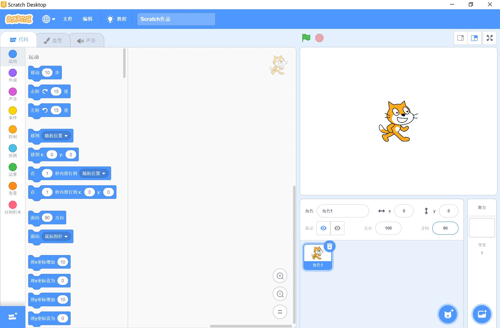 

上图所展示的就是 `Scratch` 的初始界面，怎么样？是不是突然有点意外，这和开发人员常用的程序开发软件区别太大了吧！哈哈！别急，好戏还在后头，让你看看 `Scratch` 可以干什么。

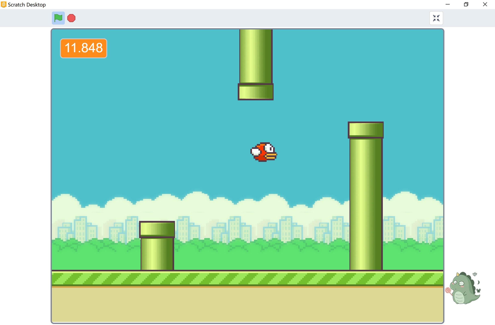

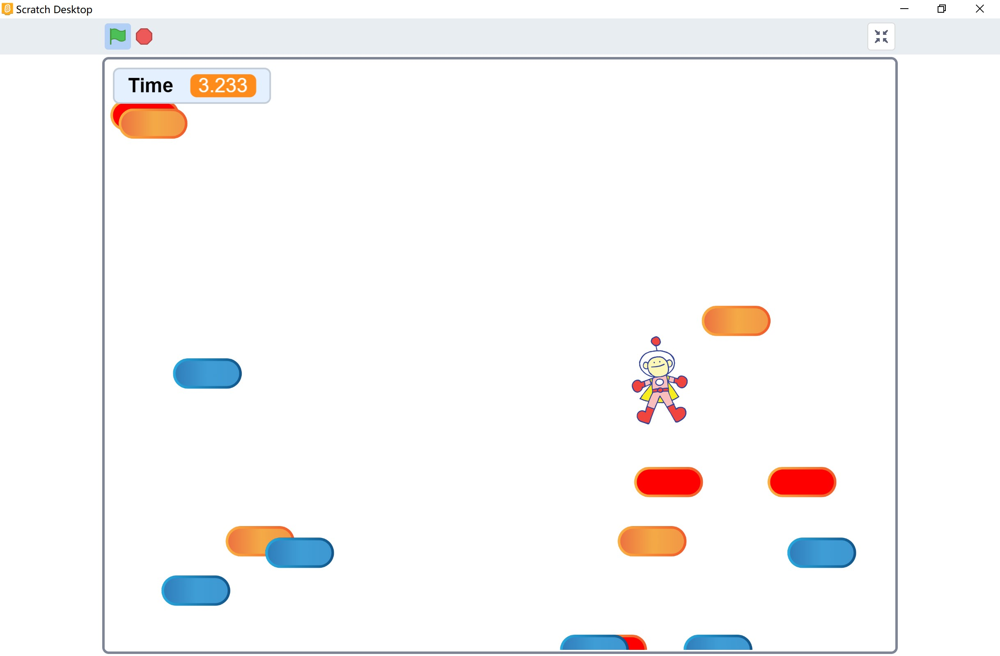 

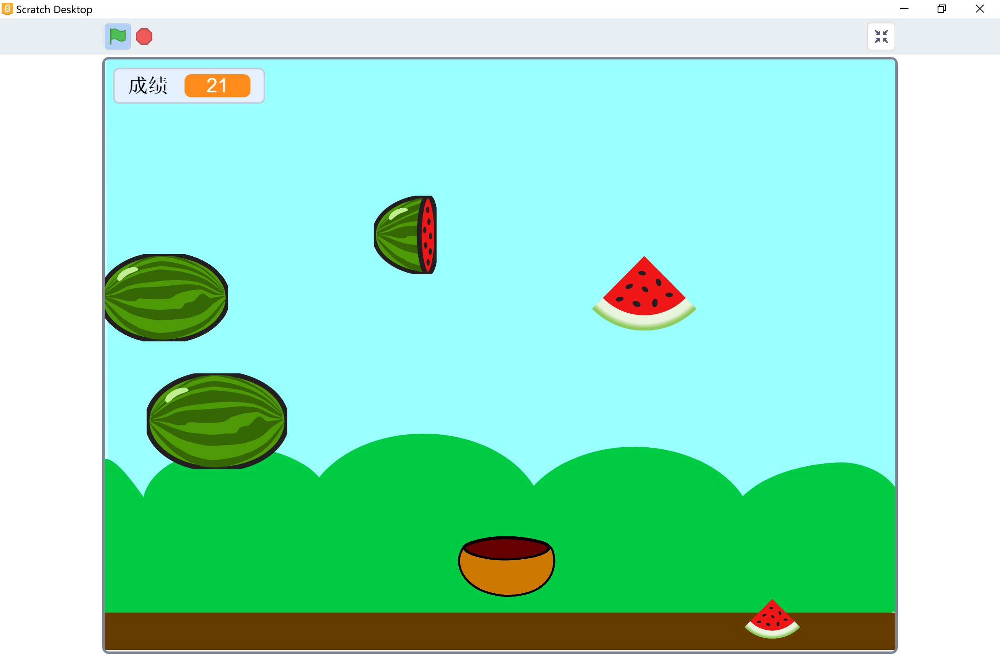

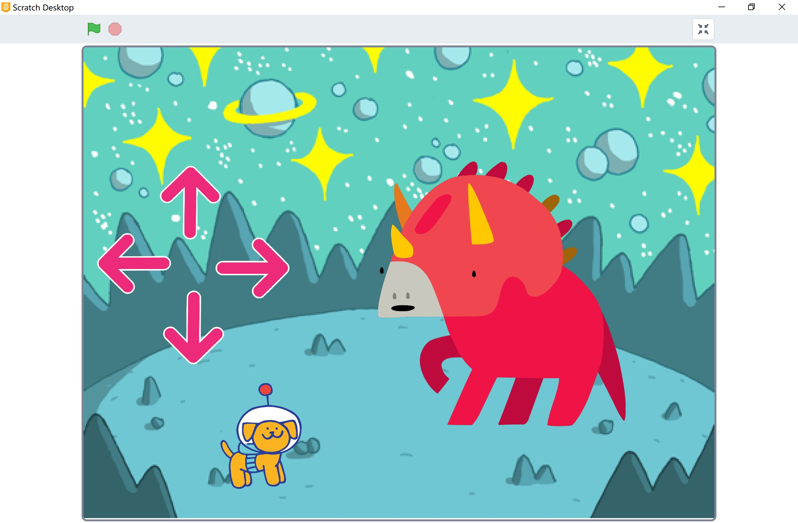 

看到这，我想你的第一念头应该是“ `Scratch` 是一个用于制作小游戏的开发软件。”哈哈！其实我刚开始接触 `Scratch` 时也这么认为，不过先别着急下结论啊，你再往下看！

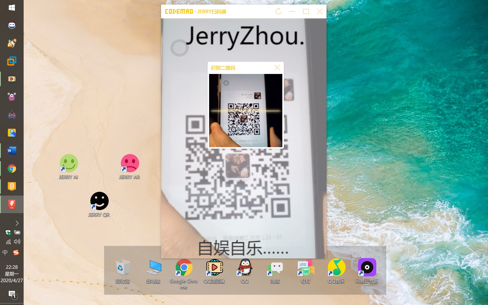 

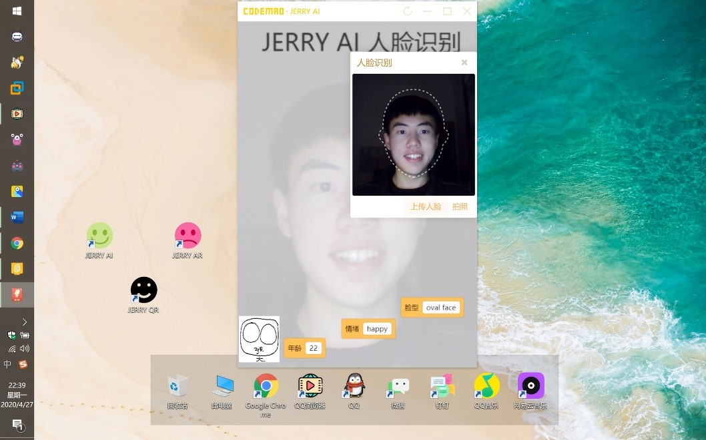 

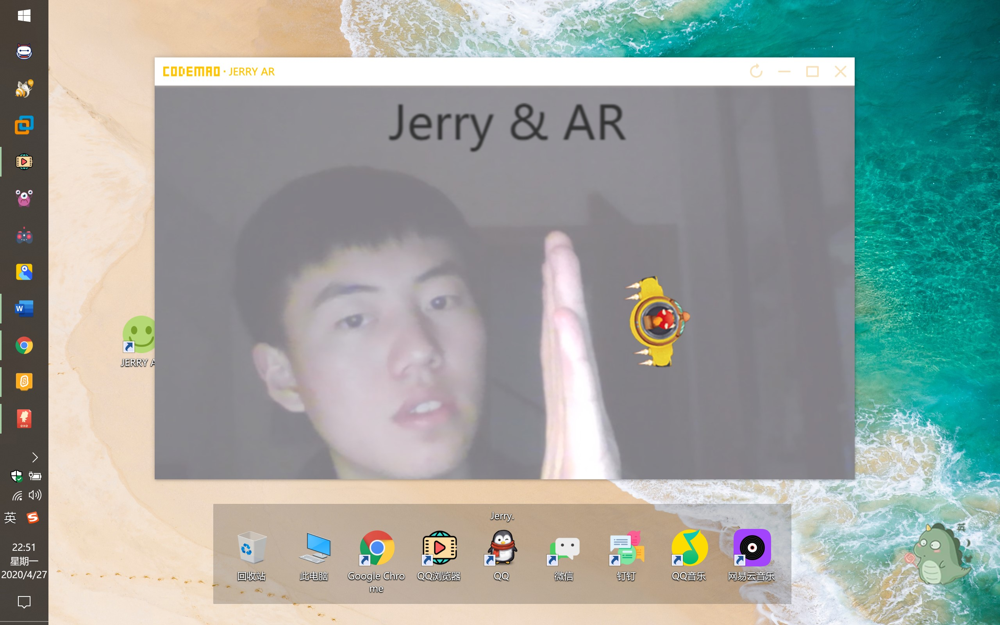 

哈哈！怎么样？有被惊讶到吧？无论是二维码识别，还是利用 `AI` 感知年龄（其实本人才19并没有22岁，可能是长的着急了哈哈！）、情绪、脸型，或是利用 `AR` 虚拟交互设计一款依靠手势便可以控制飞船移动的小游戏，通通可以在 `Scratch` 上实现。看到这，你肯定在想“这 `Scratch` 也太神奇了吧！它是怎么做到的？它到底是什么？”哈哈！好奇就对了，我也就有继续说下去的动力了！接下来让我们真正开始了解 `Scratch` 吧！

其实无论是小游戏也好，还是 `AI` 人工智能、`AR` 虚拟交互也好，假如利用我们主流的高级编程语言纯靠个人的能力来实现其实是比较困难的，毕竟且先不考虑算法设计、代码如何编写、结构如何搭建，就说用户交互界面的设计恐怕也要难倒大部分学习编程的同学，而 `Scratch` 就完美的解决了这些问题。

 

如图所示：`Scratch` 从左到右主要由：代码区、造型区、声音区、脚本区、舞台区、角色区、背景区构成。

代码区提供了控制一切东西的代码模块，其使用方式类似于“搭积木”，但是其基本程序结构和高级编程语言是一致的，比如：顺序、循环、分支……，而且，基本的编程思维也与高级语言同出一辙，像：模块化思想、代码的封装、面向过程、面向对象思想在这里都有体现。

造型区及声音区的主要功能是为创作者提供角色、背景及声音的创作平台，当然 `Scratch` 本身也是提供许多默认的角色、背景、声音可供选择。

脚本区通俗理解就是代码“堆叠”的场所，为程序创作提供代码编写的区域。

舞台区则是实时展示程序结果的窗口，在这里创作者可以实时预览每条代码、每个模块、每个对象的执行效果。

而角色区及背景区则是对舞台内所有角色和背景的管理和控制。

`Scratch` 的基本部分介绍完了，此时也许部分读者会有疑惑了，这看上去不过是将高级编程语言的语句代码变为图形代码啊，的确可以简化小游戏的制作，可怎么就能轻松实现 `AI` 人工智能，`AR` 虚拟交互技术了呢？

其实，`AI` 与 `AR` 只不过是 `Scratch` 的一部分，除了这些，`Scratch` 还可以：玩爬虫、控制外部硬件（如：机器人编程）、数学计算、物理计算、大数据处理、数据库管理……甚至我还见过一个大神利用 `Scratch` 弄了一个简单的操作系统！可以说几乎你能想到的应用场景它都可以胜任并且还较为简单！但至于“它是如何做到的？”有关这类问题的回答，我想我还是延续老方法先来看几张图吧。

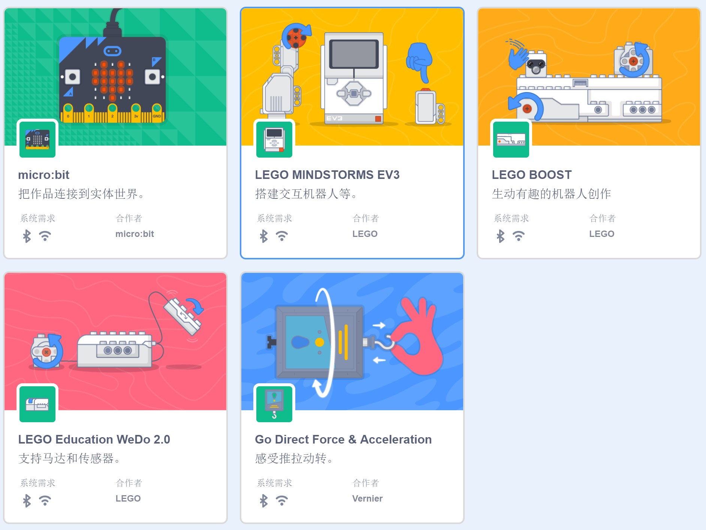

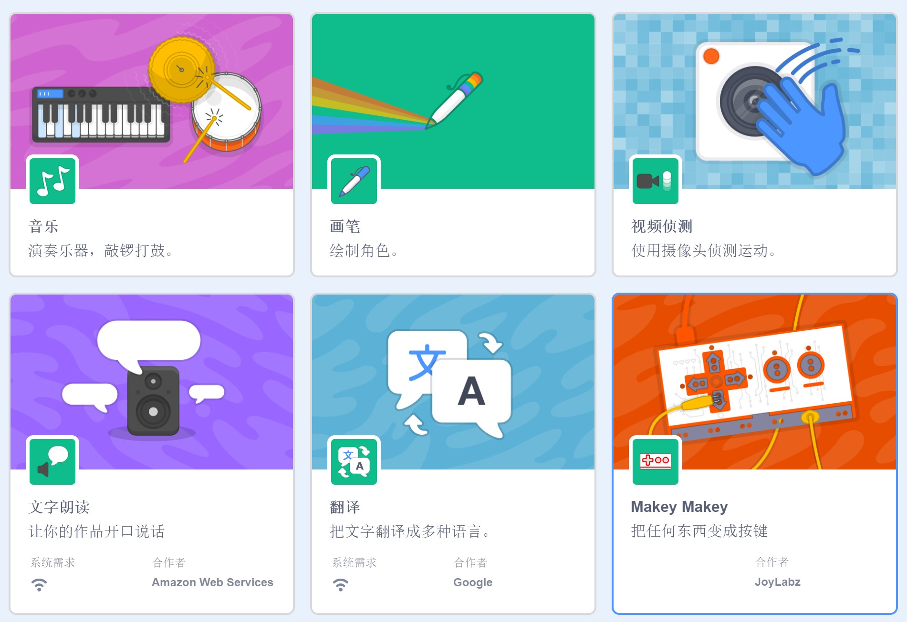

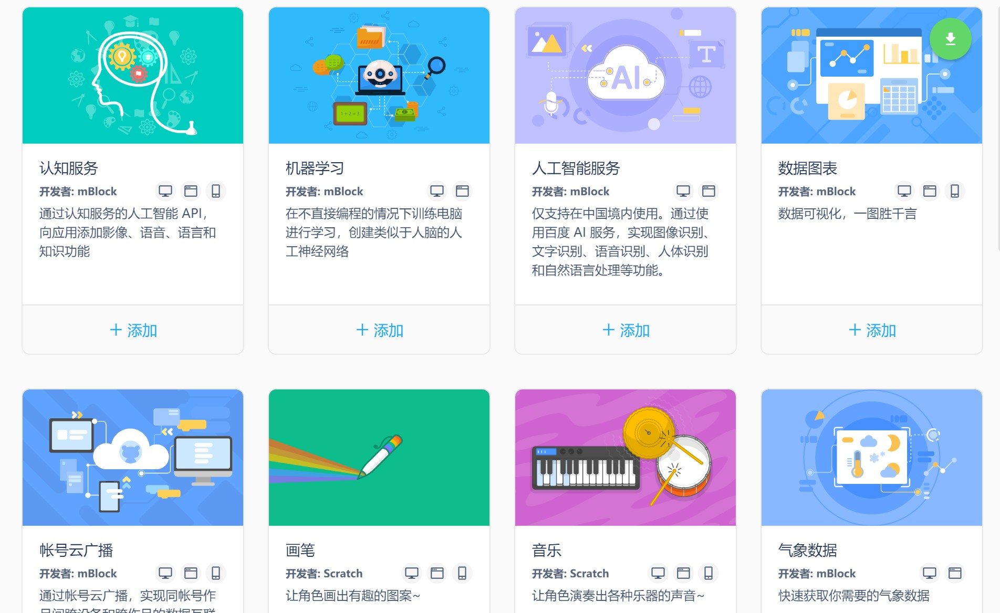

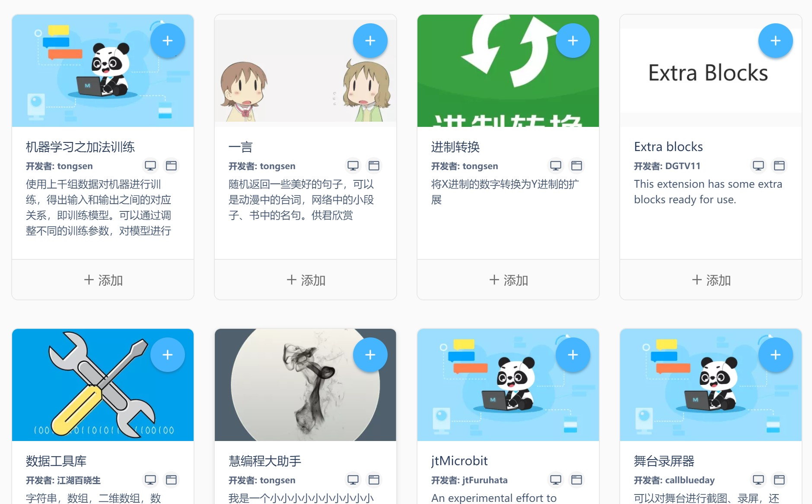

上面几幅图中一大堆东西是啥？其实，这便是 `Scratch` 中最具特点的东西！在 `Scratch` 的代码区中，除了自带的代码外，还提供了许许多多具有特殊功能的模块可供下载使用，这就类似于程序开发中面向对象的概念，它提供了具体的操作工具，至于这些工具是如何设计出来的并不需要创作者去思考，这大大节约了创作的难度，同时有利于创作者把重心放在具体的某些创意上，而不是纠结到底如何设计出一个好的算法。

而且最重要的是，`Scratch` 搭建了一个生态，这是一个巨大的全球化网络创作分享平台，在那里有全世界的创作者分享他们的作品，也包括哪些功能特殊的模块，这直接导致 `Scratch` 的创作交流学习资源空前巨大。创造者可以通过平台交流、学习和合作实现一些原本不可思议的作品，就比如上面提到的操作系统。再者：`Scratch 3.0` 更是实现了 `PC` 端与移动端的完美兼容，这空前的打开了 `Scratch` 的应用场景，作品可以同时适配你的手机和电脑。

听到这，是不是很开心？平日里学了半天程序开发最终也没弄个像样的东西出来，毕竟用高级编程语言来开发的确需要一定的专业水平，但是假如你利用`Scratch` 的话也许你早就解决了！哈哈！开心归开心，但是还有一个问题不容我们忽视！讲了这么多，你是否发现，好像 `Scratch` 把难搞的东西都简化了，对于创作者来说的确是件好事情，但是对于学习程序开发的同学来说似乎并不是一件好事。为什么这么说？因为，正是由于 `Scratch` 的简单，所以真正专业的程序开发知识在 `Scratch` 上学不到，而且就算是只用 `Scratch` 来进行创作，很多时候代码模块远远不能满足自己的需求，须要自己设计开发出一个模块来供自己使用，这时说到底还是要依靠高级语言，比如 `Scratch` 中的代码模块其实背后大部分是用 `Python` 语言编写实现的，也就是说，`Scratch` 中无论 `AI` 还是 `AR` 还是其他奇特的功能其背后就是倚仗 `Python` 这个“老大哥”！那么问题来了，`Scratch` 真的就只是一个“美丽的花瓶”吗？真的就不适合用来学习程序开发吗？真的就不能成为主流编程语言吗？其实，我也被这些问题困惑很久，对于 `Scratch` 是否可以用来学习程序开发，我个人认为是可以的，因为 `Scratch` 的代码在底层是大部分利用 `Python` 实现的，那“如何结合 `Scratch` 与 `Python` 的关系？”便是最主要的问题。答案其实很简单，那就是一起显示出来呗！这样在利用 `Scratch` 的同时也学习了 `Python`，关键的是在一些比较难实现的模块例如 `AI`、`AR`，借助 `Scratch` 可以更好的理解 `Python` 是如何实现的，这不是一举两得吗？而就在前段时间，当我利用海龟编辑器（一个基于 `Scratch`的开发软件）再一次成功打印 `Hello World!` 时，当初的那种激动与热泪盈眶，又回来了！我看见了一段有灵魂也有肉体的代码……

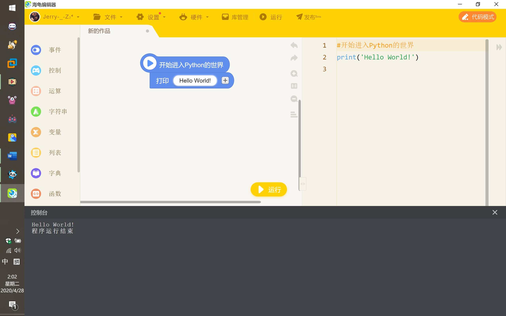 

最后回答那个问题“ `Scratch` 是不是终究成为不了主流的编程语言？”说实话，至少目前看，可能性极小！但我知道一点，无论 `Scratch` 是否能接受住时间的考验，无论图形化编程方向最终成功的是否是 `Scratch`。图形化编程一定是一种特别的艺术！图形化编程思想也必将成为一种趋势！自从世界上第一台通用计算机“ `ENIAC` ”于1946年在美国宾夕法尼亚大学诞生以来，直到今天互联网发展日新月异，但在时代的浪潮之中，唯有“创造”一词从来都是最耀眼的！而受制于计算机技术的专业性，无论是：社交平台、移动支付、网络购物、无人驾驶、共享经济……这类事物的创造都需要倚仗很高的专业知识背景，它们很美！可它们却只能在金字塔顶尖才能诞生！这不禁让我感到惋惜！设想一下，假如未来某一天程序开发可以像今天的短视频创作那样形成一个全民创作的浪潮！到那时，世界该是什么样的？我想，这或许就是图形化编程的使命吧！但无论如何，我只希望那一天早点到来！

 2020年4月28日
